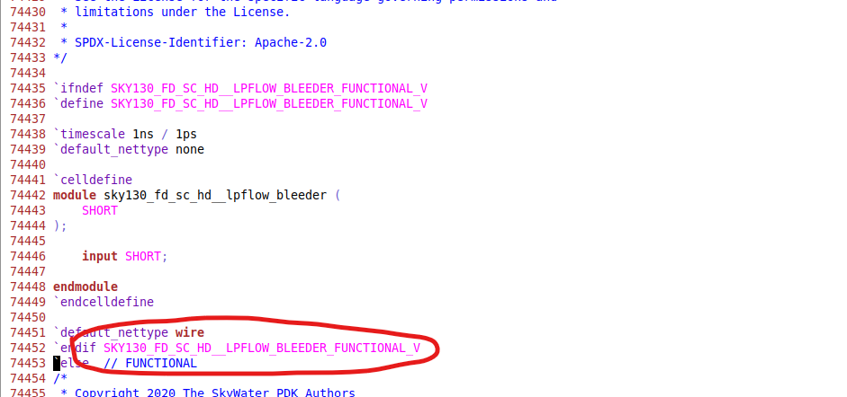
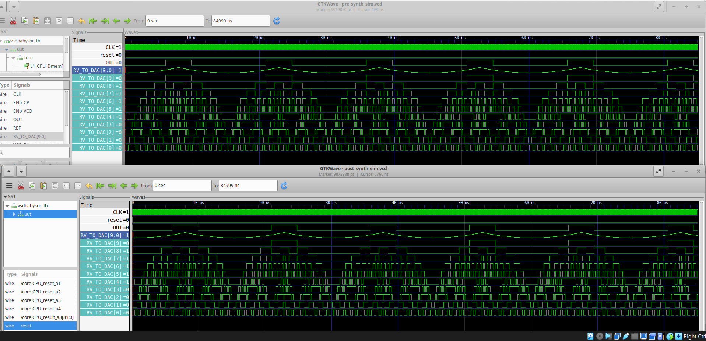
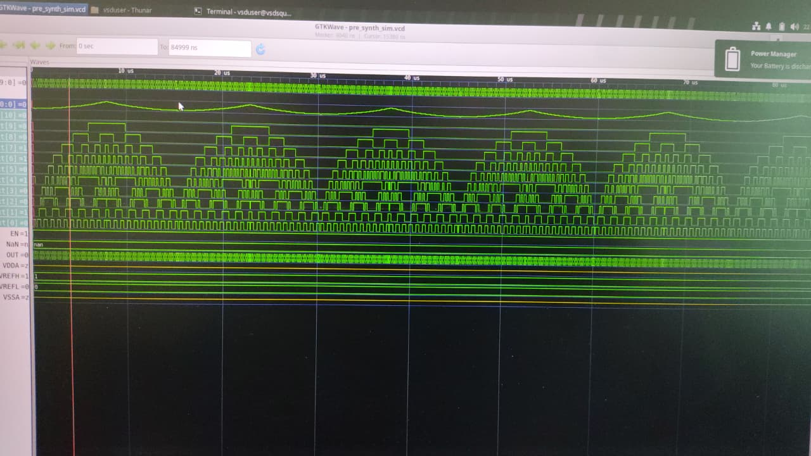

# VSDBabySoC — From RTL to Verified Gates

## What's Here

This writeup walks through taking **VSDBabySoC** — a small mixed-signal chip combining a RISC-V core with an analog PLL and DAC — from Verilog source all the way to a synthesized, gate-level-verified netlist.

Three blocks make up the design:

- `rvmyth`, a RISC-V core, doing the digital work
- `avsdpll`, an analog phase-locked loop supplying the clock
- `avsddac`, an analog DAC turning a 10-bit core output into a real-world signal

The goal of everything below is simple: prove that whatever Yosys produces after synthesis behaves exactly like the original RTL once it's mapped onto SKY130 standard cells.

> Upstream project: [VSDBabySoC on GitHub (VLSI System Design)](https://github.com/manili/VSDBabySoC)

---

## Contents

- [Getting the Repo](#getting-the-repo)
- [How the Chip Fits Together](#how-the-chip-fits-together)
- [Step One: Simulate the RTL](#step-one-simulate-the-rtl)
- [Step Two: Synthesize with Yosys](#step-two-synthesize-with-yosys)
- [A Library Bug That'll Trip You Up](#a-library-bug-that-ll-trip-you-up)
- [Step Three: Simulate the Netlist](#step-three-simulate-the-netlist)
- [Did RTL and Gates Match?](#did-rtl-and-gates-match)
- [Wrap-Up](#wrap-up)

---

## Getting the Repo

```bash
git clone https://github.com/Subhasis-Sahu/BabySoC_Simulation
cd BabySoC_Simulation
```

Everything lives under a predictable layout: RTL and the testbench sit in `src/module`, anything they `` `include `` sits in `src/include`, and every file this flow generates — compiled simulators, waveform dumps, netlists — ends up dropped at the top of the tree once you've run through the steps below.

![Project folder layout in Thunar]

*What the working directory looks like once RTL sim, synthesis, and GLS have all run at least once — compiled binaries, netlist copies, and both `.vcd` dumps sitting next to `src/`.*

---

## How the Chip Fits Together

Before touching any commands, it's worth having the block diagram in front of you — it explains why the testbench cares about the signals it does.

![VSDBabySoC block diagram — avsdpll_1v8, rvmyth, spi, and avsddac_3v3 across the 1.8V and 3.3V voltage domains]

*The crystal oscillator drives `avsdpll_1v8`, which locks onto a clock and hands it to `rvmyth`. The core's 10-bit output (`D[9:0]`) crosses through level shifters into `avsddac_3v3`, which turns it into the analog `OUT` pin. Everything on the pad ring and SPI side runs at 3.3V; everything from the PLL logic through the core and into the DAC's digital input runs at 1.8V — the `LS` boxes are where that boundary gets crossed. Diagram source: [visisystemdesign.com](https://www.visisystemdesign.com/).*

### Why the design is split this way

**`rvmyth` — the RISC-V core.** This is the only purely digital block on the chip. It's the "brain": it executes instructions and computes a value that eventually needs to leave the chip as something the outside world can use.

**`avsdpll` — the clock source.** Digital logic can't do anything without a clock, and generating a clean, stable clock is fundamentally an *analog* problem — you're dealing with continuous phase and voltage behavior, not clean 0s and 1s. The PLL takes a reference frequency from the crystal oscillator pad (`XI`/`XO`) and locks onto it, producing the `CLK` that drives `rvmyth`. This is why `avsdpll` is drawn as an analog block even though its inputs (`EN_VCO`, `EN_CP`, `B[3:0]`) come from digital control logic — the *core function* of the PLL (phase locking) is analog.

**`avsddac` — turning digital results into something physical.** The RISC-V core only knows how to produce numbers — in this case, a 10-bit value (`D[9:0]`). But most real-world uses (driving a speaker, controlling a motor, feeding a sensor interface) need a continuous voltage, not a binary number. The DAC's job is to convert that 10-bit digital value into an analog voltage on `OUT`. `VREFH`/`VREFL` set the DAC's output voltage range.

### Why two voltage domains (3.3V vs 1.8V)

- **3.3V domain** — the pad ring, the SPI interface, and the crystal oscillator pad. Higher voltage is used here because I/O pins are exposed to the outside world, and bigger voltage swings are more resistant to external noise and give more margin on longer PCB traces.
- **1.8V domain** — the PLL's internal control logic, the RISC-V core itself, and the DAC's digital input stage. Lower voltage means lower power consumption, which matters a lot here because this logic is switching at high frequency continuously.

You can't wire a 3.3V signal directly into 1.8V logic — it would exceed the input's voltage tolerance and can physically damage the circuit over time. That's what the **`LS` (level shifter)** blocks in the diagram are for: every time a signal crosses from one voltage domain to the other (SPI control signals into the PLL, the PLL's `CLK` output, the core's `D[9:0]` bus into the DAC), it passes through a level shifter that safely translates the voltage swing.

### What the testbench actually watches

The testbench mirrors this picture directly: it toggles `CLK` and `reset` (driving the chip the way the PLL and a power-on reset circuit would), then watches `OUT` and the intermediate `RV_TO_DAC[9:0]` bus to see what value the core is telling the DAC to produce. Comparing those two signals between RTL and gate-level simulation later on is really asking: *"does the synthesized chip still tell the DAC the same thing, at the same time, as the original RTL did?"*

---

## Step One: Simulate the RTL

Before handing anything to Yosys, the RTL needs to be proven correct on its own terms. There's no point synthesizing a design that's already functionally broken — if `rvmyth` isn't producing the right values at the RTL level, no amount of gate-level verification later will fix that; it'll just confirm the same wrong behavior got carried through. This RTL simulation run is the functional baseline everything else gets compared against.

Compile and run the design before synthesis touches it, using `PRE_SYNTH_SIM` to steer the testbench down its RTL-only branch (as opposed to the post-synthesis branch it'll take later, once real standard-cell timing/behavioral models are involved):

```bash
cd BabySoC_Simulation

iverilog -o ./pre_synth_sim.out -DPRE_SYNTH_SIM \
    src/module/testbench.v \
    -I src/include -I src/module/

./pre_synth_sim.out

gtkwave pre_synth_sim.vcd
```

Open the resulting `pre_synth_sim.vcd` in GTKWave and you should see `CLK` toggling, `reset` releasing, and `RV_TO_DAC[9:0]` shifting values as the core runs.

---

## Step Two: Synthesize with Yosys
PS: Speed of Synthesis Depends on the computational power of your device
Point Yosys at the RTL and the standard-cell library, then walk it through generic synthesis, flip-flop mapping, and technology mapping:

| What | Command | Why |
|---|---|---|
| Load the top module | `read_verilog src/module/vsdbabysoc.v` | Brings in the module that ties PLL, core, and DAC together |
| Load the core | `read_verilog -I src/include/ src/module/rvmyth.v` | The `-I` flag lets Yosys find rvmyth's included headers |
| Load the clock gate | `read_verilog -I src/include/ src/module/clk_gate.v` | Finishes off the digital hierarchy |
| Load PLL timing | `read_liberty -lib src/lib/avsdpll.lib` | Tells Yosys how the PLL's pins behave |
| Load DAC timing | `read_liberty -lib src/lib/avsddac.lib` | Tells Yosys how the DAC's pins behave |
| Load SKY130 cells | `read_liberty -lib src/lib/sky130_fd_sc_hd__tt_025C_1v80.lib` | The gates, buffers, and flops everything gets mapped onto |
| Run synthesis | `synth -top vsdbabysoc` | Elaborates and does technology-independent optimization |
 
| Map flops | `dfflibmap -liberty src/lib/sky130_fd_sc_hd__tt_025C_1v80.lib` | Swaps generic flip-flops for real SKY130 ones |
| Optimize | `opt` | Trims redundant logic and folds constants |
| Map gates | `abc -liberty src/lib/sky130_fd_sc_hd__tt_025C_1v80.lib` | ABC turns remaining logic into actual SKY130 cells |
| Zero out unknowns | `setundef -zero` | Any stray `x` values get pinned to `0` |
| Clean up | `clean -purge` | Drops dead wires and cells |
| Rename nets | `rename -enumerate` | Swaps Yosys's auto-generated names for readable ones |
| Check the result | `stat` | Prints cell/wire counts and area so you can sanity-check the mapping |
| Save it | `write_verilog -noattr baby_soc_net.v` | Writes the gate-level netlist; `-noattr` drops Yosys-only metadata |
`stat` at the end is your checkpoint — if the design mapped cleanly there should be no leftover generic cells, only SKY130 primitives.
   
---

## A Library Bug That'll Trip You Up

Trying to run gate-level simulation with `-DFUNCTIONAL` set, Icarus Verilog will die partway through parsing the standard-cell library:

![iverilog failing partway through sky130_fd_sc_hd.v with a syntax error]

This isn't anything wrong with BabySoC — it's a real bug in SkyWater's own `sky130_fd_sc_hd.v` (there's an open issue for it against `google/skywater-pdk`). Some of the file's conditional blocks close with the macro name left un-commented, like this:

```verilog
`endif SKY130_FD_SC_HD__LPFLOW_BLEEDER_FUNCTIONAL_V
```

Icarus reads that trailing name as code instead of a comment and bails. Every *other* `` `endif `` in the file comments the name out properly — so the fix is just making this one consistent:

```verilog
`endif // SKY130_FD_SC_HD__LPFLOW_BLEEDER_FUNCTIONAL_V
```

![Located and confirmed the exact offending line in the library source]


Rather than hunt down every occurrence by hand, one `sed` pass fixes them all:

```bash
sed -i -E 's/`endif ([A-Z_0-9]+)$/`endif \/\/ \1/' \
    my_lib/verilog_model/sky130_fd_sc_hd.v
```

It only touches lines where an uncommented macro name follows `` `endif ``, so anything already correct is left alone.

---

## Step Three: Simulate the Netlist

With the library patched, compile the synthesized netlist against the same standard-cell behavioral models, this time with `POST_SYNTH_SIM` and `FUNCTIONAL` steering the testbench toward its gate-level path:

```bash
sudo iverilog -DPOST_SYNTH_SIM -DFUNCTIONAL \
    -I src/include/ \
    -I ../VSDSquadron_FM/sky130RTLDesignAndSynthesisWorkshop/my_lib/verilog_model/ \
    -I src/module/ \
    src/module/testbench.v

./a.out

gtkwave post_synth_sim.vcd
```

> `sudo` shows up here because the standard-cell library path sits outside the user's home directory on this machine — skip it if `my_lib/verilog_model/` is already readable without elevated permissions. There's no `-o` flag, so Icarus falls back to writing `a.out`.

---

## Did RTL and Gates Match?

With both `.vcd` files opened at once in GTKWave, `CLK`, `reset`, `OUT`, and `RV_TO_DAC[9:0]` were lined up between the pre-synthesis run and the gate-level run:

![RTL (top) vs GLS (bottom) GTKWave windows side by side]

![Zoomed-in comparison of RV_TO_DAC bus activity, RTL vs GLS]

They line up exactly, everywhere in the window — no divergence on any of the observed signals.

A couple more captures from the same session, showing how `RV_TO_DAC` toggles alongside the DAC's analog `OUT` trend over time:

![RV_TO_DAC bus and analog OUT trend]

![Full-window waveform capture]

---

## Wrap-Up

Start to finish, this covered:

- Running the original RTL and confirming it behaves as expected
- Synthesizing it in Yosys against the SKY130 library plus the PLL/DAC analog models
- Hitting and patching a real bug in the SkyWater library's own Verilog source
- Simulating the resulting netlist and comparing it against the RTL run

The two waveforms matched exactly on every signal that was checked, which means synthesis didn't change the design's behavior — the gate-level netlist is functionally equivalent to the RTL it came from.