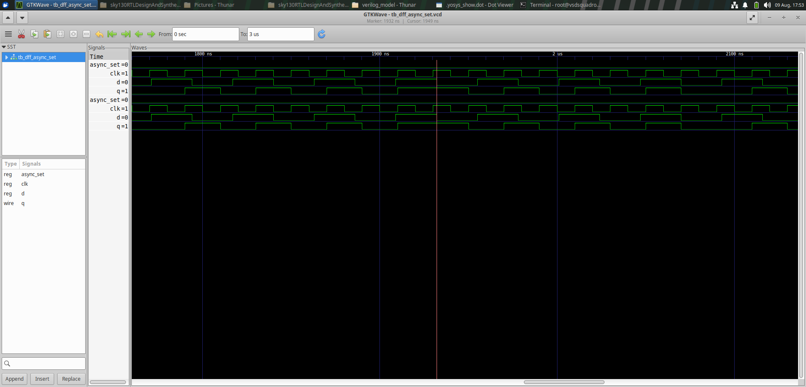
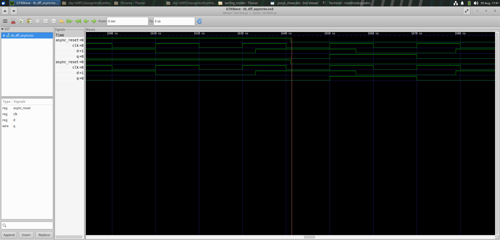
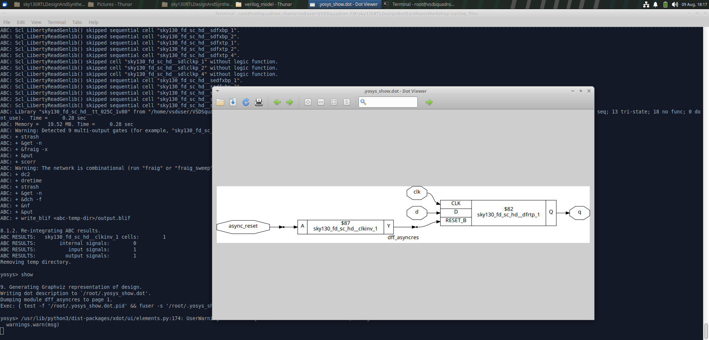
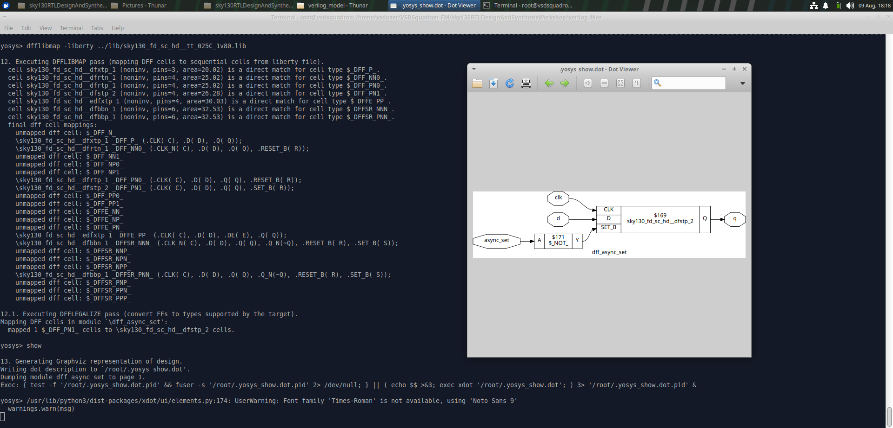
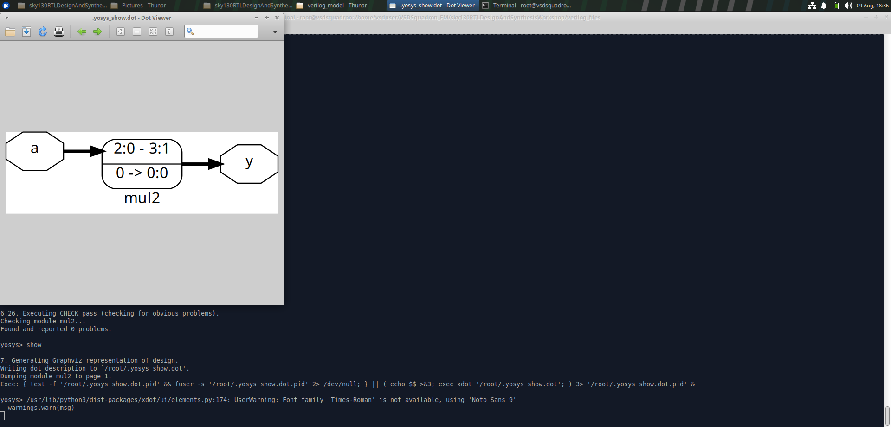
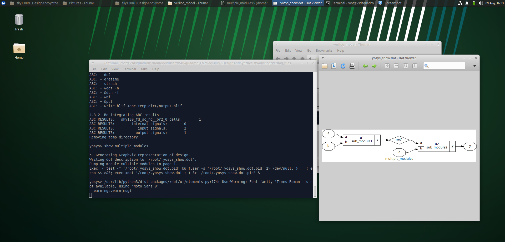

RTL Design, Simulation, and Synthesis Workshop

_Day 1 and Day 2 Report - Verilog RTL to SKY130 Gate-Level Netlist_

_Figures below are the actual workshop screenshots captured for each step. Two steps (the multiply-by-8 netlist and the flattened netlist) have no corresponding screenshot and are marked accordingly._

# Day 2 - Sequential Logic, Hierarchical Design and RTL Synthesis

## 1\. RTL Verification Fundamentals

Sequential logic is a type of digital logic in which the output depends on the present input as well as the previously stored state. A D Flip-Flop is a basic sequential circuit used to store one bit of data. The input D is transferred to the output Q at the active edge of the clock.

In this experiment, different D Flip-Flop configurations were implemented and verified:

- D Flip-Flop with synchronous reset
- D Flip-Flop with asynchronous set
- D Flip-Flop with asynchronous reset

The designs were simulated using Icarus Verilog and verified using GTKWave. The designs were then synthesized using Yosys and mapped to the SKY130 standard-cell library.

## 2\. D Flip-Flop Designs

### D Flip-Flop with Synchronous Reset

A synchronous reset affects the output only at the active edge of the clock.

module dff_syncres (

input clk,

input async_reset,

input sync_reset,

input d,

output reg q

);

always @(posedge clk)

begin

if (sync_reset)

q <= 1'b0;

else

q <= d;

end

endmodule

### D Flip-Flop with Asynchronous Set

An asynchronous set can force the output to logic 1 independently of the clock.

module dff_async_set (

input clk,

input async_set,

input d,

output reg q

);

always @(posedge clk, posedge async_set)

begin

if (async_set)

q <= 1'b1;

else

q <= d;

end

endmodule

### D Flip-Flop with Asynchronous Reset

An asynchronous reset can force the output to logic 0 independently of the clock.

module dff_asyncres (

input clk,

input async_reset,

input d,

output reg q

);

always @(posedge clk, posedge async_reset)

begin

if (async_reset)

q <= 1'b0;

else

q <= d;

end

endmodule

## 3\. RTL Simulation and Waveform Verification

The D Flip-Flop designs were compiled and simulated using Icarus Verilog. The generated VCD files were opened using GTKWave to verify the behavior of the sequential circuits.

### Simulation Commands

**Synchronous Reset**

iverilog dff_syncres.v tb_dff_syncres.v

./a.out

gtkwave tb_dff_syncres.vcd

**Asynchronous Set**

iverilog dff_async_set.v tb_dff_async_set.v

./a.out

gtkwave tb_dff_async_set.vcd

**Asynchronous Reset**

iverilog dff_asyncres.v tb_dff_asyncres.v

./a.out

gtkwave tb_dff_asyncres.vcd

### GTKWave - Synchronous Reset

_q changes only on the next clk edge after sync_reset asserts, not immediately._

### GTKWave - Asynchronous Set

_q is held at 1 by a prior async_set pulse, independent of the clock._

### GTKWave - Asynchronous Reset

_q is forced to 0 on every async_reset pulse, independent of the clock edge._

## 4\. RTL Synthesis Using Yosys

After functional verification, the RTL designs were synthesized using Yosys. Yosys converts the Verilog RTL into a gate-level representation and maps the design to standard cells from the selected technology library.

### Load the SKY130 Standard-Cell Library

read_liberty -lib ../lib/sky130_fd_sc_hd_\_tt_025C_1v80.lib

### Read the Verilog RTL

For example:

read_verilog dff_syncres.v

The corresponding Verilog file was used for each design.

### Perform RTL Synthesis

synth -top dff_syncres

The top-level module is specified using the -top option.

### Map Flip-Flops to SKY130 Cells

dfflibmap -liberty ../lib/sky130_fd_sc_hd_\_tt_025C_1v80.lib

This maps generic flip-flop cells to equivalent sequential cells available in the SKY130 library.

### Technology Mapping

abc -liberty ../lib/sky130_fd_sc_hd_\_tt_025C_1v80.lib

The abc command performs logic optimization and technology mapping using the selected standard-cell library.

### Visualize the Synthesized Design

show

The synthesized design can be viewed as a graphical representation using Graphviz. The resulting schematics for each of the three flip-flop variants are shown below.

_dff_asyncres mapped to sky130_fd_sc_hd_\_dfrtp_1, with async_reset inverted via a clkinv cell into RESET_B._

_dff_async_set mapped to sky130_fd_sc_hd_\_dfstp_2, with async_set inverted via a \$\_NOT_cell into SET_B._

_dff_syncres mapped to a plain sky130_fd_sc_hd_\_dfxtp_1 (no reset pin); sync_reset implemented via a MUX in front of D._

### Generate the Synthesized Netlist

write_verilog -noattr dff_syncres_net.v

The generated Verilog file represents the synthesized gate-level implementation.

## 5\. Multiplier Designs

Simple multiplier circuits were also implemented using Verilog RTL and synthesized using Yosys.

### Multiplier by 2

The input is a 3-bit signal and the output is a 4-bit signal. Multiplication by 2 can be represented by shifting the input one bit to the left.

module mul2 (

input \[2:0\] a,

output \[3:0\] y

);

assign y = a \* 2;

endmodule

_mul2 optimized to pure wiring: input bits \[2:0\] rewired to output \[3:1\], LSB tied to constant 0 - no gates needed._

### Multiplier by 8

The input is a 3-bit signal and the output is a 6-bit signal. Multiplication by 8 can be represented by shifting the input three bits to the left.

module mult8 (

input \[2:0\] a,

output \[5:0\] y

);

assign y = a \* 8;

endmodule

Note: the synthesized implementation represents the required multiplication operation through the optimized hardware structure generated by Yosys.

_\[Figure: Synthesized netlist of the multiply-by-8 module - no screenshot was captured for this step, so it is not included here.\]_

## 6\. Hierarchical Design

A hierarchical RTL design consists of multiple modules where a top-level module instantiates and connects lower-level submodules. In this experiment, a design containing two submodules was created: sub_module1 performs an AND operation, sub_module2 performs an OR operation, and multiple_modules acts as the top-level module.

### Submodule 1

module sub_module1 (

input a,

input b,

output y

);

assign y = a & b;

endmodule

### Submodule 2

module sub_module2 (

input a,

input b,

output y

);

assign y = a | b;

endmodule

### Top-Level Module

module multiple_modules (

input a,

input b,

input c,

output y

);

wire net1;

sub_module1 u1 (

.a(a),

.b(b),

.y(net1)

);

sub_module2 u2 (

.a(net1),

.b(c),

.y(y)

);

endmodule

The resulting logic is:

net1 = a & b

y = net1 | c

Therefore:

y = (a & b) | c

## 7\. Hierarchical Synthesis and Netlist

The multi-module design was synthesized using Yosys while preserving its module hierarchy.

### Start Yosys

yosys

### Load the SKY130 Library

read_liberty -lib ../lib/sky130_fd_sc_hd_\_tt_025C_1v80.lib

### Read the Verilog Design

read_verilog multiple_modules.v

Yosys identifies the following modules:

sub_module1

sub_module2

multiple_modules

### Synthesize the Top-Level Module

synth -top multiple_modules

### Visualize the Hierarchical Design

show

The synthesized design shows sub_module1 and sub_module2 connected through the intermediate signal net1.

### Generate the Hierarchical Netlist

write_verilog -noattr multiple_modules_netlist.v

The generated netlist retains the module hierarchy.

_Hierarchy preserved in the Yosys schematic: u1/sub_module1 -> net1 -> u2/sub_module2._

## 8\. Flat Synthesis

A hierarchical design can also be converted into a flat representation. In a flat netlist, the lower-level modules are merged into the top-level design. The original module hierarchy is removed, allowing the complete logic to be represented at one level.

### Flatten the Design

flatten

### Visualize the Flat Design

show

The resulting representation directly shows the logic implemented by the complete design rather than separate submodule blocks.

### Generate the Flat Netlist

write_verilog multiple_modules_flat.v

A version without synthesis attributes was also generated:

write_verilog -noattr multiple_modules_flat.v

_\[Figure: Flat netlist of multiple_modules - no screenshot was captured for this step, so it is not included here.\]_

## 9\. Hierarchical vs Flat Netlist

### Hierarchical Netlist

The hierarchical netlist preserves the original module structure:

multiple_modules

|

+---- sub_module1

|

+---- sub_module2

This representation makes the design structure and individual module boundaries easier to understand.

### Flat Netlist

The flat netlist removes the submodule hierarchy and represents the complete logic at a single level. For this design:

a ----+

|

AND ----+

| |

b ----+ |

OR ---- y

c ------------+

The final logic is:

y = (a & b) | c

### Comparison

| **Feature**          | **Hierarchical Netlist**  | **Flat Netlist**                        |
| -------------------- | ------------------------- | --------------------------------------- |
| Module hierarchy     | Preserved                 | Removed                                 |
| Submodule instances  | Present                   | Removed                                 |
| Design structure     | Clearly visible           | Combined                                |
| Debugging            | Easier at module level    | More difficult for large designs        |
| Logic representation | Module-based              | Single-level                            |
| Optimization         | Module structure retained | Entire design can be optimized together |

## 10\. Observation

The D Flip-Flop designs were successfully simulated using Icarus Verilog and verified using GTKWave. The synchronous reset operated only at the active clock edge, while the asynchronous set and asynchronous reset could affect the output independently of the clock. The flip-flop designs were then synthesized using Yosys and mapped to cells from the SKY130 standard-cell library.

Multiplier designs for multiplication by 2 and 8 were also implemented using Verilog RTL and synthesized to observe their corresponding hardware representations.

A hierarchical multi-module design was created using sub_module1, sub_module2, and the top-level multiple_modules. The hierarchical netlist preserved the original module structure. The design was then flattened to remove the module hierarchy and obtain a single-level representation.

## 11\. What I Learned

- Difference between combinational and sequential logic.
- Working principle of a D Flip-Flop.
- Difference between synchronous and asynchronous reset.
- Operation of an asynchronous set.
- RTL simulation using Icarus Verilog.
- Waveform verification using GTKWave.
- RTL synthesis using Yosys.
- Use of the SKY130 standard-cell Liberty library.
- Flip-flop technology mapping using dfflibmap.
- Technology mapping using abc.
- Generation of synthesized Verilog netlists.
- Hierarchical RTL design using multiple modules.
- Module instantiation and interconnection.
- Difference between hierarchical and flat netlists.
- Use of the flatten command in Yosys.

## 12\. Conclusion

This experiment provided practical experience with sequential RTL design, simulation, synthesis, hierarchical design, and netlist generation. Different D Flip-Flop configurations were implemented and verified using Icarus Verilog and GTKWave. The designs were subsequently synthesized and technology-mapped using Yosys and the SKY130 standard-cell library.

Multiplier designs were also implemented and synthesized to observe their hardware representations. Finally, a hierarchical multi-module design was synthesized while preserving its hierarchy and was then flattened to obtain a single-level representation.

