# Day 8 – Custom Standard Cell (sky130_inv) Design, Extraction & Characterization

## Table of Contents
- [Overview](#overview)
- [Part A: 16-Mask CMOS Fabrication Process](#part-a-16-mask-cmos-fabrication-process)
  - [A.1 Substrate Selection](#a1-substrate-selection)
  - [A.2 Creating Active Regions for Transistors (Mask 1)](#a2-creating-active-regions-for-transistors-mask-1)
  - [A.3 N-Well and P-Well Formation (Mask 3)](#a3-n-well-and-p-well-formation-mask-3)
  - [A.4 Formation of the Gate (Mask 6)](#a4-formation-of-the-gate-mask-6)
  - [A.5 Lightly Doped Drain (LDD) Formation](#a5-lightly-doped-drain-ldd-formation)
  - [A.6 Source and Drain Formation (Mask 9, Mask 10)](#a6-source-and-drain-formation-mask-9-mask-10)
  - [A.7 Contacts and Local Interconnect](#a7-steps-to-form-contacts-and-interconnects-local)
  - [A.8 Higher Level Metal Formation (Mask 13)](#a8-higher-level-metal-formation-mask-13)
  - [Final Cross-Section](#final-cross-section)
  - [Fabrication Summary Table](#fabrication-summary-table)
- [Part B: Custom Standard Cell Layout, Extraction & SPICE Characterization](#part-b-custom-standard-cell-layout-extraction--spice-characterization)
  - [1. Cloning the Repo](#1-cloning-the-custom-standard-cell-design-repo)
  - [2. Opening the Layout in Magic](#2-opening-the-layout-in-magic)
  - [3. Inspecting Layers and Labels](#3-inspecting-layers-and-labels--the-what-command)
  - [4. LEF: Layout vs. Abstract View](#4-lef-layout-vs-abstract-view)
  - [5. DRC Check](#5-drc-check)
  - [6. Extracting the SPICE Netlist](#6-extracting-the-spice-netlist-from-the-layout)
  - [7. Reading the .ext File](#7-reading-the-ext-file)
  - [8. Generating the SPICE Deck](#8-generating-the-spice-deck)
  - [9. Fixing the Deck for Simulation](#9-fixing-the-deck-for-simulation)
  - [10. Running ngspice](#10-running-ngspice)
  - [11. Plotting and Reading the Switching Threshold](#11-plotting-and-reading-the-switching-threshold)
  - [Command Summary](#command-summary)
  - [Summary Table](#summary-table)
- [Reference](#reference)

---

## Overview
This lab walks through taking a custom-drawn `sky130_inv` (CMOS inverter) standard cell layout in **Magic**, extracting its parasitics, generating a SPICE netlist, fixing it up, simulating it in **ngspice**, and finally reading the switching threshold off the transient waveform. It also covers the underlying **16-mask CMOS fabrication process** that produces the transistors this layout represents — i.e. everything that happens *before* a `.mag` file becomes real silicon.

**Pipeline:**
```
16-mask CMOS fabrication → Magic layout (.mag) → extract → .ext → ext2spice → .spice → ngspice → waveform → Vm (switching threshold)
```

---

## Part A: 16-Mask CMOS Fabrication Process

Before a layout like `sky130_inv.mag` becomes silicon, the foundry runs a sequence of masked photolithography, implantation, and deposition steps. This section walks through that 16-mask CMOS process, from substrate to first-level metal, ending in the completed NMOS/PMOS cross-section that the rest of this README (Part B) extracts and simulates.

### A.1) Substrate Selection
The process starts on a **P-substrate** wafer. Substrate choice determines the base doping and sets up the foundation for the subsequent N-well and P-well formation.

### A.2) Creating Active Regions for Transistors (Mask 1)
A stack is deposited on the substrate:
- ~**1 µm photoresist**
- ~**80 nm Si₃N₄** (silicon nitride)
- ~**40 nm SiO₂** (silicon dioxide)

**Mask 1** patterns the active (transistor) regions; exposed photoresist is **washed out in developing solution**, leaving the patterned active-area stack behind.

### A.3) N-Well and P-Well Formation (Mask 3)
Photoresist is applied and patterned using **Mask 3**. The wafer is exposed to **UV light** through the mask; exposed photoresist regions wash away, opening a window for well implantation. This defines the **N-well** and **P-well** regions side by side on the P-substrate — the N-well hosts the PMOS, the P-well hosts the NMOS.

### A.4) Formation of the 'Gate' (Mask 6)
Polysilicon gate material is deposited over the active regions. **Mask 6** patterns the gate stack sitting above the N-well/P-well junction, defining the gate terminals for both the NMOS (in P-well) and PMOS (in N-well) transistors.

### A.5) Lightly Doped Drain (LDD) Formation
A thin layer (~**0.1 µm**) of **Si₃N₄ or SiO₂** is deposited to form **side-wall spacers** around the gate. Shallow implants follow:
- **P- implant** on the N-well side (for PMOS)
- **N- implant** on the P-well side (for NMOS)

LDD regions reduce hot-carrier effects and control short-channel behavior by lightly doping the drain/source extension near the channel.

### A.6) Source and Drain Formation (Mask 9, Mask 10)
- **Mask 9** protects the N-well while the P-well side receives an **N- implant**.
- **Mask 10** protects the P-well while the N-well side receives a **P- implant** using **Boron at 50 keV**.

This heavier implantation converts the LDD regions into full-strength **P+ source/drain** (PMOS, N-well) and **N+ source/drain** (NMOS, P-well).

### A.7) Steps to Form Contacts and Interconnects (Local)
**TiN (Titanium Nitride)** is etched using **RCA cleaning**, a solution of:
- De-ionized water (H₂O) — 5 parts
- Ammonium hydroxide (NH₄OH) — 1 part
- Hydrogen peroxide (H₂O₂) — 1 part

The wafer is then **heated at ~650–700 °C in an N₂ ambient for 60 seconds**, producing **low-resistance TiSi₂** (titanium silicide) at the contact regions — improving conductivity between silicon and the metal interconnect layers.

### A.8) Higher Level Metal Formation (Mask 13)
**Mask 13** defines the higher-level metal layer patterning. **Chemical Mechanical Polishing (CMP)** planarizes the wafer surface before/after metal deposition, ensuring a flat surface for subsequent lithography layers. This completes local contacts, interconnects, and the first level of metal routing on top of the transistor structures.

### Final Cross-Section
Putting it all together — completed NMOS (P-well) and PMOS (N-well) transistors with source/gate/drain contacts and first metal, ready to be characterized (Part B) or connected into larger cells.

### Fabrication Summary Table

| Step | Process | Mask Used | Key Detail |
|---|---|---|---|
| A.1 | Substrate selection | – | P-substrate base |
| A.2 | Active region creation | Mask 1 | Si₃N₄ / SiO₂ / photoresist stack, washed out in developer |
| A.3 | N-well & P-well formation | Mask 3 | UV exposure + develop |
| A.4 | Gate formation | Mask 6 | Polysilicon gate patterning |
| A.5 | LDD formation | – | Side-wall spacers, P-/N- implants |
| A.6 | Source/drain formation | Mask 9, Mask 10 | Boron 50 keV, P+/N+ implants |
| A.7 | Contacts & local interconnect | – | RCA clean, TiSi₂ formation |
| A.8 | Higher level metal | Mask 13 | CMP planarization |

---

## Part B: Custom Standard Cell Layout, Extraction & SPICE Characterization

With the fabrication flow in mind, this part covers taking the `sky130_inv` layout (built on exactly this transistor stack) through extraction and SPICE-level characterization.

### 1) Cloning the Custom Standard Cell Design Repo

The lab starts from a pre-built repo containing the sky130A tech file, the `.mag` layout, and supporting libs.

```bash
sudo git clone https://github.com/nickson-jose/vsdstdcelldesign.git
```

Repo contents:
```
bsim4v5.out  Images  libs  LICENSE  README.md  sky130A.tech  sky130_inv.ext  sky130_inv.mag  sky130_inv.spice
```

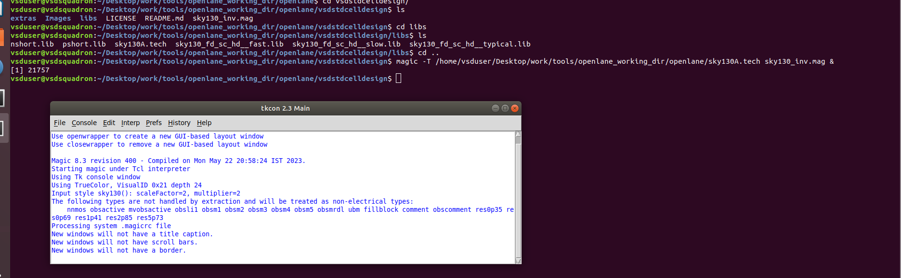

---

### 2) Opening the Layout in Magic

```bash
magic -T sky130A.tech sky130_inv.mag &
```

This loads the inverter layout using the sky130A technology file, which defines the layer stack (nwell, pdiff, ndiff, poly, locali, viali, metal1, etc.).

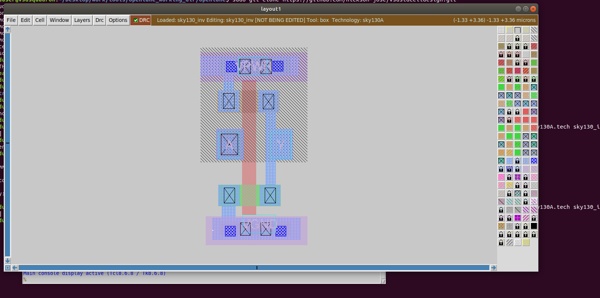

---

### 3) Inspecting Layers and Labels — the `what` Command

With a region selected in Magic, typing `what` in the **tkcon** console prints which mask layers and labels are attached to the selection. This is how the ports (`A`, `Y`, `VPWR`, `VGND`) are verified against the correct metal/diffusion layers.

```tcl
% what
Selected mask layers:
    metal1  ( Topmost cell in the window )
Selected label(s):
    "VPWR" is attached to metal1 in cell def sky130_inv
```

**Theory:** Each label (`A`, `Y`, `VPWR`, `VGND`) is a *port* of the standard cell. Their layer and (x, y) position are exactly what later shows up in the `.ext` file under `port "..." ...` lines — this is what lets the cell be instantiated as a black box (LEF abstract) in a larger design.

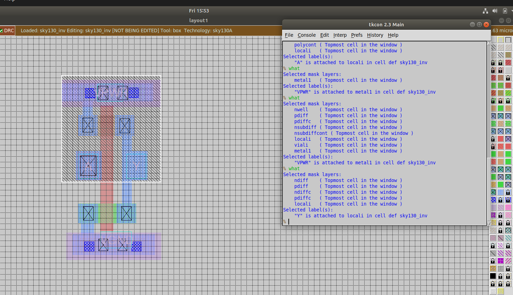

---

### 4) LEF: Layout vs. Abstract View

A standard cell delivered to a place-and-route tool doesn't need full transistor detail — it only needs the **abstract view**: the outline, the pin shapes (`A`, `Q`/`Y`), and the power rails (`VDD`, `GND`). Everything else (transistor geometry, routing inside the cell) is hidden. This is why the extraction step below only needs to expose the ports correctly — the P&R tool never looks inside.

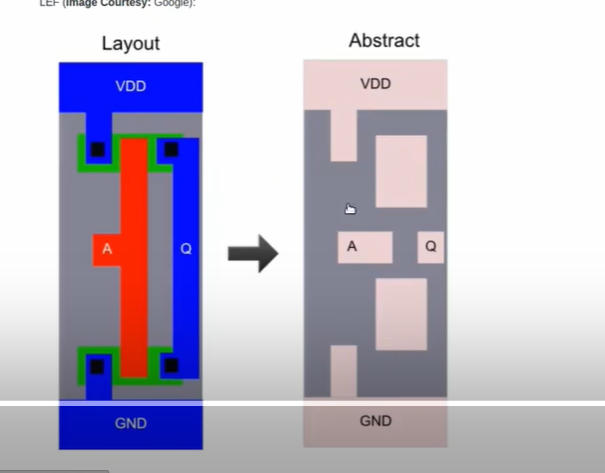

---

### 5) DRC Check

The **DRC** toggle button (top-left of the Magic window, shown green/checked) is enabled so any design-rule violations are flagged live while editing, per the sky130A rule deck.

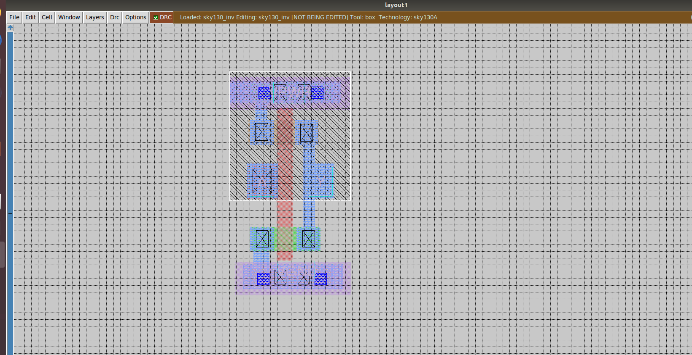

---

### 6) Extracting the SPICE Netlist from the Layout

In the Magic **tkcon** console, from inside the project directory:

```tcl
% pwd
/home/vsduser/Desktop/work/tools/openlane_working_dir/openlane/vsdstdcelldesign
% extract all
Extracting sky130_inv into sky130_inv.ext:
% ext2spice cthresh 0 rthresh 0
% extract all
Extracting sky130_inv into sky130_inv.ext:
```

- `extract all` walks the layout and produces `sky130_inv.ext` — a technology-independent netlist with devices, nodes, and parasitics.
- `ext2spice cthresh 0 rthresh 0` sets the **capacitance** and **resistance thresholds** to 0, so *every* parasitic cap/res is written out instead of being pruned as "too small to matter" (important for accurate transient sim on a small cell).
- `extract all` is re-run after setting thresholds so the `.ext` file picks up the new extraction settings.

> The LEF box shown in the console (`{FIXED_BBOX 0 0 138 272}`, 0.230 µm × 1.200 µm) confirms the abstract's fixed outline used for placement.

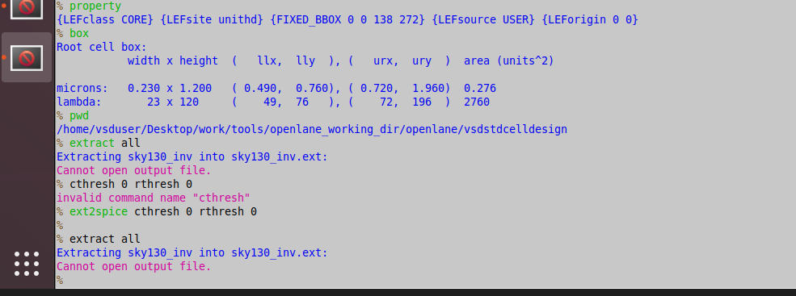

---

### 7) Reading the `.ext` File

The `.ext` file is Magic's internal extracted-netlist format — not SPICE yet.

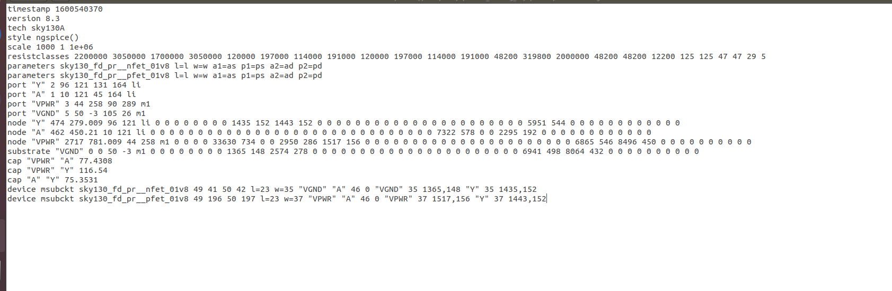

| Field | Meaning |
|---|---|
| `port "Y" 2 96 121 131 164 li` | Port `Y`, on layer `li` (local interconnect), at the given bounding box |
| `node "A" 462 450.21 ...` | Node `A` with its extracted resistance/area data |
| `cap "VPWR" "A" 77.4308` | Parasitic capacitance (aF) between `VPWR` and `A` |
| `device msubckt sky130_fd_pr__nfet_01v8 ...` | The transistor instance — an NMOS with `l=23 w=35`, tied to `VGND` |
| `device msubckt sky130_fd_pr__pfet_01v8 ...` | The PMOS instance, tied to `VPWR` |

This is the raw data `ext2spice` will translate into a `.spice` deck.

---

### 8) Generating the SPICE Deck

```bash
ext2spice sky130_inv.ext
```

This produces `sky130_inv.spice`, initially with the device lines commented as a `.subckt` (i.e. `//.subckt ... //.ends`) so the models can be dropped straight into a larger testbench:

```spice
//.subckt sky130_inv A Y VPWR VGND
M1000 Y A VPWR VPWR pshort w=37 l=23
+  ad=1443 pd=152 as=1517 ps=156
M1001 Y A VGND VGND nshort w=35 l=23
+  ad=1435 pd=152 as=1365 ps=148
VDD VPWR 0 3.3V
VSS VGND 0 0V
Va A VGND PULSE(0V 3.3V 0 0.1ns 0.1ns 2ns 4ns)
C0 A Y 0.05fF
C1 Y VPWR 0.11fF
C2 A VPWR 0.07fF
C3 Y 0 0.24fF
C4 VPWR 0 0.59fF
//.ends
.tran 1n 20n

.control
run
.endc
.end
```

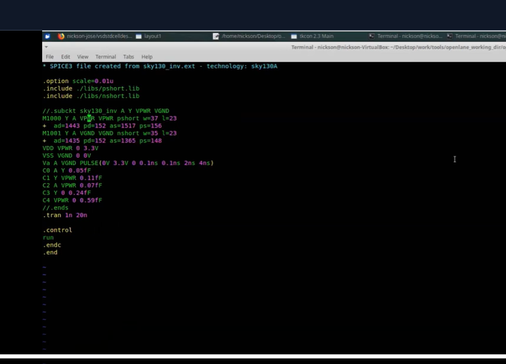

---

### 9) Fixing the Deck for Simulation

The auto-generated deck needs a few corrections before it simulates correctly:

| Problem | Fix | Why |
|---|---|---|
| `X0`/`X1` (subckt-instance prefix) used with `pshort_model.0`/`nshort_model.0` | Use `M0`/`M1` instead | `X` means "instantiate a subcircuit"; `pshort_model.0`/`nshort_model.0` are **models**, not subckts |
| PMOS (`pshort`) tied to `VGND`, NMOS (`nshort`) tied to `VPWR` | Swap: PMOS body/source → `VPWR`, NMOS body/source → `VGND` | Standard CMOS convention — getting this backwards biases the devices wrong and can blow up the transient solver (`Timestep too small` abort) |
| `PULSE(0V 3.3V 0 0.1ns 2ns 4ns)` — only 6 args | `PULSE(0V 3.3V 0 0.1ns 0.1ns 2ns 4ns)` — 7 args | PULSE needs `V1 V2 TD TR TF PW PER` |
| `printall` | `print all` | needs the space to be parsed as a valid ngspice command |
| open `.subckt`/`.ends` with no instantiation | comment out as `*.subckt` / `*.ends` | an un-instantiated open subckt leaves no top-level circuit for `.tran` to simulate |

Final corrected deck:

```spice
* SPICE3 file created from sky130_inv.ext - technology: sky130A

.option scale=0.01u
.include ./libs/pshort.lib
.include ./libs/nshort.lib

*.subckt sky130_inv A Y VPWR VGND
M0 Y A VPWR VPWR pshort_model.0 ad=1.44n pd=0.152m as=1.37n ps=0.148m w=35 l=23
M1 Y A VGND VGND nshort_model.0 ad=1.44n pd=0.152m as=1.52n ps=0.156m w=37 l=23
VDD VPWR 0 3.3V
VSS VGND 0 0V
Va A VGND PULSE(0V 3.3V 0 0.1ns 0.1ns 2ns 4ns)
C0 Y A 0.0754f
C1 A VPWR 0.0774f
C2 Y VPWR 0.117f
C3 Y VGND 0.279f
C4 A VGND 0.45f
C5 VPWR VGND 0.781f
*.ends
.tran 1n 20n

.control
run
print all
plot y vs time a
.endc
.end
```

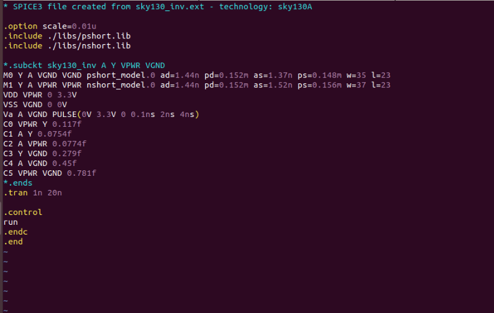

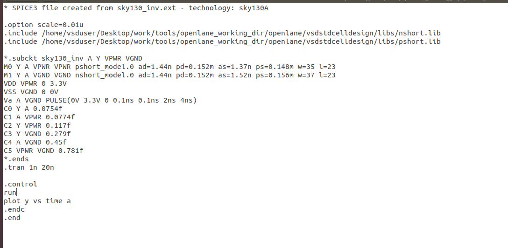

---

### 10) Running ngspice

```bash
ngspice sky130_inv.spice
```

On a correct run, ngspice auto-executes `.control ... run ... .endc` and immediately prints the **Initial Transient Solution** — the DC operating point at t=0 — followed by the full transient data.

**Reading the table:** with `a = 0` (input low) at t=0, `y` (output) should sit near `VPWR` (3.3 V) — this confirms the PMOS/NMOS connections are correct (see the fix table above).

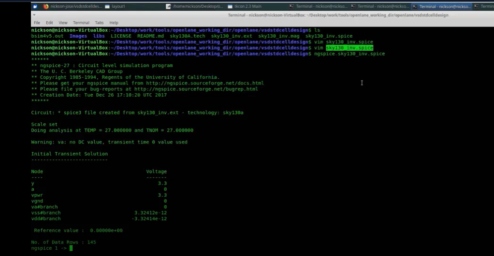

Before the fix (PMOS tied to `VGND`, NMOS tied to `VPWR`), `y` came out to an invalid ~0.47 V and the run aborted with `doAnalyses: TRAN: Timestep too small`:

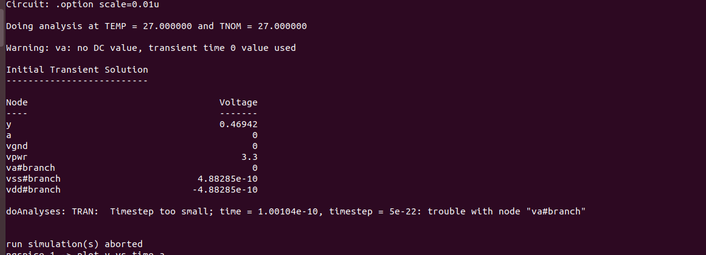

**Troubleshooting — "no such vector":** If `plot y vs time a` (or `print all`) is typed manually **before** `run` has actually completed, ngspice has no data yet:

```
ngspice 1 -> plot y vs time a
Error: no such vector y
```

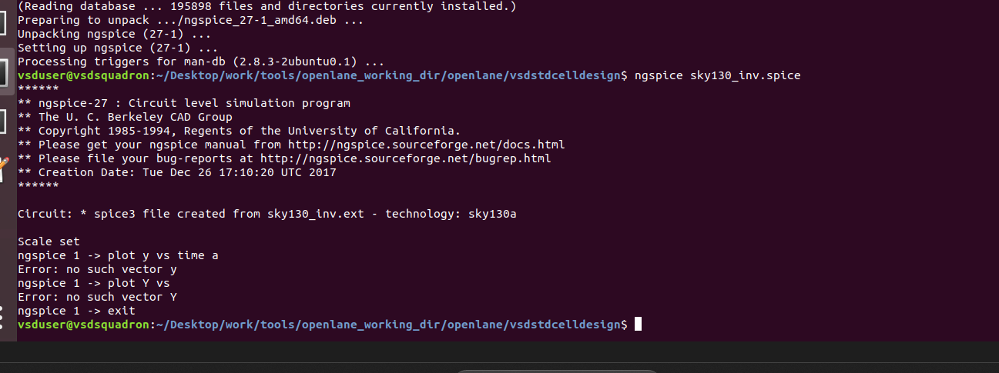

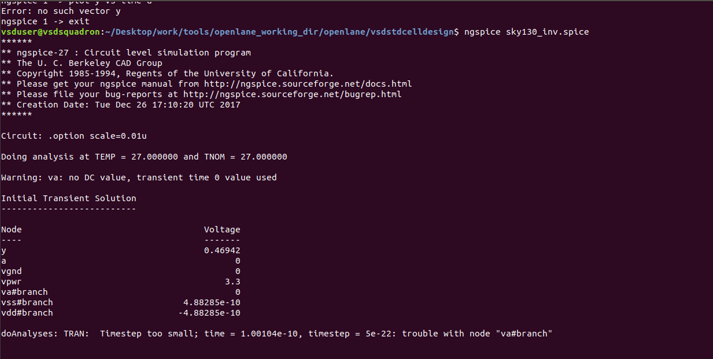

**Fix:** run `display` at the `ngspice 1 ->` prompt to list the vectors that actually exist, and make sure `run` (or a `.control` block containing `run`) has completed before plotting.

---

### 11) Plotting and Reading the Switching Threshold

Once the deck runs cleanly, the input (`a`, blue) and output (`y`, red) transient waveforms show a clean, rail-to-rail inverting square wave over the full 20 ns sweep:

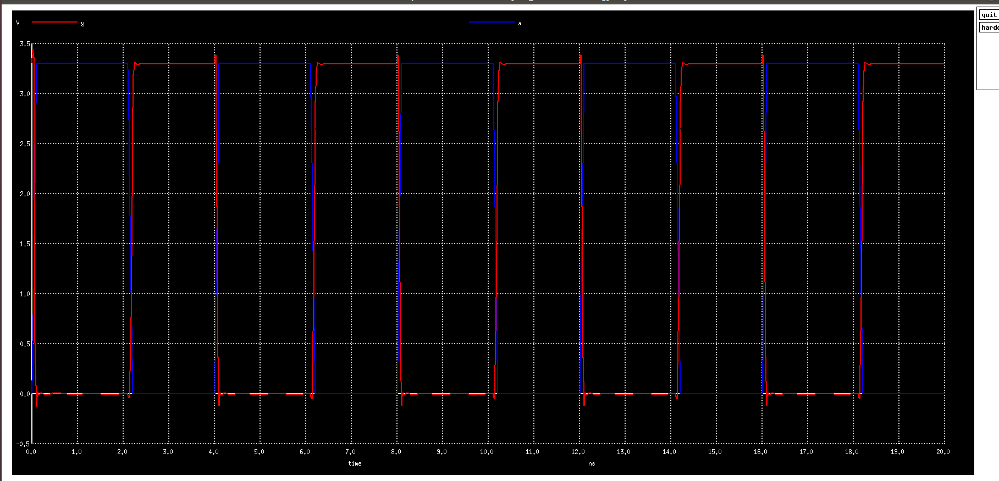

Zooming into one edge (drag-select a box in the ngspice plot window) isolates the region where `a` and `y` cross — this is the **switching threshold** region:

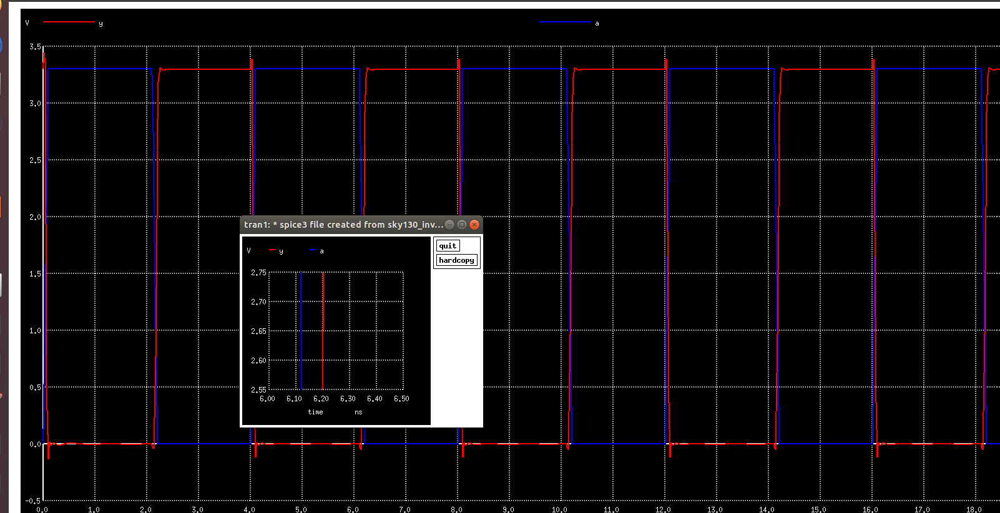

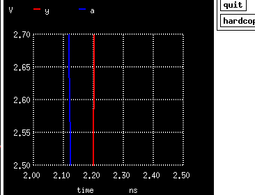

**Theory — Switching Threshold (Vm):** Vm is defined as the input voltage at which `Vin = Vout` on the transfer characteristic (or, on a transient plot, the output voltage level the falling/rising edges are centered around as `a` crosses its own transition). It's a key inverter figure of merit — it tells you how balanced the pull-up (PMOS) and pull-down (NMOS) drive strengths are. A Vm close to `VDD/2` (≈1.65 V here) indicates a well-balanced inverter; a Vm skewed toward VDD or GND indicates the PMOS or NMOS is comparatively stronger.

To read exact crossing coordinates instead of eyeballing the plot, ngspice's cursor/measure output in the console gives `x0, y0` pairs directly:

```
x0 = 2.42169e-09, y0 = 1.51648   x1 = 2.10843e-09, y1 = 1.33516
dx = -3.13253e-10, dy = -0.181319
dy/dx = 5.78825e+08   dx/dy = 1.72764e-09
```

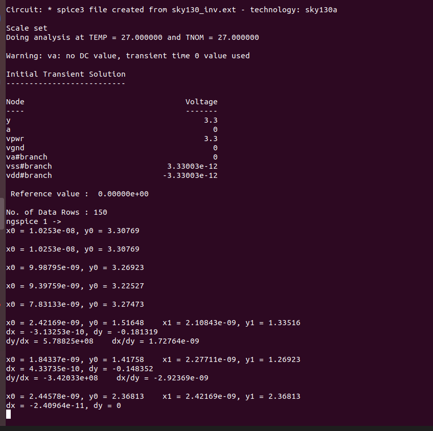

---

### Command Summary

```bash
# 1. Clone the repo
sudo git clone https://github.com/nickson-jose/vsdstdcelldesign.git

# 2. Open the layout in Magic
magic -T sky130A.tech sky130_inv.mag &
```
```tcl
# 3. Inspect a selection
% what

# 4. Extract layout -> .ext, with full parasitics
% extract all
% ext2spice cthresh 0 rthresh 0
% extract all
```
```bash
# 5. Generate the SPICE deck from the .ext file
ext2spice sky130_inv.ext

# 6. (after manually fixing the deck - see Section 9) simulate
ngspice sky130_inv.spice
```
```
# 7. Inside ngspice, if it stops at the prompt without a table:
display          # list currently available vectors
run              # force the .tran to execute
print all        # dump the transient table
plot y vs time a # plot output vs input
```

---

### Summary Table

| Step | Tool | Command(s) | Output |
|---|---|---|---|
| Clone repo | git | `git clone ...vsdstdcelldesign.git` | Project folder with `.mag`, `.tech`, `libs/` |
| View layout | Magic | `magic -T sky130A.tech sky130_inv.mag &` | Layout window |
| Inspect layers/labels | Magic tkcon | `what` | Layer + port info |
| Extract | Magic tkcon | `extract all`, `ext2spice cthresh 0 rthresh 0`, `extract all` | `sky130_inv.ext` |
| Generate SPICE | shell | `ext2spice sky130_inv.ext` | `sky130_inv.spice` (raw) |
| Fix deck | manual edit | swap PMOS/NMOS nets, `X`→`M`, fix `PULSE(...)`, `print all` | corrected `sky130_inv.spice` |
| Simulate | ngspice | `ngspice sky130_inv.spice` | Initial Transient Solution + transient data |
| Analyze | ngspice | `plot y vs time a`, zoom, cursor read `x0,y0` | Switching threshold Vm |

---

## Reference
Sky130 Module 3 - Design library and characterization workshop, "Labs for CMOS inverter ngspice characterization" (SKY_L0–SKY_L5) and "Inception of Layout" (custom standard cell) lab series (SKY_L1–SKY_L9).
