# Day 8 — Post-Synthesis STA, Custom Cell Integration, Placement & Clock Tree Synthesis (Sky130 / OpenLANE)

Today's session covers four things that all fed into each other on the `picorv32a` design, run through the OpenLANE + OpenROAD flow on the Sky130 PDK:

1. Recapping **setup timing analysis** theory (ideal clocks, jitter, flip-flop internals) and **clock tree / signal-integrity** concepts (buffering, crosstalk-induced skew, glitches, clock net shielding).
2. Wiring a **custom standard cell** (`sky130_vsdinv`) into the flow via `EXTRA_LEFS` / `EXTRA_LIBS`.
3. Running **post-synthesis Static Timing Analysis** with OpenSTA outside the full flow (`pre_sta.conf`), and working through a string of path/shell/syntax errors to get a clean report.
4. Pushing the design through **Placement → Macro Placement → Resizer → Clock Tree Synthesis**, hitting and resolving three distinct OpenROAD failures along the way (`ORD-0003`, `MAPL-3`, missing `.lib` files).

---

## Course Progress Checklist

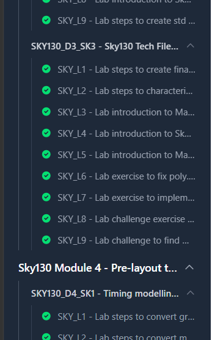
*SKY130_D3_SK3 wrapping up + Sky130 Module 4 (Pre-layout timing) checklist begins*

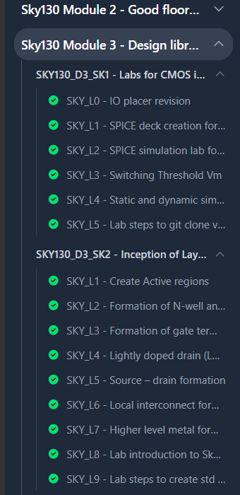
*Sky130 Module 2/3 checklist — CMOS labs, floorplanning, layout inception (all complete)*

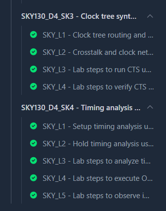
*SKY130_D4_SK3 (Clock Tree Synthesis) and SKY130_D4_SK4 (Timing analysis) checklist — complete*

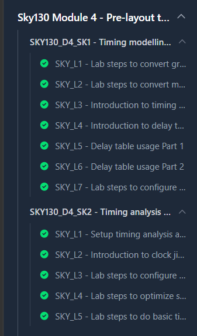
*SKY130_D4_SK1 (Timing modelling) and SKY130_D4_SK2 (Timing analysis basics) checklist — complete*

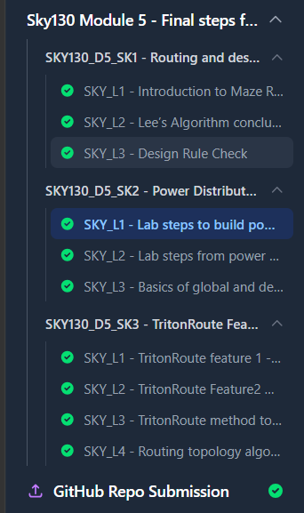
*Sky130 Module 5 (Routing, PDN, TritonRoute) checklist and final GitHub repo submission — complete*

---

## Theory Recap — Timing, Clock Tree & Signal Integrity

*Setup analysis, single clock: launch/capture flop, jitter (theta), setup slack condition theta < (T-S)*

*Same setup-timing diagram — the real window within which the clock edge can arrive on silicon*

*Setup analysis diagram with numeric example: T = 1ns, S (setup time) assumed 10ps = 0.01ns*

*Inside a flip-flop: Mux1/Mux2 master-slave structure, D/Q_M/Q waveforms, capture flop D-pin timing*

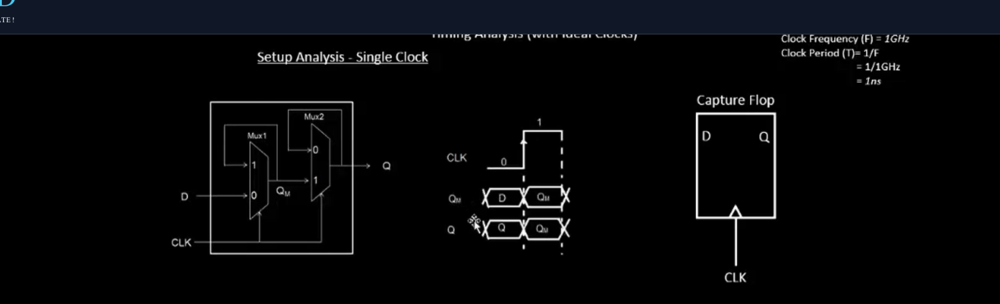
*Full view of the master-slave mux flip-flop model used to explain setup time*

*Course breadcrumb: Sky130 Module 4 > SKY130_D4_SK2 > SKY_L1 — Setup timing analysis lecture*

*CTS (Buffering) concept diagram — H-tree style clock distribution with decap/filler blocks*

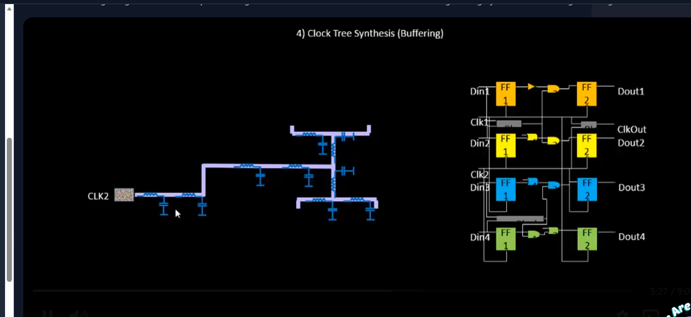
*Zoomed CTS buffering diagram — CLK2 net fanning out through inserted buffers to leaf flops*

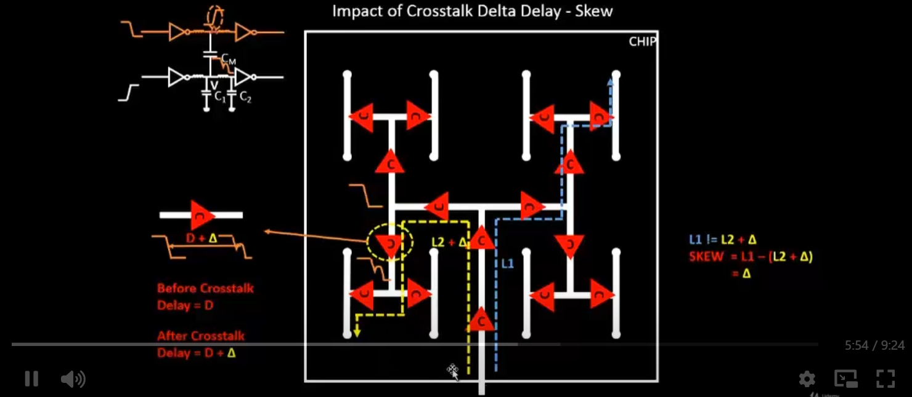
*Impact of crosstalk delta-delay on clock skew: SKEW = L1 - (L2 + delta)*

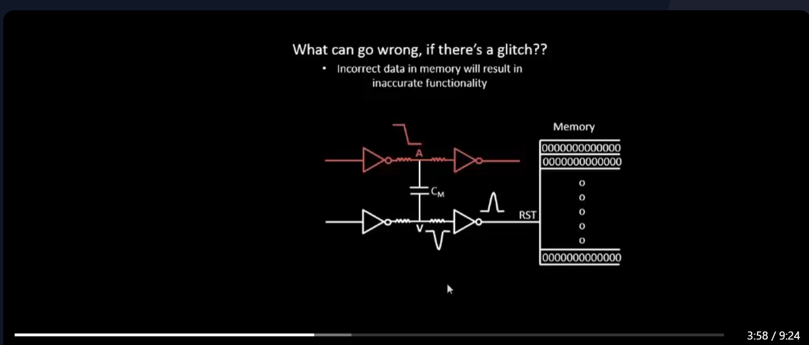
*What goes wrong with a glitch: a coupled glitch on a reset/clock line can corrupt memory contents*

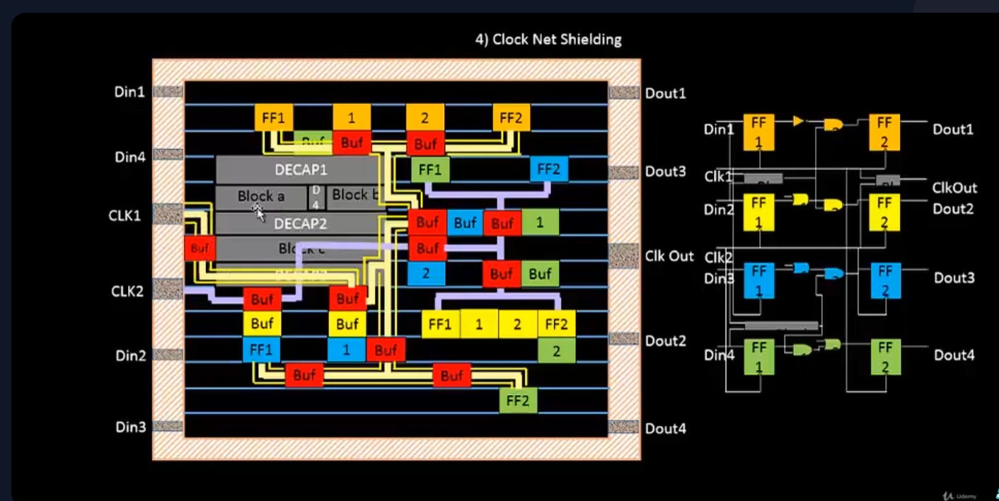
*Clock net shielding: routing clock nets between grounded shield wires to suppress crosstalk*

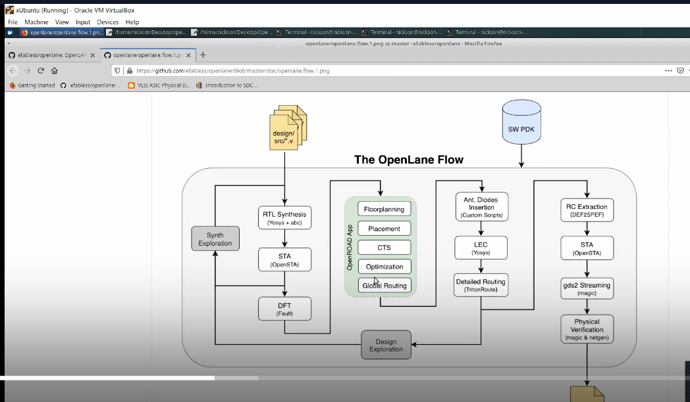
*The OpenLANE flow diagram — Floorplan -> Placement -> CTS -> Optimization -> Global Routing, inside OpenROAD*

---

## Custom Standard Cell Integration — sky130_vsdinv

![First sight of the recurring OpenROAD error: [ERROR ORD-0003] 0 does not exist](images/img018.png)
*First sight of the recurring OpenROAD error: [ERROR ORD-0003] 0 does not exist*

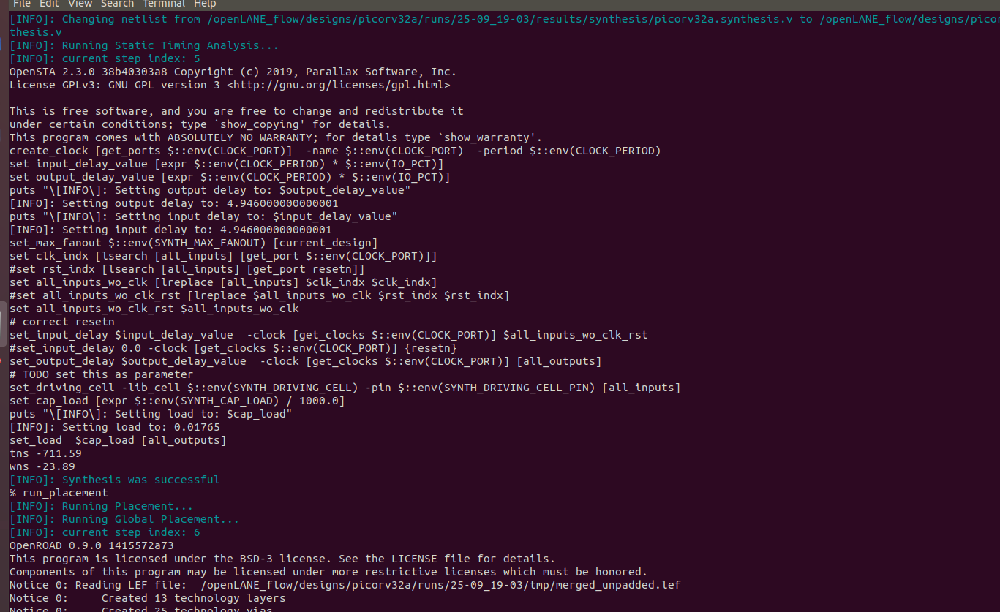
*Pre-crash STA settings (clock, I/O delay, driving cell, cap load) — Synthesis was successful, tns -711.59 / wns -23.89*

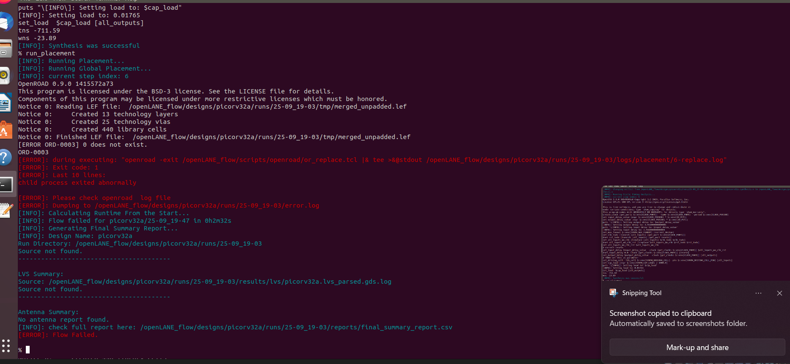
*Global Placement begins right after synthesis, then hits ORD-0003 '0 does not exist' inside or_replace.tcl — Flow Failed*

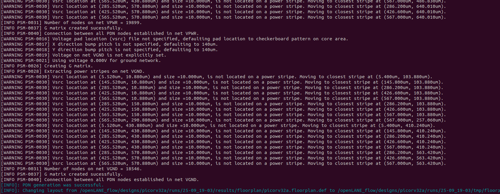
*PDN generation log: PSM-0030 warnings moving Vsrc points onto the nearest power stripe, then 'PDN generation was successful'*

*Placement Design Stats: 19916 instances, 36% utilization (57% padded), HPWL before/after with -1.8% delta*

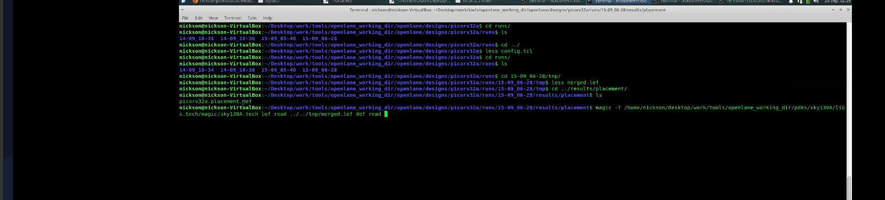
*Older run (15-09_06-28) — loading merged.lef and placement.def into Magic for a visual sanity check*

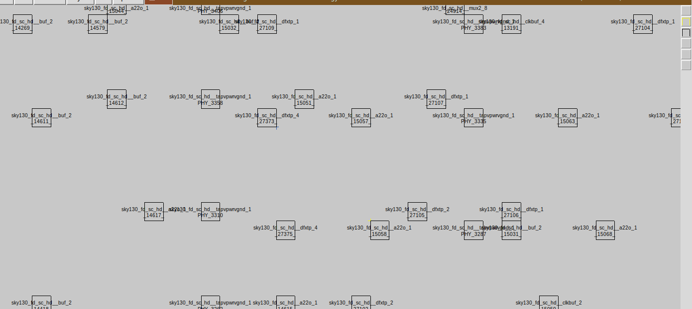
*Magic layout, zoomed: individual placed standard cells labelled (mux2_8, clkbuf_4, dfxtp_1, tapvpwrvgnd_1...)*

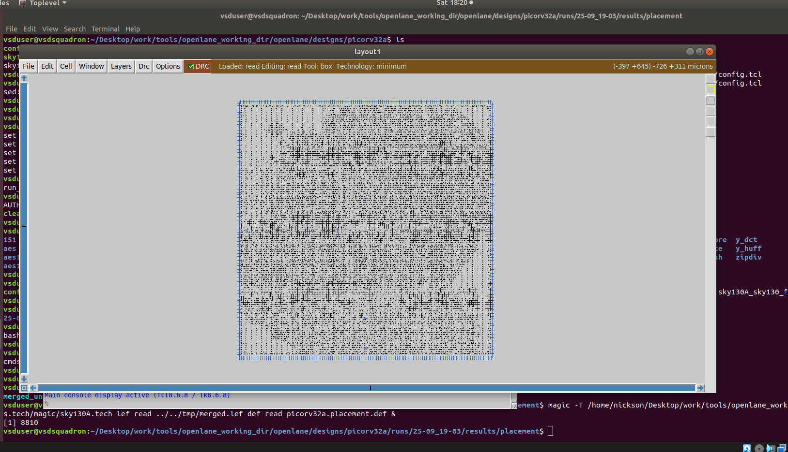
*Magic + Toplevel console — merged.lef and picorv32a.placement.def loaded, full chip rendered*

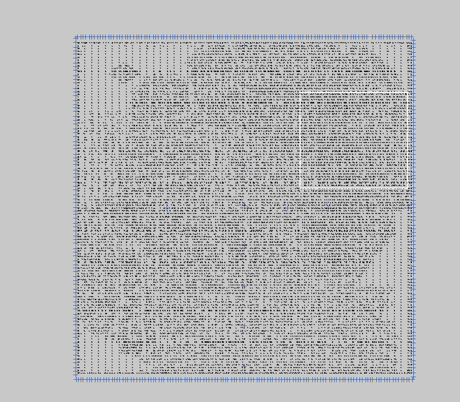
*Full-chip Magic view (zoomed out) of the placed design — dense standard-cell rows across the floorplan*

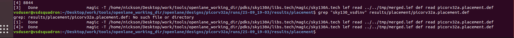
*Checking for the custom cell in the placement DEF: grep 'sky130_vsdinv' -> No such file yet (placement DEF not regenerated)*

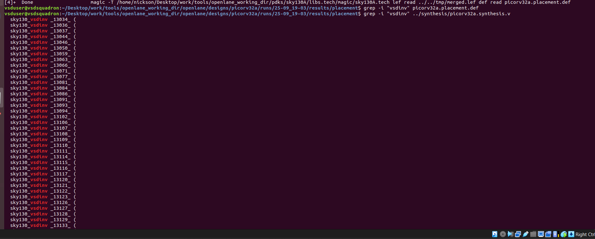
*Magic session: grep -i vsdinv across placement.def / synthesis.v — custom inverter instances (_13034_, _13037_, ...) confirmed present*

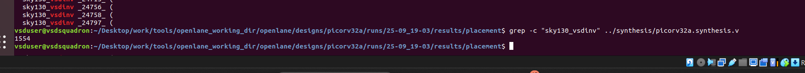
*grep -c 'sky130_vsdinv' synthesis.v -> 1554 instances; EXTRA_LEFS/EXTRA_LIBS not yet set in config.tcl*

*Same check repeated — 1554 sky130_vsdinv instances confirmed synthesized into the netlist*

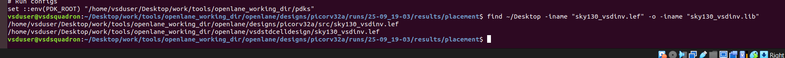
*find ~/Desktop -iname sky130_vsdinv.lef — file exists under both src/ and vsdstdcelldesign/*

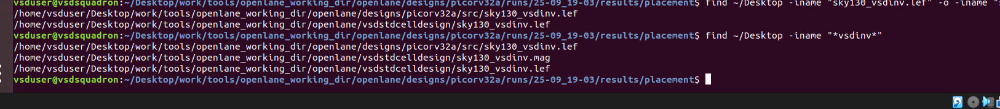
*find ~/Desktop -iname '*vsdinv*' — locates the .lef and the original .mag cell view*

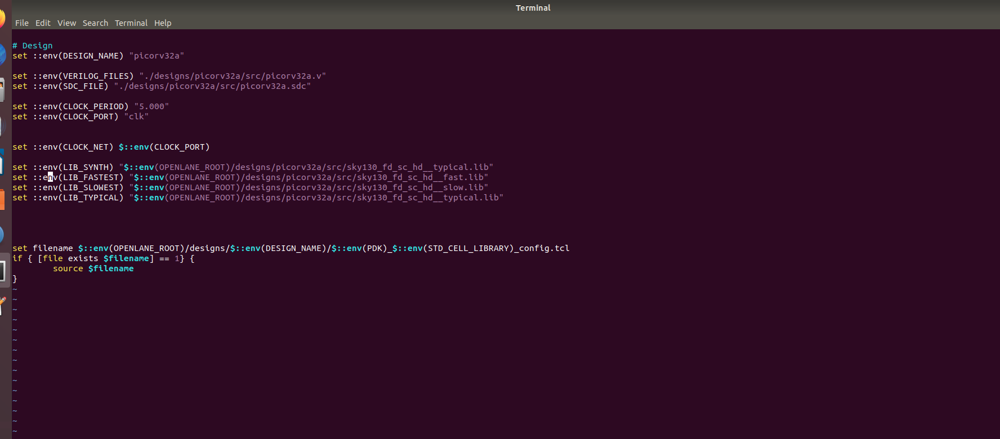
*config.tcl for picorv32a: DESIGN_NAME, VERILOG_FILES, SDC_FILE, CLOCK_PERIOD/PORT, LIB_SYNTH/FASTEST/SLOWEST/TYPICAL*

*config.tcl edited to add EXTRA_LEFS -> sky130_vsdinv.lef and EXTRA_LIBS -> sky130_vsdinv.lib*

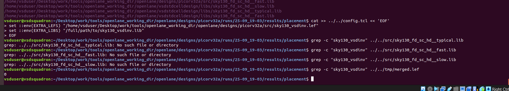
*grep 'sky130_vsdinv' across typical/fast/slow libs (not found) and tmp/merged.lef -> 0 matches, before the fix lands*

---

## Post-Synthesis Static Timing Analysis (OpenSTA) — the pre_sta.conf saga

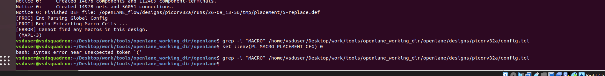
*sta pre_sta.conf -> Error: base.sdc, 8 ambiguous command name 'get' (Tcl can't resolve which get_* command was meant)*

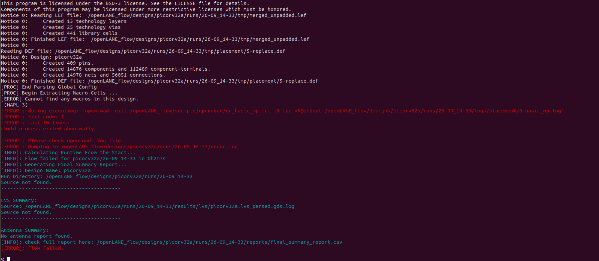
*Appending EXTRA_LEFS / EXTRA_LIBS to config.tcl for sky130_vsdinv, then re-checking the .lib files for the custom cell*

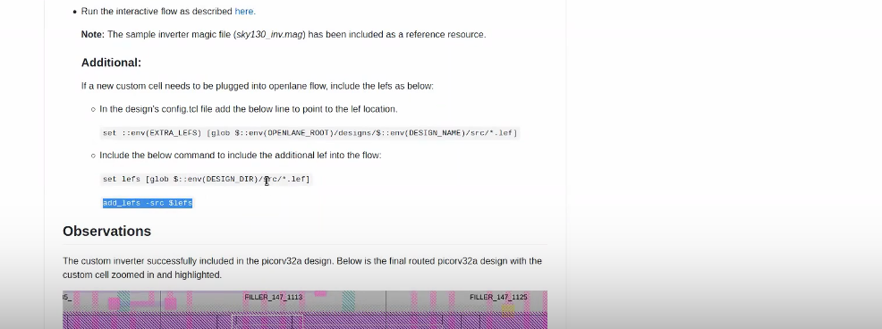
*Wrong shell: 'sudo docker run ... efabless/openlane' drops into bash-4.2, so 'package require openlane' fails ('command not found')*

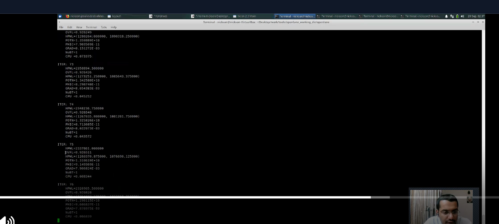
*Same mistake repeated on a fresh docker run — package require only works inside the openlane Tcl interactive shell, not bash*

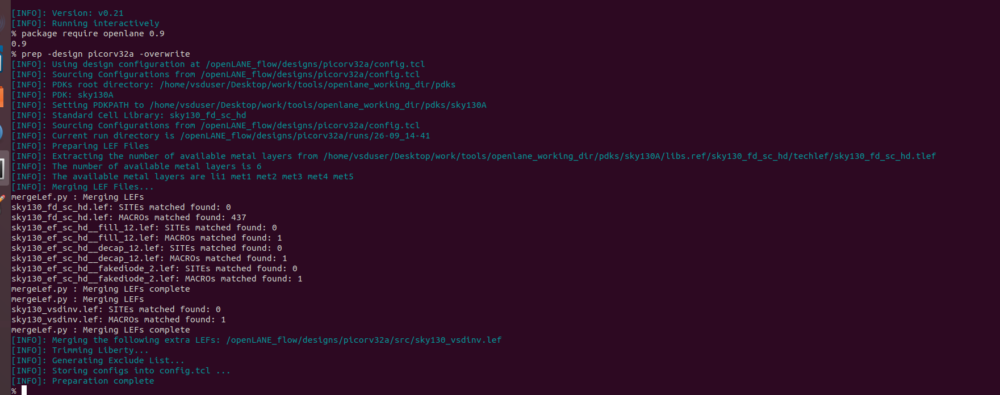
*Correct entry point: 'prep -design picorv32a -overwrite' inside the openlane Tcl shell — LEFs merged successfully, including sky130_vsdinv.lef*

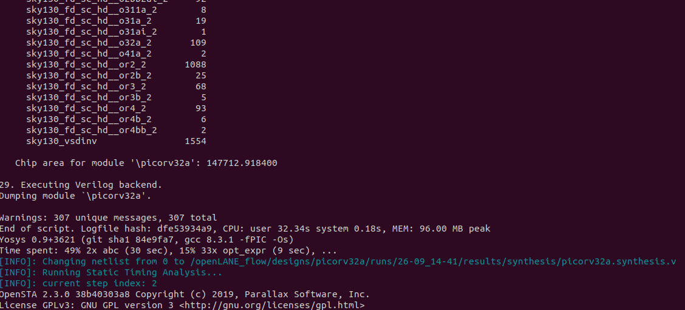
*Design cell histogram after synthesis — sky130_vsdinv: 1554 — followed by Static Timing Analysis kicking off in OpenSTA 2.3.0*

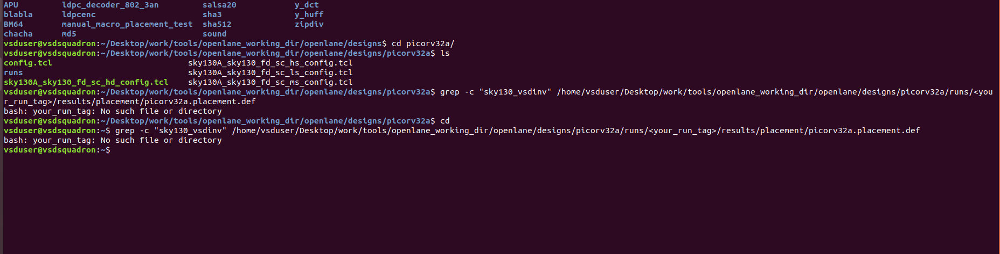
*Listing example OpenLANE designs, cd into picorv32a, checking config variants (sky130A_*_config.tcl)*

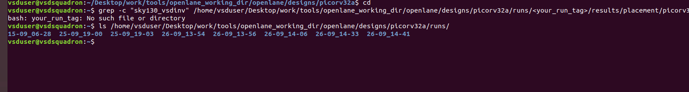
*grep for a placeholder <your_run_tag> path fails as expected — need the real run-directory timestamp instead*

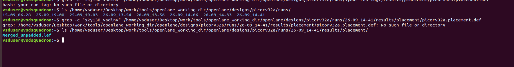
*Same placeholder mistake retried; ls runs/ to find the actual run folder names*

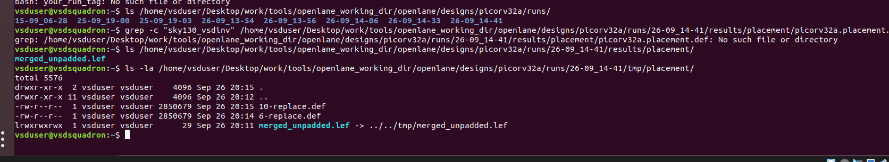
*grep 'sky130_vsdinv' on results/placement/picorv32a.placement.def -> not found yet; only tmp/placement/10-replace.def & 6-replace.def exist*

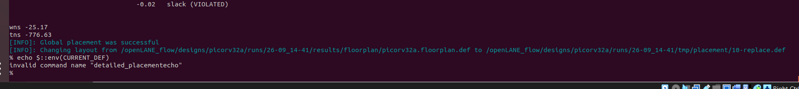
*'Global placement was successful', wns -25.17 / tns -776.63 — then a stray 'echo $::env(CURRENT_DEF)' triggers an invalid-command-name typo*

*grep -c 'sky130_vsdinv' tmp/placement/10-replace.def -> 1554 — custom cell confirmed present after placement*

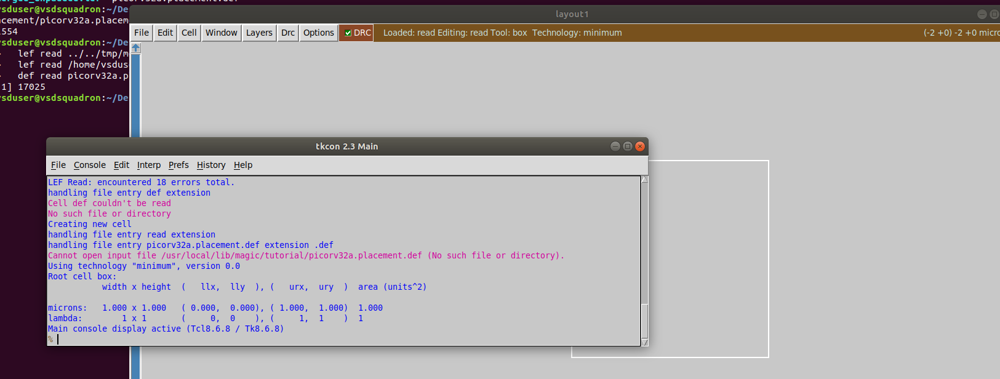
*Magic + tkcon: LEF read encountered 18 errors ('Cell def couldn't be read' / 'No such file'), root box collapses to 1x1 micron*

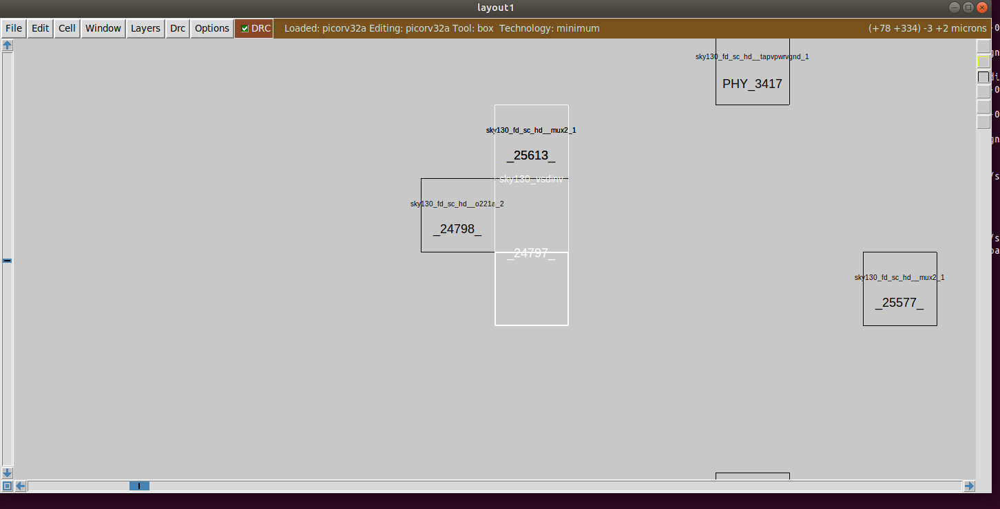
*Magic DRC view after the bad LEF read — only a handful of cells visible (mux2_1, o221a_2, tapvpwrvgnd_1) instead of the full design*

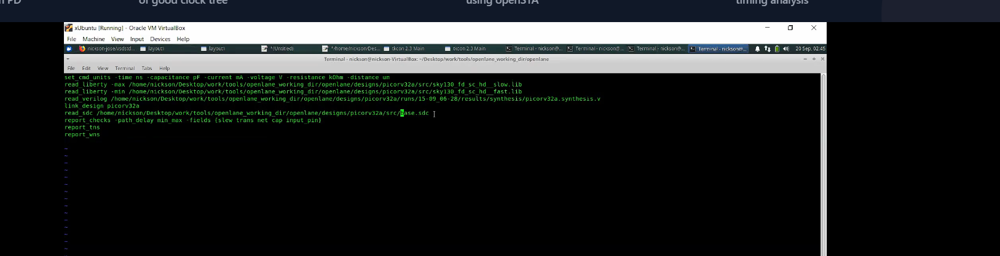
*pre_sta.conf contents: set_cmd_units, read_liberty -max/-min, read_verilog, link_design, read_sdc, report_checks/tns/wns*

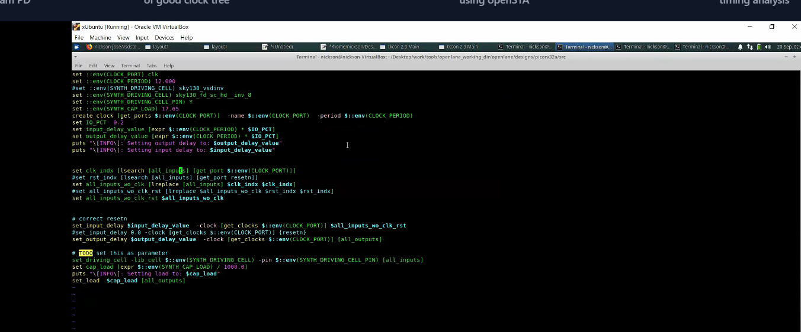
*base.sdc opened directly with CLOCK_PORT=clk and CLOCK_PERIOD=12.000 hard-set for a standalone STA debug run*

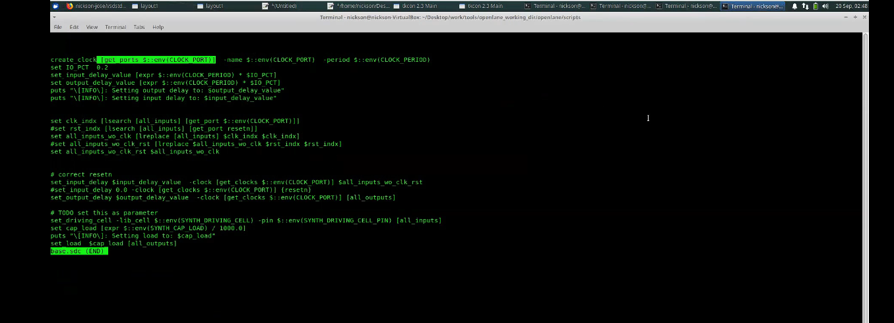
*Full base.sdc reviewed line by line — create_clock, IO_PCT, input/output delay, clk_idx handling, driving cell & cap load setup*

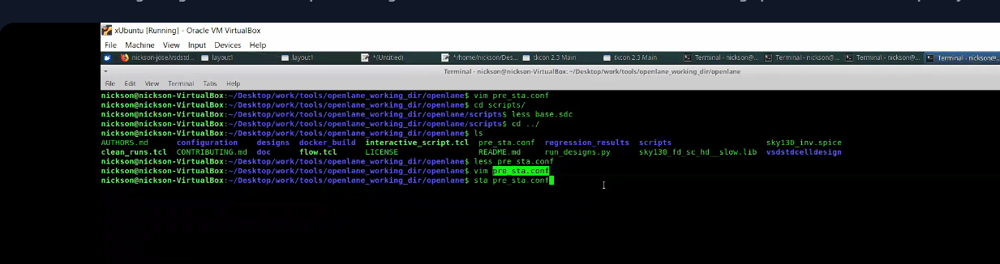
*Re-running the same vim/less/sta sequence to retry the STA flow after edits*

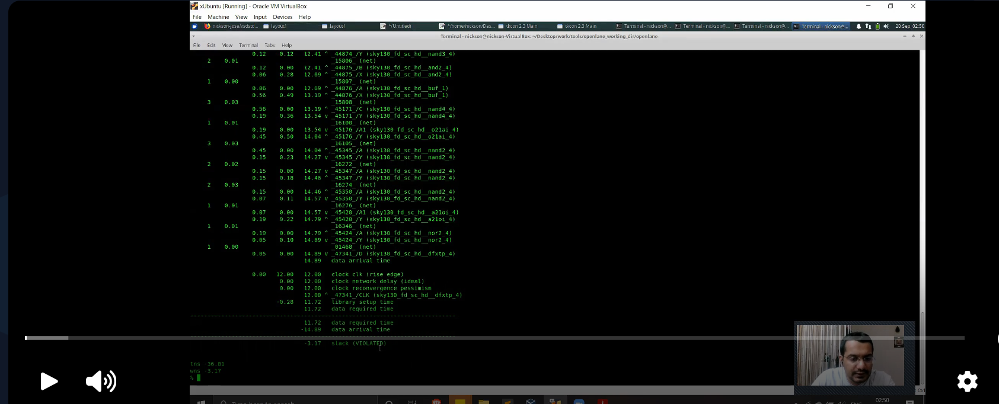
*Long STA path report scrolling by (an earlier attempt) — tns -36.01 / wns -3.17*

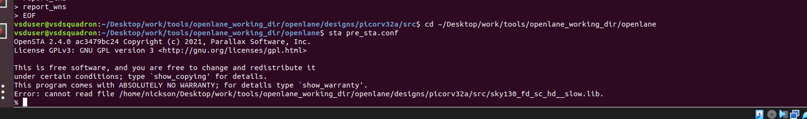
*sta pre_sta.conf still failing: 'cannot read file .../sky130_fd_sc_hd__slow.lib' — path pointed at the wrong home directory (nickson vs vsduser)*

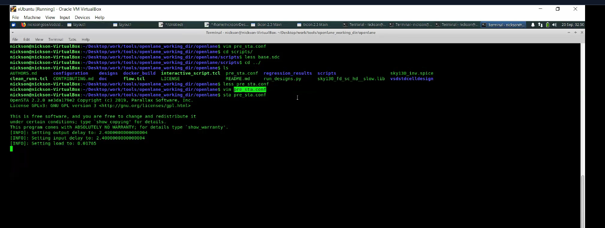
*cat pre_sta.conf | grep read_sdc confirms base.sdc path; sed -n '8p' base.sdc shows the exact create_clock line causing the ambiguous 'get'*

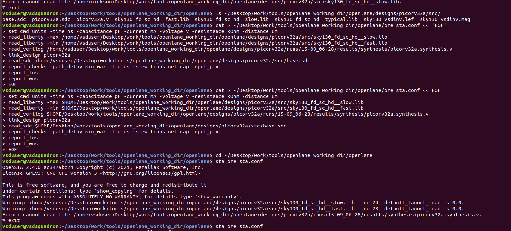
*sta pre_sta.conf rerun — same 'ambiguous command name get' error reproduced cleanly for diagnosis*

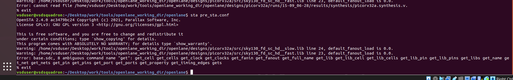
*One more rerun from a clean shell — identical ambiguous-'get' error confirms it's the .sdc syntax, not the environment*

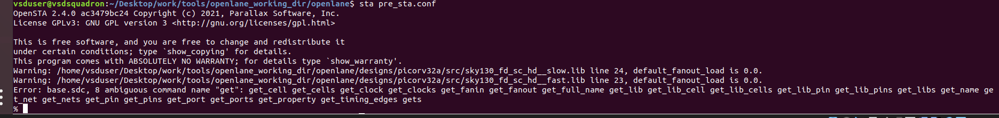
*Wrong-path error again: 'cannot read file /home/nickson/.../sky130_fd_sc_hd__slow.lib' — rewriting pre_sta.conf with a here-doc and $HOME*

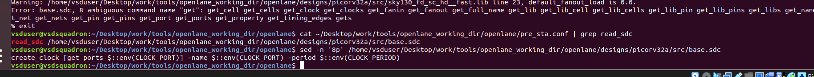
*Rewritten pre_sta.conf (with $HOME substitution) run — progresses further, then fails on a stale synthesis.v from an old run tag*

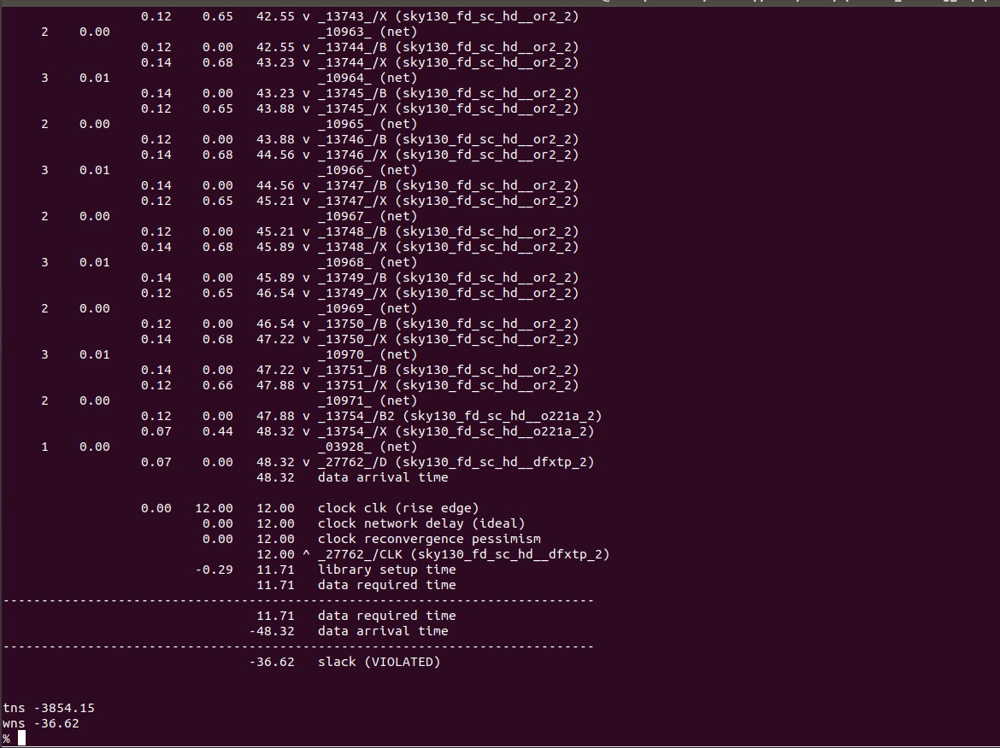
*xUbuntu VirtualBox session: vim pre_sta.conf, less base.sdc, sta pre_sta.conf — output/input delay and load being set correctly*

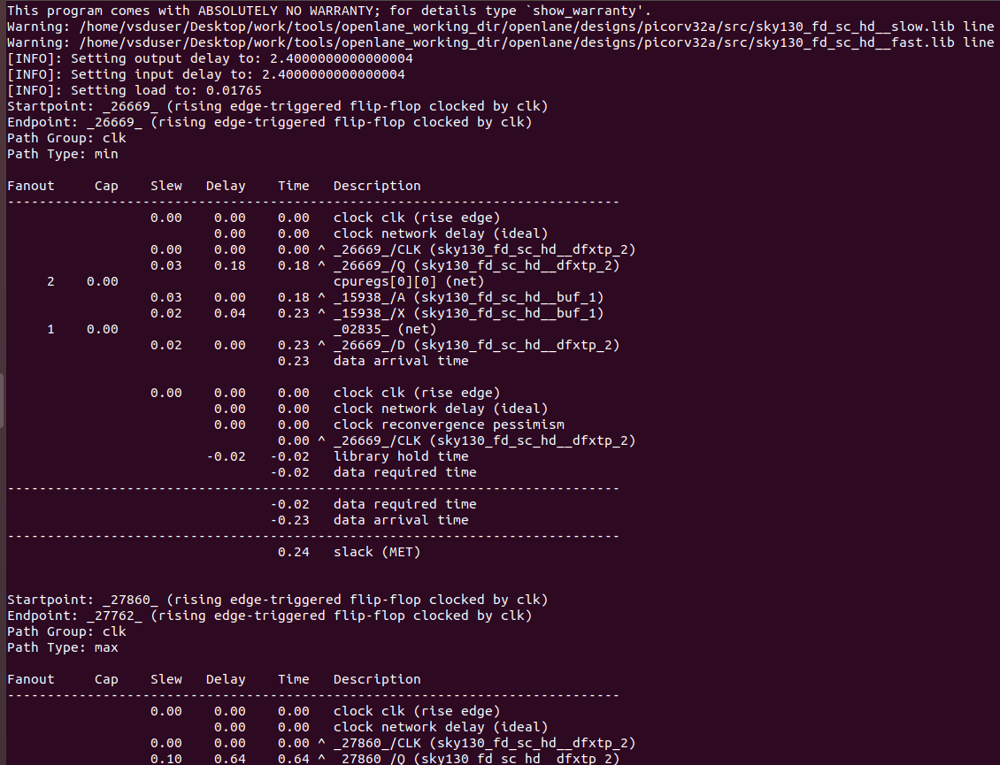
*Same VirtualBox session zoomed — command history for editing and re-running pre_sta.conf*

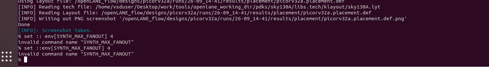
*sky130_fd_sc_hd config.tcl snippet — LIB_SYNTH/FASTEST/SLOWEST/TYPICAL sourced conditionally per standard-cell library variant*

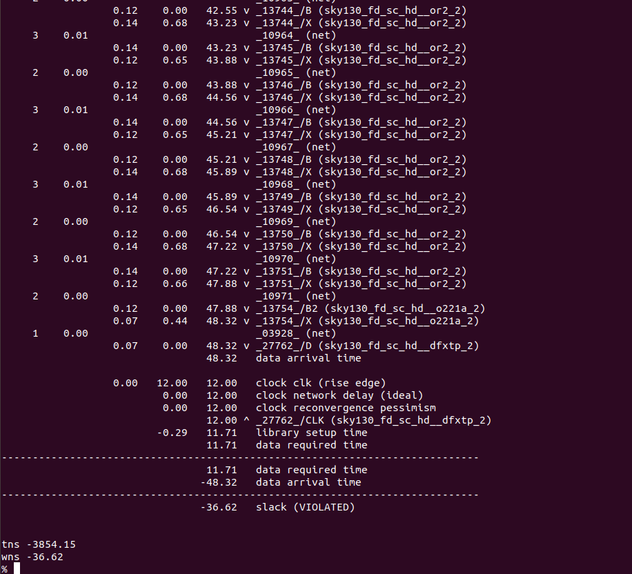
*grep 'EXTRA_LEFS\|EXTRA_LIBS' confirms both variables now point at sky130_vsdinv.lef / .lib in config.tcl*

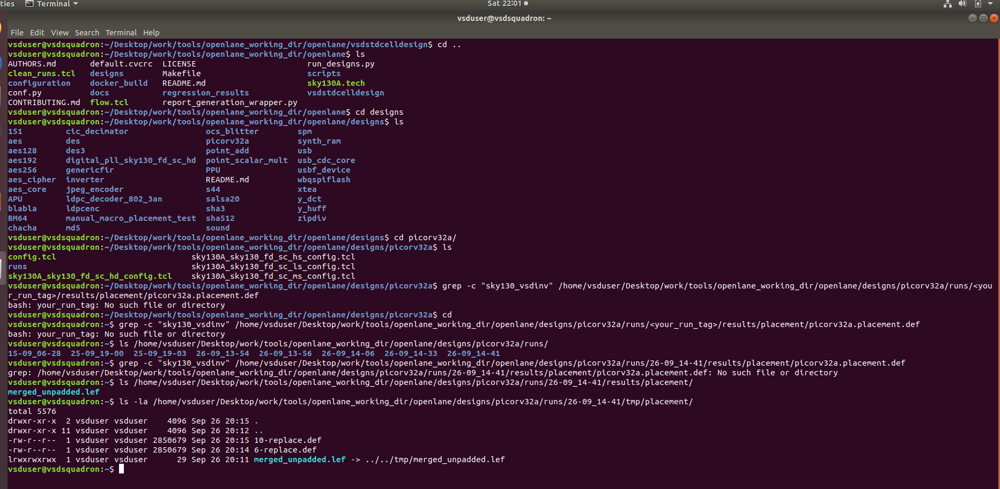
*grep -c 'sky130_vsdinv' across synthesis.v and merged.lef — 1554 instances in the netlist, now also visible in the merged LEF*

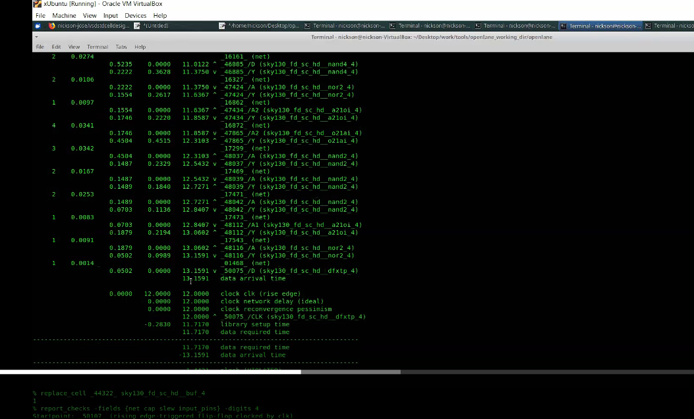
*Verifying the custom cell truly landed in the current run's merged.lef and placement.def, not just an older run*

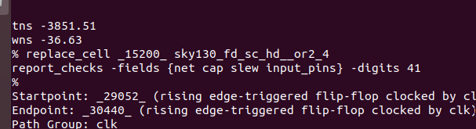
*diff between the project's local sky130_fd_sc_hd__typical.lib and the vsdstdcelldesign reference copy — confirming which one is being read*

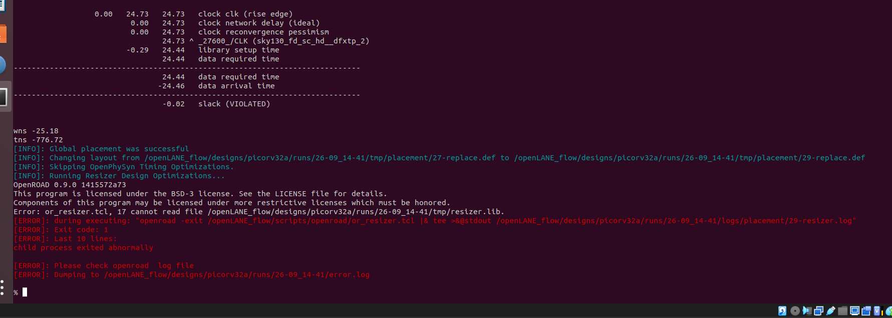
*Final confirmation pass: sky130_vsdinv present in typical/fast/slow libs and picked up correctly for the next OpenLANE stage*

---

## Macro Placement Failure — MAPL-3 'Cannot find any macros'

![[ERROR] Cannot find any macros in this design (MAPL-3) — thrown right after 'Begin Extracting Macro Cells'](images/img069.png)
*[ERROR] Cannot find any macros in this design (MAPL-3) — thrown right after 'Begin Extracting Macro Cells'*

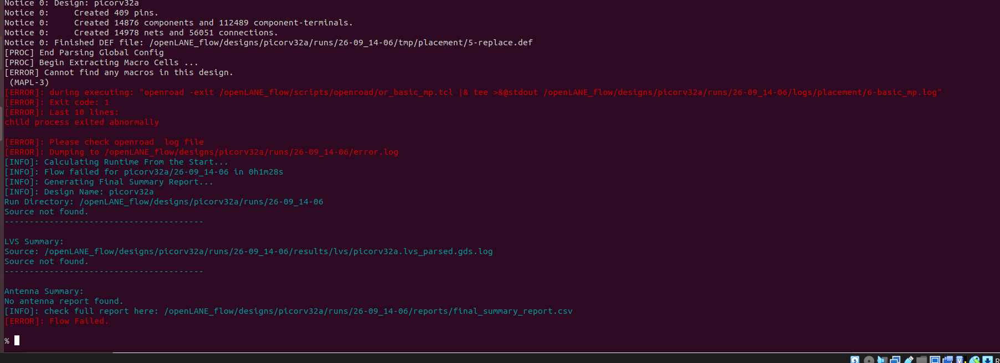
*Flow aborts: or_basic_mp.tcl exits 1, 'Flow failed for picorv32a' — this run's summary reports come back 'Source not found'*

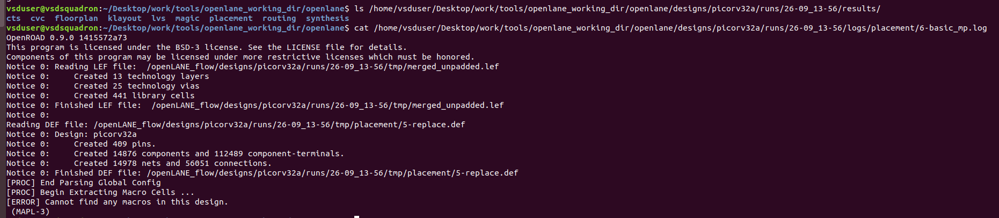
*cat the run's 6-basic_mp.log directly — same MAPL-3 error confirmed in the raw OpenROAD log*

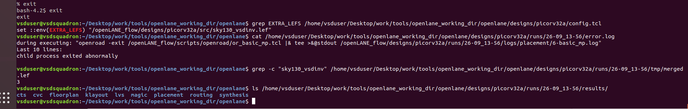
*grep EXTRA_LEFS finds the sky130_vsdinv.lef path already set — but grep -c in merged.lef only returns 3 (partial merge, not full placement)*

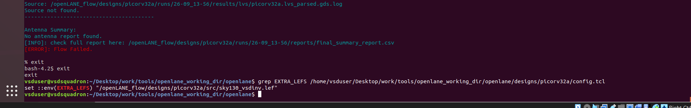
*Re-confirming the EXTRA_LEFS line in config.tcl before digging further into the macro-placement failure*

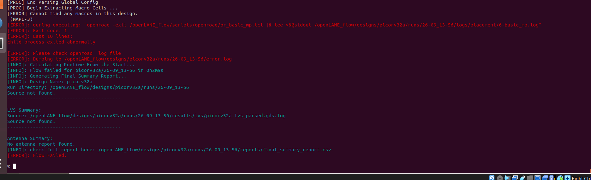
*Full tail of the failed run's error.log — MAPL-3, 'Flow Failed', run 26-09_13-56*

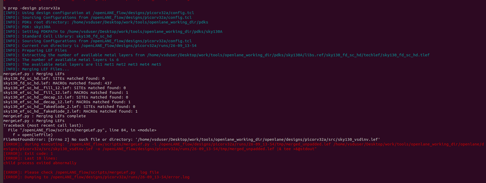
*Root cause found: prep -design's mergeLef.py Traceback -> FileNotFoundError: sky130_vsdinv.lef missing from designs/picorv32a/src/*

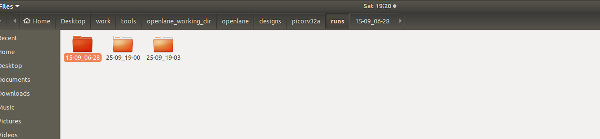
*Files browser: the runs/ directory (15-09_06-28, 25-09_19-00, 25-09_19-03) — checking which run actually has the custom LEF in place*

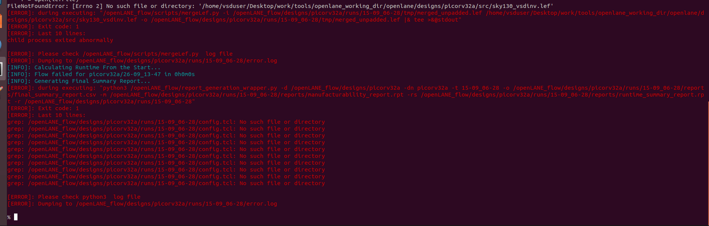
*Same FileNotFoundError reproduced on run 15-09_06-28 — flow fails almost instantly (0h0m0s) since prep never completes*

---

## Environment Slip-ups: Wrong Shell / Docker Session

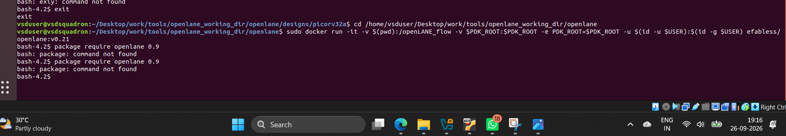
*Windows host: 'sudo docker run ... efabless/openlane:v0.21' drops to bash-4.2 — 'package require openlane 0.9' is not a bash command*

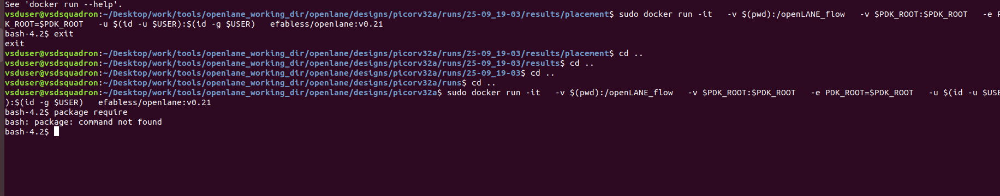
*Same mistake again in a fresh docker session — 'package require' only works once inside the openlane Tcl shell*

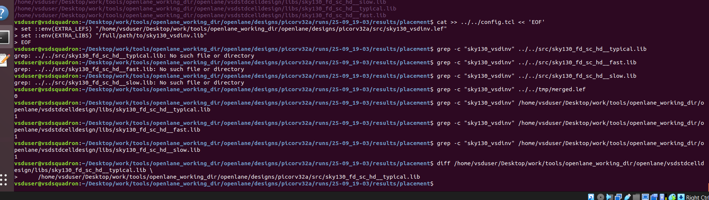
*Idle bash-4.2 prompt inside the container, right before switching to the correct 'openlane' interactive entrypoint*

---

## Resizer Stage Error — or_resizer.tcl cannot read resizer.lib

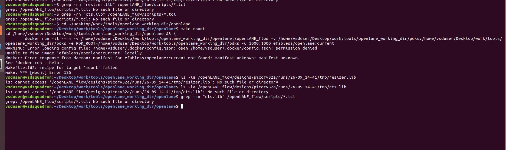
*Docker mount attempt fails with a permission error on .docker/config.json while chasing a missing resizer.lib*

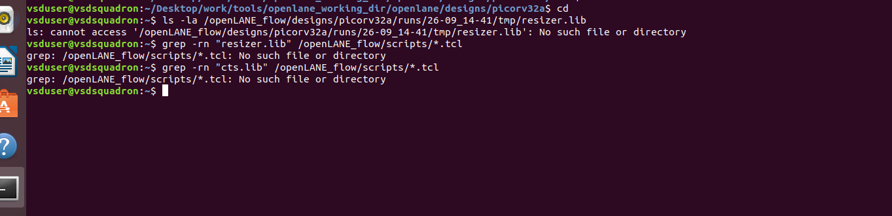
*ls -la tmp/resizer.lib and tmp/cts.lib -> both 'No such file or directory' — confirms the .lib was never generated for this run*

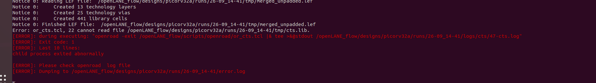
*grep across scripts for 'resizer.lib' / 'cts.lib' comes back empty in this checkout — points at a stale or partial OpenLANE script tree*

---

## Placement / Resizer Timing Snapshots

*Design Stats after a fresh placement run: 19916 instances, 234 rows, row height 2.7u — matches the earlier successful run*

*An earlier placement run's Design Stats (run 25-09_19-03): 19916 instances, 36%/53% utilization, HPWL delta 2% — used as the baseline to compare later runs against*

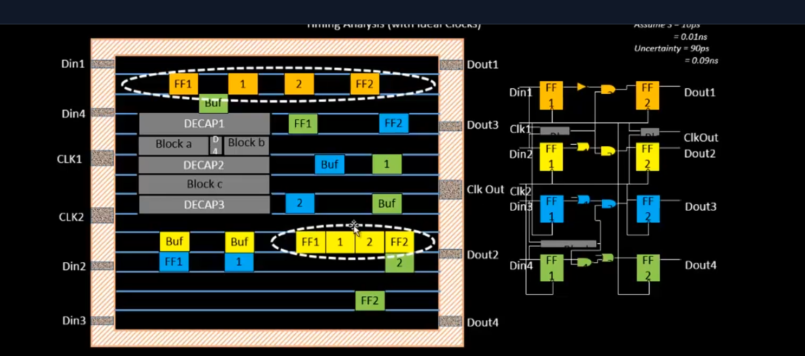
*Final sanity check on merged.lef before the EXTRA_LEFS fix: sky130_vsdinv still absent, confirming the custom cell had not been merged in yet*

---

## Clock Tree Synthesis (CTS) — Source Review & the cts.lib Debugging Saga

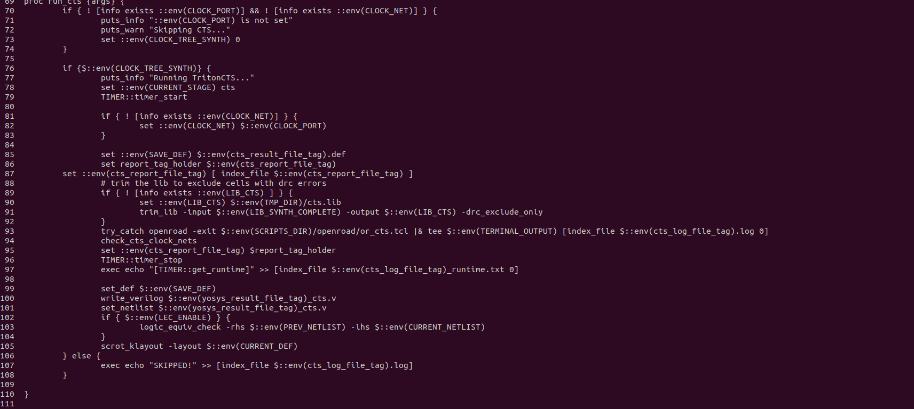
*cts.tcl's run_cts proc: if CLOCK_NET isn't set it falls back to CLOCK_PORT, trims the liberty to build cts.lib, then calls or_cts.tcl via TritonCTS*

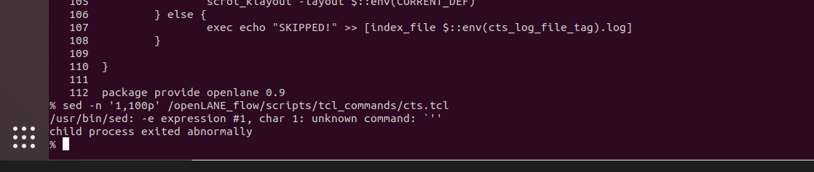
*Trying to view cts.tcl with sed at the shell prompt — wrong shell context again ('unknown command' from /usr/bin/sed vs the Tcl shell)*

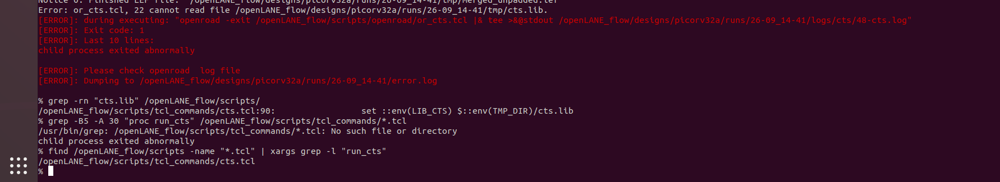
*Root cause pinned down: 'Error: or_cts.tcl, 22 cannot read file .../tmp/cts.lib' — the trimmed liberty file was never written for this run*

![The original symptom: [ERROR ORD-0003] 0 does not exist inside or_cts.tcl — Flow Failed after 0h7m33s](images/img090.png)
*The original symptom: [ERROR ORD-0003] 0 does not exist inside or_cts.tcl — Flow Failed after 0h7m33s*

---

## CTS Success — Final Timing Report & Layout

*Post-CTS OpenSTA report: wns -18.54 / tns -593.91, clock skew reported per flop — 'Clock Tree Synthesis was successful'*

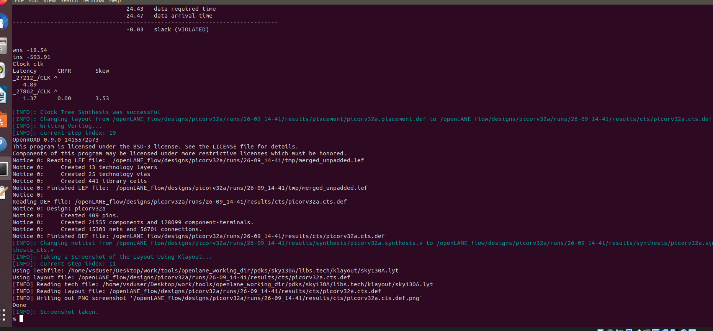
*CTS DEF written (21555 components, 15303 nets), netlist updated to *_cts.v, and a KLayout PNG screenshot of the CTS'd layout is generated*

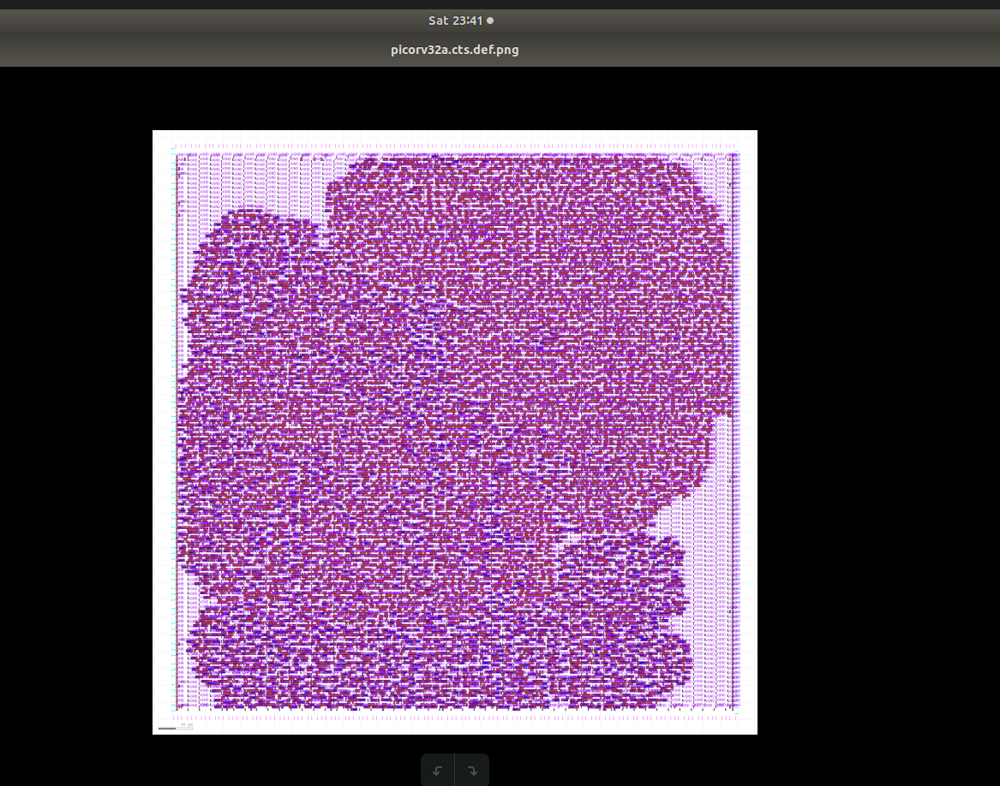
*picorv32a.cts.def.png — the routed clock tree buffers spread across the die after a successful CTS run*

---

## Key Takeaways

- **`EXTRA_LEFS` / `EXTRA_LIBS`** must point at real files that exist *before* `prep -design` runs — `mergeLef.py` fails hard with a `FileNotFoundError` otherwise, which cascades into the confusing downstream `MAPL-3` ('Cannot find any macros') error at the macro-placement stage.
- **`[ERROR ORD-0003] 0 does not exist`** is a generic OpenROAD/Tcl error meaning *some object handle OpenROAD expected doesn't exist* — it showed up twice today for two different reasons: once during `or_replace.tcl` (placement) and once during `or_cts.tcl` (CTS), where the real cause both times was a **missing trimmed `.lib` file** (`resizer.lib` / `cts.lib`) that a prior step should have generated.
- **`sta pre_sta.conf` outside the full flow** is a fast way to sanity-check timing, but it is picky: `read_sdc`'s `create_clock [get ports ...]` needs the *fully-qualified* Tcl command (`get_ports`, not `get`), and every path in `pre_sta.conf` must match the actual home directory / run-tag on disk.
- **`package require openlane`** and other OpenLANE Tcl commands only work *inside* the OpenLANE interactive shell (`docker run ... efabless/openlane` then typing `openlane` or reading `interactive_script.tcl`) — not at the raw `bash-4.2` prompt the container drops you into.
- Once `cts.lib` was actually generated and read, **CTS completed successfully**, and the post-CTS timing report showed the expected clock skew and slack numbers, confirmed visually in the KLayout screenshot of the routed clock tree.
