# Day 8 — Post-Synthesis STA, Custom Cell Integration, Placement & Clock Tree Synthesis (Sky130 / OpenLANE)

Today's session covers four things that all fed into each other on the `picorv32a` design, run through the OpenLANE + OpenROAD flow on the Sky130 PDK:

1. **Setup timing analysis** theory (ideal clocks, jitter, flip-flop internals, the setup-slack equation), **clock reconvergence pessimism removal (CRPR)**, and **clock tree / signal-integrity** theory (why CTS exists, useful skew, crosstalk-induced delay, glitches, clock net shielding).
2. Wiring a **custom standard cell** (`sky130_vsdinv`) into the flow via `EXTRA_LEFS` / `EXTRA_LIBS`.
3. Running **post-synthesis Static Timing Analysis** with OpenSTA outside the full flow (`pre_sta.conf`), and working through a string of path/shell/syntax errors to get a clean report.
4. Pushing the design through **Synthesis → Floorplan → Placement → Macro Placement → Resizer → Clock Tree Synthesis**, hitting and resolving three distinct OpenROAD failures along the way (`ORD-0003`, `MAPL-3`, missing `.lib` files).

---

## Part 1 — Theory

### 1.1 Static Timing Analysis — what it's actually checking

STA verifies, for every register-to-register path in the design, that data launched by one flip-flop arrives at the next flip-flop **neither too late** (setup check) **nor too early** (hold check), relative to the clock edges that launch and capture it. It does this exhaustively, without simulation vectors — every path in the design is checked algebraically against the clock waveform, which is why it scales to millions of gates where simulation cannot.

Two checks matter for every register-to-register path:

- **Setup check (max-delay check):** data must arrive *before* the next active clock edge, with margin for setup time. This bounds how *slow* a path can be, and is what determines the maximum operating frequency of the chip.
- **Hold check (min-delay check):** data must *not* arrive too early and overwrite what the capture flop is still trying to sample from the previous cycle. This bounds how *fast* a path can be, and is independent of clock frequency — a hold violation exists at any speed once it exists.

In OpenSTA's `report_checks -path_delay min_max`, `Path Type: max` lines are setup checks and `Path Type: min` lines are hold checks — both were seen in today's `pre_sta.conf` output.

### 1.2 Setup Timing Analysis — the launch/capture model

A **launch flop** pushes data out on a clock edge; it travels through combinational logic (the "cloud") and must arrive at the **capture flop**'s D pin before the *next* clock edge, with margin for setup time (S) and clock jitter (θ).

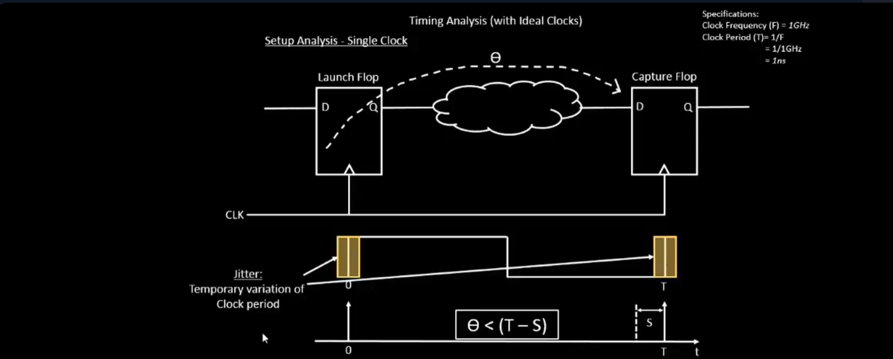
*Launch flop → combinational cloud → capture flop, with clock jitter θ marked on the rising edge*

For a numeric example at **F = 1 GHz** (T = 1/F = 1 ns) with an assumed setup time **S = 10 ps = 0.01 ns**:

- **Condition for correct capture:** `θ < (T − S)`
- The real constraint isn't a single instant — it's a **window** within which the clock edge can arrive on real silicon and still be captured correctly.

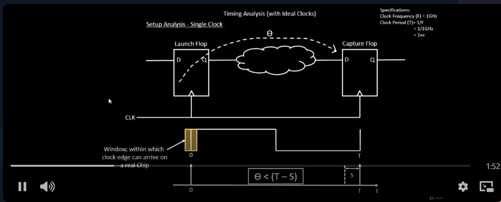
*The shaded window is where the clock edge can legally land on a real chip, not an idealized point in time*

**The general setup-slack equation** that every STA tool ultimately evaluates for a path is:

```
Setup Slack = (T + Skew_useful) − (T_clk-to-q + T_combinational + T_setup)
```

where:
- **T** is the clock period,
- **T_clk-to-q** is the launch flop's clock-to-output delay,
- **T_combinational** is the delay through the logic cloud between the two flops,
- **T_setup** is the capture flop's required setup time,
- **Skew_useful** is the (signed) difference between when the clock edge arrives at the capture flop versus the launch flop — positive if the capture edge arrives *later* than the launch edge (this "buys back" slack; see §1.4).

A **positive slack** means the path meets timing; a **negative (violated) slack** means the path is too slow for the target clock period — exactly what was seen repeatedly in this session's `report_checks` output (e.g. `wns -18.54`, `tns -593.91` after CTS, and standalone-STA violations down to `-36.62`).

**Why jitter eats into the budget:** every extra picosecond of θ directly reduces the (T − S) margin available to real combinational delay. This is exactly why `IO_PCT`, `set_input_delay`, and `set_output_delay` in `base.sdc` exist — they reserve a percentage of the clock period as timing margin at the chip boundary, the same conceptual role that jitter margin plays for internal paths.

### 1.3 Inside a flip-flop — where setup time physically comes from

A standard **master-slave flip-flop** is really two back-to-back latches (Mux1 = master, Mux2 = slave), each built from a 2:1 mux with clock-controlled select lines:

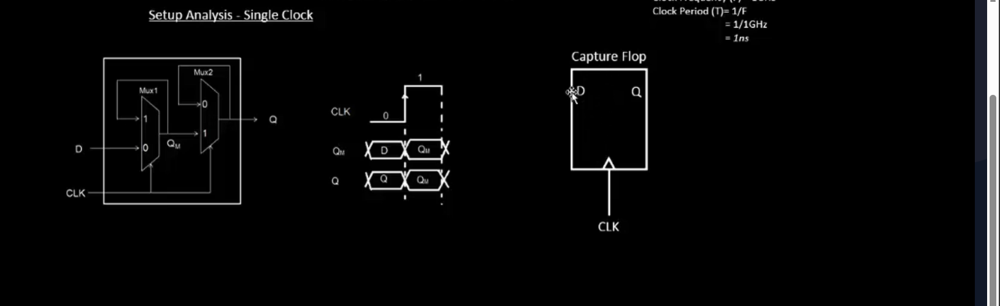
*D feeds Mux1 (master); its output Q_M feeds Mux2 (slave), whose output is Q — CLK toggles which mux passes data through*


*Full view: D must be stable long enough before the clock edge for Q_M to settle — that settling time is exactly where "setup time" comes from*

**Operating sequence:**

1. While **CLK = 0**, the master latch (Mux1) is transparent — it passes D straight through to Q_M. The slave latch (Mux2) is opaque, holding its previous output steady on Q.
2. On the **rising edge of CLK**, the master latch closes (becomes opaque), freezing whatever value Q_M had at that instant, and the slave latch opens, passing that frozen Q_M value through to Q.
3. **Setup time (S)** is therefore the minimum time D must be stable *before* the rising edge — enough time for the internal mux/inverter chain inside the master latch to fully resolve D into a stable Q_M *before* the edge arrives and freezes it. Violate this, and Q_M is still transitioning when the master latch closes, which can propagate a **metastable** (neither-0-nor-1) value into the slave latch and out to Q — the physical root cause every setup check exists to prevent.
4. **Hold time**, by contrast, is the minimum time D must remain stable *after* the edge, so the master latch has fully closed and isn't still transparently passing a changing D through before it locks in.

This is why setup and hold aren't arbitrary tool parameters — they're physically derived from the internal mux/latch delay chain of whichever real standard cell (e.g. `sky130_fd_sc_hd__dfxtp_2`) is instantiated at that flop. Every path trace captured today (see §3.5) ends exactly at a `_dfxtp_2/D` or `_dfxtp_2/CLK` pin for this reason — `dfxtp` is the Sky130 HD library's positive-edge-triggered D flip-flop.

### 1.4 Clock latency, skew, and Clock Reconvergence Pessimism Removal (CRPR)

Every path report captured in this session ends with a block that looks like:

```
0.00   24.73   24.73   clock clk (rise edge)
       0.00    24.73   clock network delay (ideal)
       0.00    24.73   clock reconvergence pessimism
24.73 ^ _26481_/CLK (sky130_fd_sc_hd__dfxtp_2)
```

Three separate numbers stack up to form the **required time** at the capture flop's clock pin:

- **`clock clk (rise edge)`** — the ideal clock edge time, i.e. `N × T` for the Nth rising edge.
- **`clock network delay (ideal)`** — before CTS exists, this is `0` (an *ideal*, zero-latency clock is assumed); after CTS, this becomes the real buffer-chain insertion delay from the clock root to this specific flop's CLK pin (this is exactly the `Latency` column — e.g. `4.89` ns and `1.37` ns for the two flops reported after CTS in Part 8).
- **`clock reconvergence pessimism (CRPR)`** — a *correction*, not a delay. STA computes the launch-clock path and the capture-clock path as two independent traces through the clock tree. If those two paths share a common trunk of buffers before diverging, the tool would otherwise double-count that shared segment's delay/uncertainty once for the launch side and once for the capture side — an artificially pessimistic (falsely tighter) slack. CRPR identifies the shared portion of the two clock paths and subtracts the redundant common-path pessimism back out, which is why it shows as `0.00` for paths whose launch/capture clock trees diverge immediately at the root, and non-zero for paths that share a long common clock buffer chain before splitting to the two flops.

**Why this matters for the numbers seen today:** post-CTS, `wns -18.54` / `tns -593.91` are *after* CRPR has already been applied — so the reported violation is the true, pessimism-corrected number, not an inflated one. This is also why the post-CTS `Skew` column (`3.53` ns on `_27862_/CLK`) is a *real*, physically-buffered skew number, whereas pre-CTS timing (with ideal `0` clock network delay) reports no meaningful skew at all — there's no physical clock tree yet to have skew in.

### 1.5 Clock Tree Synthesis (CTS) — why it exists and what "useful skew" means

In an ideal (ungrounded) design, every flop's clock pin would see the clock edge at exactly the same instant — **zero skew**. In reality, a single clock source cannot physically drive thousands of flops with equal wire length and equal load, so CTS's job is to insert a *tree* of buffers between the clock source and every leaf flop such that:

- **Insertion delay is roughly balanced** across all branches (bounding skew to within a target spec), and
- **Signal integrity is maintained** — each buffer re-drives the signal so slew/transition time doesn't degrade across long branches, and large fanout is split across multiple buffer stages instead of one buffer trying to drive everything.

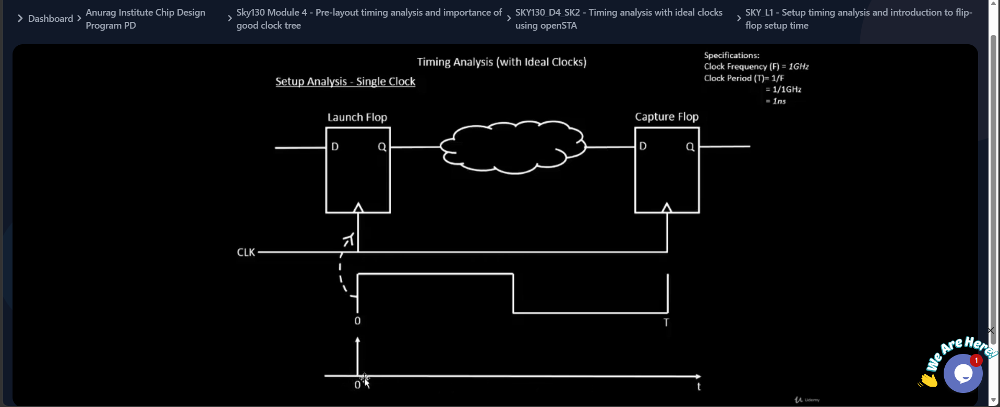
*Clock nets CLK1/CLK2 fan out through inserted buffers to reach every flip-flop (FF1, FF2 pairs) across the die; DECAP/filler blocks sit between rows*

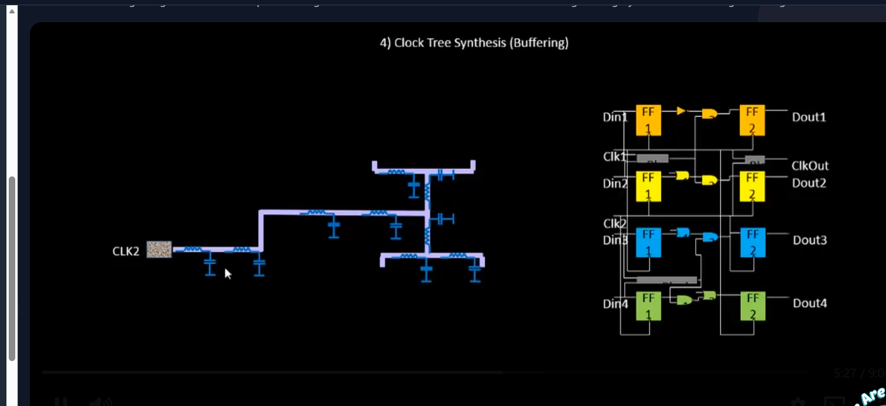
*Zoomed view — CLK2 branches through a chain of inserted buffers before reaching its leaf flip-flops*

**Not all skew is bad — "useful skew."** Recall the setup-slack equation from §1.2: `Setup Slack = (T + Skew_useful) − (...)`. If a path's setup slack is tight, deliberately *delaying* the capture flop's clock edge (positive useful skew on that branch) directly adds slack back to that path — at the cost of subtracting it from the corresponding hold check on the same edge. CTS tools like TritonCTS (used by OpenLANE's `or_cts.tcl` here) can exploit this deliberately rather than simply minimizing skew to zero everywhere; OpenLANE's default objective is still to balance latency/skew per the `CTS_*` config knobs, but the underlying tradeoff is why skew reports (as seen in this session's post-CTS output, e.g. `Skew 3.53`) are read together with slack, not in isolation.

**Why `DECAP`/filler blocks appear alongside the clock buffers** in the diagram above: decoupling capacitance cells are placed near switching-heavy clock buffers to locally stabilize the power rail against the current spikes every buffer transition draws, which in turn keeps the buffer's own delay (and therefore skew) from drifting with supply noise.

### 1.6 Crosstalk, Skew, and Glitches — signal-integrity theory

**Physical origin.** Any two adjacent routed metal wires form a parasitic coupling capacitor (C_M) between them, in addition to each wire's capacitance to ground/substrate. When one wire (the *aggressor*) switches, charge injected across C_M perturbs the voltage on the neighboring wire (the *victim*) — this is crosstalk. The size of the effect scales with how much wire runs in parallel, how close together the wires are, and how fast the aggressor switches (faster edges → more current → more coupled charge in the same time window).

**Crosstalk delta-delay → clock skew.** If the victim net is itself a clock branch, the coupled charge doesn't just add noise — it changes the *effective delay* of that branch by some Δ, because the victim net's own transition is sped up or slowed down depending on whether the aggressor switches in the same or opposite direction. If two clock branches (L1, L2) were designed to arrive together but one picks up Δ from crosstalk, the result is added skew:

```
SKEW = L1 − (L2 + Δ)
```

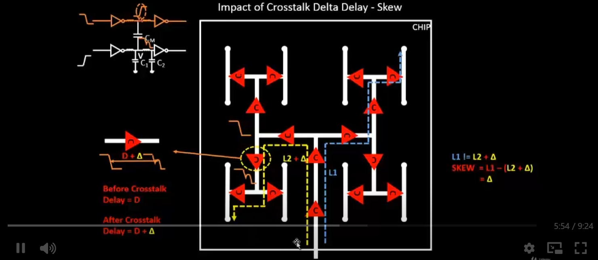
*Before crosstalk: delay = D. After crosstalk: delay = D + Δ. The mismatch between branches becomes skew = Δ*

This is functionally identical in *effect* to the useful-skew term in the setup equation (§1.4) — except it's **unintentional and data-dependent**, so it can't be compensated for at design time the way deliberate useful skew can; it has to be bounded instead, via spacing, shielding, or routing rules.

**Why a glitch is dangerous.** If the coupled Δ is large enough — for example when several aggressors switch simultaneously next to the same victim — the injected noise can be large enough to look like a full logic transition rather than just a delay shift. A coupled *glitch* on a clock or (worse) an asynchronous reset line can be misread by a flip-flop as a real clock/reset edge, triggering an unintended capture or reset cycle and silently corrupting whatever state was stored.

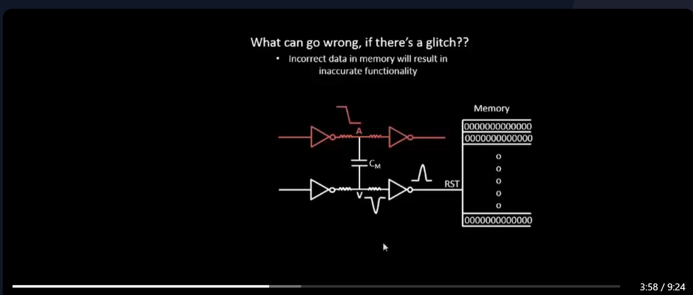
*A glitch coupled onto a reset line corrupts what would otherwise be valid memory content — "Incorrect data in memory will result in inaccurate functionality"*

This is qualitatively worse than a timing violation: a slow path just needs a slower clock to still function correctly, but a glitch-induced false capture is a **functional** failure that no amount of clock slowdown fixes, because it isn't a delay problem — it's a false logic-level event.

**Mitigation — Clock Net Shielding.** Routing the clock net between grounded (or VDD-tied) shield wires reduces the effective coupling capacitance between the clock net and any adjacent signal net, because the shield wire — held at a fixed potential — absorbs the coupled field instead of the signal wire seeing it. This directly reduces both the delta-delay (skew) mechanism and the glitch-injection mechanism described above, at the cost of extra routing tracks consumed by the shield wires themselves — a direct area/congestion tradeoff CTS and routing stages have to balance.

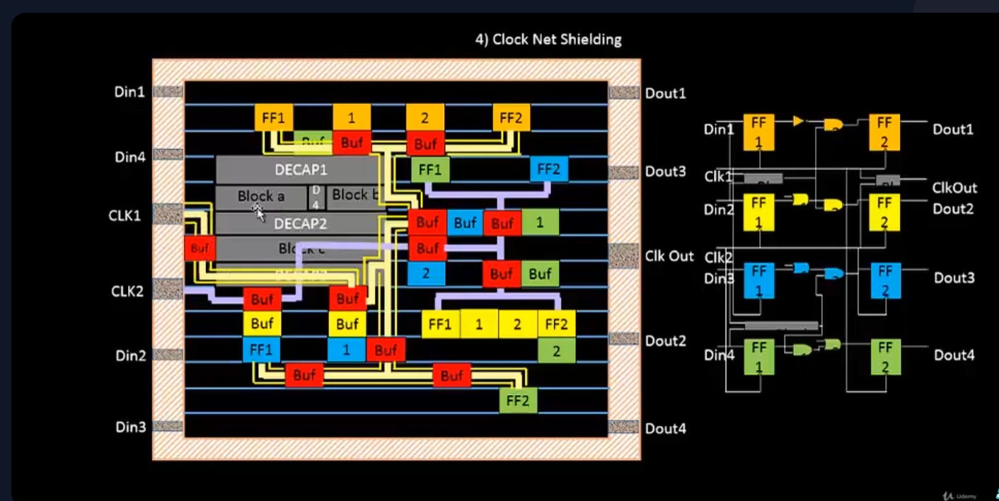
*Clock nets (CLK1/CLK2) routed with dedicated shield tracks on either side, isolating them from Din/Dout signal nets*

### 1.7 The OpenLANE Flow — what each stage actually does

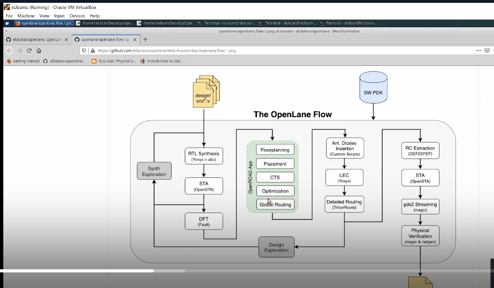
*`design/src/*.v` + the Sky130 PDK feed into: RTL Synthesis (Yosys+abc) → STA (OpenSTA) → DFT (Fault) → Floorplanning → Placement → CTS → Optimization → Global Routing (all inside OpenROAD) → Antenna/Diode Insertion → LEC → Detailed Routing (TritonRoute) → RC Extraction → STA → GDSII Streaming (Magic) → Physical Verification (Magic + Netgen)*

- **RTL Synthesis (Yosys + abc):** translates the behavioral Verilog into a gate-level netlist of actual standard cells from the target library (`sky130_fd_sc_hd`, plus today's custom `sky130_vsdinv`), and `abc` performs logic optimization/technology mapping.
- **STA (OpenSTA), post-synthesis:** an early timing sanity check on the synthesized netlist, before any physical placement exists — delays here are estimated from Liberty tables and wire-load models, not real parasitics. This is the stage `pre_sta.conf` in Part 4 replicates standalone.
- **Floorplanning:** defines the die/core area, row structure, and pin placement (I/O ports around the boundary) that every later stage builds on top of.
- **Placement (global + detailed):** assigns physical (x, y) locations to every standard cell instance so that wirelength and congestion are minimized, subject to the floorplan's legal row/site grid.
- **CTS (TritonCTS, inside OpenROAD):** covered in depth in §1.4/§1.5 and Part 8 — builds the buffered clock distribution tree once cell locations (and therefore real distances to drive) are known.
- **Optimization (Resizer):** re-sizes cells and inserts additional buffers to fix timing/electrical violations found once real placement-based parasitics are available — this is the stage that reads/writes the `resizer.lib` file debugged in Part 7.
- **Global Routing:** plans coarse routing paths (which routing tracks/regions each net will use) without committing to exact geometry yet — used to estimate final wire parasitics and catch congestion problems early.
- **Antenna/Diode Insertion:** protects thin gate oxides from charge accumulated on long metal routes during plasma-etch fabrication steps, by inserting antenna diodes to safely discharge that charge.
- **LEC (Logical Equivalence Check, Yosys):** formally proves the post-optimization netlist is logically equivalent to the pre-optimization one — catches any correctness bug an automated optimization pass might have introduced.
- **Detailed Routing (TritonRoute):** commits to exact metal-layer geometry for every net, obeying full DRC design rules.
- **RC Extraction → final STA:** once real routed geometry exists, parasitic RC values are extracted from it and STA is re-run — this final pass is far more accurate than the post-synthesis pass, since it uses real wire delays instead of estimates.
- **GDSII Streaming (Magic) → Physical Verification (Magic + Netgen):** generates the final manufacturable layout (GDSII) and runs DRC (design rule check) and LVS (layout-vs-schematic) to confirm the physical layout both obeys fab rules and matches the intended netlist.

Everything in the rest of this README is one pass through the **Synthesis → Floorplan → Placement → CTS → STA** portion of this diagram, plus the extra work of getting a *custom* standard cell recognized by every stage along the way.

---

## Part 2 — Custom Standard Cell Integration (`sky130_vsdinv`)

### 2.1 Wiring the cell into `config.tcl`

Per the flow's docs, a new custom cell needs its LEF (and, for full timing coverage, its Liberty `.lib`) pointed to from the design's `config.tcl`:

```tcl
# in designs/picorv32a/config.tcl
set ::env(EXTRA_LEFS) [glob $::env(OPENLANE_ROOT)/designs/$::env(DESIGN_NAME)/src/*.lef]
```

and, to actually merge it into the flow at `prep` time:

```tcl
set lefs [glob $::env(DESIGN_DIR)/src/*.lef]
add_lefs -src $lefs
```

In practice, this session used an explicit path rather than a glob, appended directly to `config.tcl`:

```bash
cat >> designs/picorv32a/config.tcl << 'EOF'
set ::env(EXTRA_LEFS) "/home/vsduser/Desktop/work/tools/openlane_working_dir/openlane/designs/picorv32a/src/sky130_vsdinv.lef"
set ::env(EXTRA_LIBS) "/full/path/to/sky130_vsdinv.lib"
EOF
```

### 2.2 Locating the missing cell files

The custom cell files didn't exist in the design's `src/` folder at first. `find` located them elsewhere in the repo:

```bash
find ~/Desktop -iname "sky130_vsdinv.lef" -o -iname "sky130_vsdinv.lib"
# -> .../openlane/designs/picorv32a/src/sky130_vsdinv.lef
# -> .../openlane/vsdstdcelldesign/sky130_vsdinv.lef

find ~/Desktop -iname "*vsdinv*"
# -> also turns up the original sky130_vsdinv.mag cell view
```

Once the `.lef` was confirmed present at the path `EXTRA_LEFS` pointed to, `prep -design picorv32a -overwrite` merged it successfully:

```
mergeLef.py : Merging LEFs
sky130_vsdinv.lef: SITEs matched found: 0
sky130_vsdinv.lef: MACROs matched found: 1
mergeLef.py : Merging LEFs complete
[INFO]: Merging the following extra LEFs: .../designs/picorv32a/src/sky130_vsdinv.lef
```

### 2.3 Confirming the cell made it into synthesis

```bash
grep -c "sky130_vsdinv" runs/<run-tag>/results/synthesis/picorv32a.synthesis.v
# -> 1554   (instances of the custom inverter in the synthesized netlist)
```

### 2.4 Visual sanity check in Magic

Loading the merged LEF + placement DEF into Magic confirms the custom cell physically exists in the placed layout, not just in the netlist text:

```bash
magic -T /home/vsduser/Desktop/work/tools/openlane_working_dir/pdks/sky130A/libs.tech/magic/sky130A.tech \
      lef read ../../tmp/merged.lef \
      def read picorv32a.placement.def
```


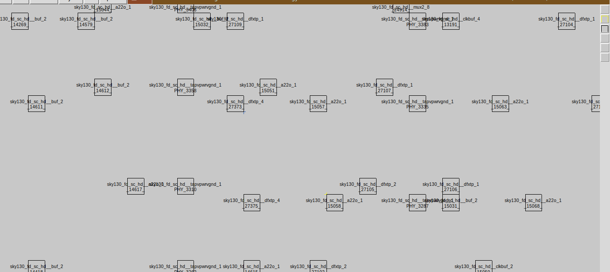
*Individual placed cells labelled — `mux2_8`, `clkbuf_4`, `dfxtp_1`, `tapvpwrvgnd_1`, and the custom `sky130_vsdinv` sitting among them*

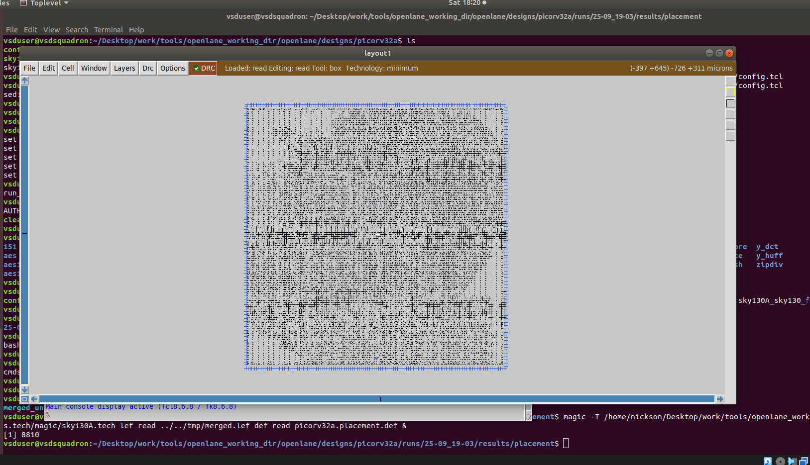
*Full chip rendered after a successful `lef read` / `def read` pair — `[1] 8810` process handle shown in the console*

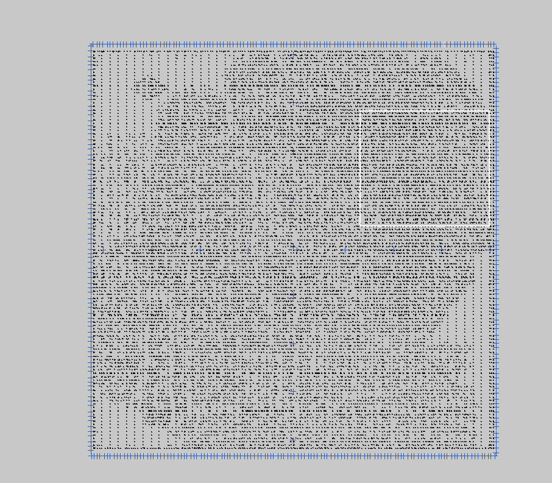
*Zoomed-out view — dense standard-cell rows spanning the whole `picorv32a` floorplan*

---

## Part 3 — Running the Individual OpenLANE Stages (Synthesis → Floorplan → Placement)

Rather than firing the whole flow with a single `run` command, each stage was driven **individually** from inside the OpenLANE interactive Tcl shell — this is what let the LEF-merge fix (Part 2), the macro-placement fix (Part 5), and the resizer/CTS `.lib` fix (Parts 7–8) each be re-tested in isolation without re-running stages that had already passed.

```tcl
% package require openlane 0.9
% prep -design picorv32a -overwrite
```

### 3.1 `run_synthesis` — RTL → gate-level netlist

`run_synthesis` drives Yosys through three phases: **read/elaborate** the RTL (`read_verilog`, `hierarchy`), **generic optimization** (constant propagation, dead-code elimination, `opt` passes working on technology-independent logic), and **technology mapping** via `abc`, which maps the optimized generic netlist onto real `sky130_fd_sc_hd` (+ `sky130_vsdinv`) standard cells, picking specific drive strengths to trade off area against delay.

```tcl
% run_synthesis
```

A specific fanout constraint was tuned interactively before re-synthesizing:

```tcl
% set ::env(SYNTH_MAX_FANOUT) 4
4
% prep -design picorv32a
```

`SYNTH_MAX_FANOUT` caps how many downstream pins a single synthesized gate's output is allowed to drive. A high-fanout net has more capacitance to charge/discharge, which directly slows down that gate's output transition (slew) and adds delay to every path through it — capping fanout at `4` forces `abc` to insert buffer trees on nets that would otherwise exceed it, trading extra cell area for shorter, lower-capacitance nets and better timing. `report_tns` / `report_wns` were re-checked immediately after re-synthesis to confirm the effect (see Part 4.5).

Synthesis finishes by reporting its own internal (wire-load-model-based) STA numbers directly from Yosys — `tns -711.59`, `wns -23.89` in one of today's runs — before physical placement even exists, which is why this number is always somewhat optimistic/pessimistic compared to the real, placement-based numbers later.

### 3.2 Floorplanning — individual steps

Floorplanning is not a single monolithic command; it is three distinct steps, each solving a different physical-planning problem:

```tcl
% init_floorplan
% place_io
% tap_decap_or
```

**`init_floorplan`** — computes the die and core area from the target utilization (`FP_CORE_UTIL`) and aspect ratio (`FP_ASPECT_RATIO`), then lays down the legal standard-cell **rows** (aligned to the PDK's site grid, e.g. Sky130's `unithd` site) that every later placement step must snap cells onto. This is also where `FP_IO_MODE`/pin-order configuration is consumed to reserve space for I/O pins around the boundary.

**`place_io`** — places the actual I/O pin shapes along the four edges of the core boundary, either following an explicit pin-order file or spacing them automatically/equidistantly if none is given. Getting this step wrong (or skipping it) is why the very first debugging session in this workshop hit `[ERROR ORD-0003] 0 does not exist` — pin placement has to complete before downstream steps that reference pin locations can run.

**`tap_decap_or`** — inserts two different classes of filler cells at regular intervals across every row:
- *Tap cells* (`tapvpwrvgnd` — visible labelled in the Magic screenshots in Part 2.4) tie the local substrate/well to VPWR/VGND at a fixed pitch, which is a **latch-up prevention** requirement in bulk CMOS — without them, parasitic bipolar structures inherent to the CMOS process can turn on and short VDD to GND.
- *Decap cells* add local decoupling capacitance to the power rails, damping the voltage droop caused by many nearby cells switching simultaneously (the same physical role the `DECAP1/2/3` blocks play next to the clock buffers in the CTS diagram in §1.5).

### 3.3 Placement — individual steps

Placement is likewise three distinct steps:

```tcl
% global_placement
% detailed_placement
% optimize_mirroring
```

**`global_placement`** — an analytical placer (OpenROAD's `RePlAce`, based on an electrostatics-inspired force-directed model) that treats every cell as a charged particle repelling its neighbors in proportion to local density, converging on (x, y) positions that minimize total half-perimeter wirelength (HPWL) while roughly respecting a target density everywhere on the die. Its output coordinates are *continuous* — cells can (and do) overlap slightly or sit off the legal site grid at this stage; today's `report_checks`/design-stats screenshots show HPWL numbers (e.g. `original HPWL 698284.0 u` → `legalized HPWL 711228.1 u`, a `2%` delta) that come directly from comparing global placement's raw output against the next step's legalized result.

**`detailed_placement`** (legalization) — snaps every cell from its continuous global-placement coordinate onto the nearest **legal** site/row position, resolving any remaining overlaps between cells while trying to disturb the global placer's wirelength-optimized solution as little as possible. `[INFO DPL-0020] Mirrored 5804 instances` / `[INFO DPL-0021] HPWL before` / `[INFO DPL-0022] HPWL after` messages seen in this session's logs are legalization's own bookkeeping of exactly this snapping process.

**`optimize_mirroring`** — flips (mirrors) selected cell instances left-right or top-bottom where doing so shortens the wires to their neighbors, without changing the logical netlist at all (a mirrored cell is still functionally identical, just physically flipped) — a cheap, purely-geometric wirelength improvement pass run after legalization has already fixed the overlap problem.

### 3.4 Macro placement (only meaningful when hard macros exist)

```tcl
# invoked internally by the flow via openroad -exit .../or_basic_mp.tcl
```

See Part 5 for what happens when a design (like `picorv32a` here) has no true hardened macros, combined with an incomplete LEF merge.

### 3.5 Resizer / Optimization and CTS

```tcl
% run_resizer_design   ;# Part 7
% run_cts               ;# Part 8
```

Each of these stages can also be chained back-to-back in one shell session — `run_synthesis; init_floorplan; place_io; tap_decap_or; global_placement; detailed_placement; optimize_mirroring; run_resizer_design; run_cts` — once every prerequisite `.lib`/`.lef` file is confirmed present, which is exactly the discipline that fixed the cascading failures in Parts 5–8 below.

---

## Part 4 — Post-Synthesis STA (`pre_sta.conf`) — the debugging saga

Running OpenSTA standalone (outside the full OpenLANE flow) via a driver script hit **three distinct classes of error** before producing a clean report.

### 4.1 `pre_sta.conf` — the driver script

```tcl
set_cmd_units -time ns -capacitance pF -current mA -voltage V -resistance kOhm -distance um
read_liberty -max $HOME/Desktop/work/tools/openlane_working_dir/openlane/designs/picorv32a/src/sky130_fd_sc_hd__slow.lib
read_liberty -min $HOME/Desktop/work/tools/openlane_working_dir/openlane/designs/picorv32a/src/sky130_fd_sc_hd__fast.lib
read_verilog $HOME/Desktop/work/tools/openlane_working_dir/openlane/designs/picorv32a/runs/<run-tag>/results/synthesis/picorv32a.synthesis.v
link_design picorv32a
read_sdc $HOME/Desktop/work/tools/openlane_working_dir/openlane/designs/picorv32a/src/base.sdc
report_checks -path_delay min_max -fields {slew trans net cap input_pin}
report_tns
report_wns
```

Note the `-max` / `-min` split on `read_liberty`: OpenSTA needs *both* corner libraries loaded simultaneously so it can run setup checks against the **slow** corner (worst-case max delay) and hold checks against the **fast** corner (worst-case min delay) in the same `report_checks -path_delay min_max` pass — this is the standard multi-corner STA methodology, not a redundant load.

### 4.2 Error #1 — wrong home directory

```
Error: cannot read file /home/nickson/Desktop/work/tools/openlane_working_dir/openlane/designs/picorv32a/src/sky130_fd_sc_hd__slow.lib.
```

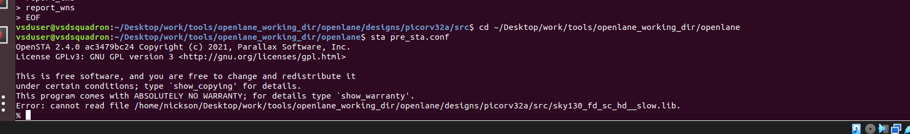
*`sta pre_sta.conf` failing because the script was hard-coded to another machine's home directory (`nickson`) instead of the actual one (`vsduser`)*

`pre_sta.conf` had been drafted (or copy-pasted) with a hardcoded username (`nickson`) that didn't match the actual machine's home directory (`vsduser` on `vsdsquadron`).

**Fix:** rewrite every path using `$HOME`, so the script is portable across machines/users:

```bash
cat > pre_sta.conf << EOF
set_cmd_units -time ns -capacitance pF -current mA -voltage V -resistance kOhm -distance um
read_liberty -max \$HOME/Desktop/work/tools/openlane_working_dir/openlane/designs/picorv32a/src/sky130_fd_sc_hd__slow.lib
read_liberty -min \$HOME/Desktop/work/tools/openlane_working_dir/openlane/designs/picorv32a/src/sky130_fd_sc_hd__fast.lib
read_verilog \$HOME/Desktop/work/tools/openlane_working_dir/openlane/designs/picorv32a/runs/15-09_06-28/results/synthesis/picorv32a.synthesis.v
link_design picorv32a
read_sdc \$HOME/Desktop/work/tools/openlane_working_dir/openlane/designs/picorv32a/src/base.sdc
report_checks -path_delay min_max -fields {slew trans net cap input_pin}
report_tns
report_wns
EOF
```

### 4.3 Error #2 — ambiguous Tcl command in `base.sdc`

```
Error: base.sdc, 8 ambiguous command name "get": get_cell get_cells get_clock get_clocks get_fanin
get_fanout get_full_name get_lib get_lib_cell get_lib_cells get_lib_pin get_lib_pins get_libs get_name
get_net get_nets get_pin get_pins get_port get_ports get_property get_timing_edges gets
```

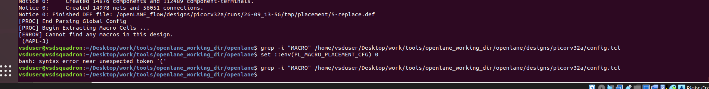
*Tcl refuses to guess which `get_*` command was meant — eight candidates listed, none chosen*

Diagnosed by pulling exactly which line was failing:

```bash
cat pre_sta.conf | grep read_sdc
# -> read_sdc .../designs/picorv32a/src/base.sdc

sed -n '8p' .../designs/picorv32a/src/base.sdc
# -> create_clock [get ports $::env(CLOCK_PORT)] -name $::env(CLOCK_PORT) -period $::env(CLOCK_PERIOD)
```

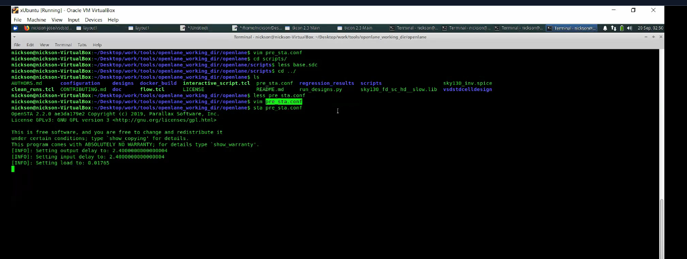
*`cat pre_sta.conf | grep read_sdc` then `sed -n '8p' base.sdc` — pinpointing line 8 as the source of the ambiguous command*

`get` alone is ambiguous — Tcl can't tell whether you meant `get_ports`, `get_pins`, `get_cells`, etc. It has to be the fully-qualified command.

**Fix:** `get ports` → `get_ports` in `base.sdc`:

```tcl
create_clock [get_ports $::env(CLOCK_PORT)] -name $::env(CLOCK_PORT) -period $::env(CLOCK_PERIOD)
```

### 4.4 Error #3 — stale `synthesis.v` path

```
Error: cannot read file .../designs/picorv32a/runs/15-09_06-28/results/synthesis/picorv32a.synthesis.v
```

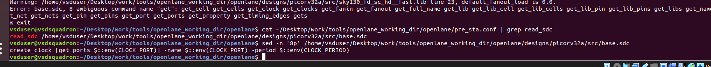
*The `read_verilog` path pointed at an old/incomplete run directory (`15-09_06-28`) that never actually finished synthesis*

The `read_verilog` path pointed at an old/incomplete run-tag directory. Fix: `ls runs/` to find the actual (current) run folder, and point `pre_sta.conf` at that run's `results/synthesis/picorv32a.synthesis.v` instead.

### 4.5 Clean run — real terminal captures

With all three fixed, `sta pre_sta.conf` produces the full `report_checks` path report, including both **MET** and **VIOLATED** paths, plus a summary. The screenshot below is the tail end of a `report_checks` path trace through a chain of `or2_2` / `o221a_2` gates into a `dfxtp_2` flop, ending in a **violated setup path** — followed by the exact shell commands (`set ::env(SYNTH_MAX_FANOUT) 4`, `prep -design picorv32a`, `exit`, and finally `sta pre_sta.conf` launching OpenSTA 2.4.0):

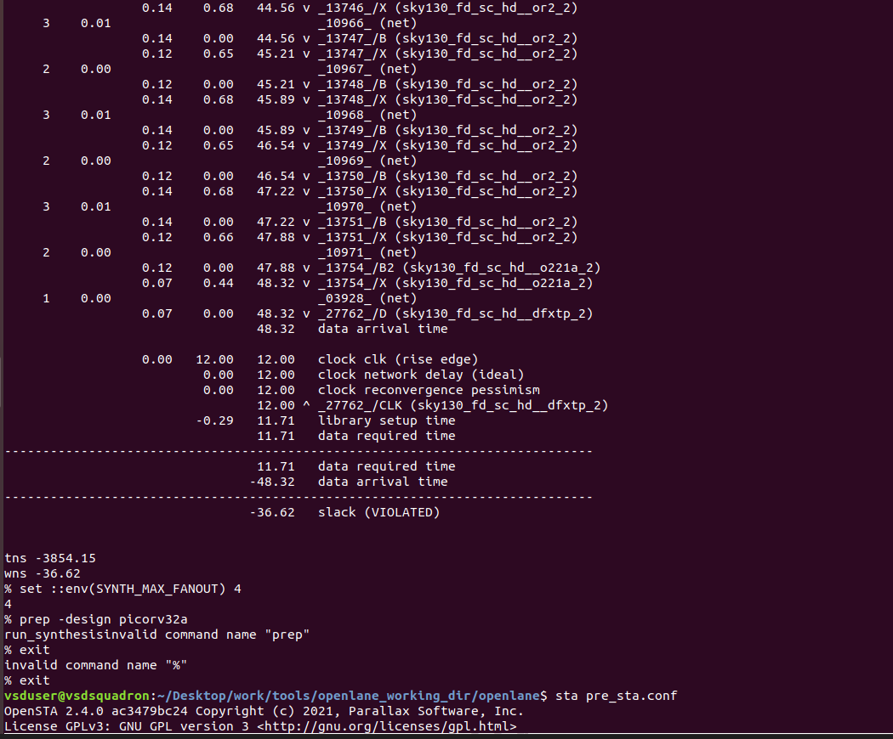
*`tns -3854.15`, `wns -36.62` — then `set ::env(SYNTH_MAX_FANOUT) 4` → `prep -design picorv32a` → `exit` (out of the OpenLANE Tcl shell) → `sta pre_sta.conf` (into OpenSTA directly) — this is the actual command sequence used to re-check timing after the fanout constraint was tightened*

A second violated path, traced entirely through a chain of `sky130_fd_sc_hd__or2_2` OR-gates and an `o221a_2` AND-OR-invert gate before landing on `_27628_/D`:

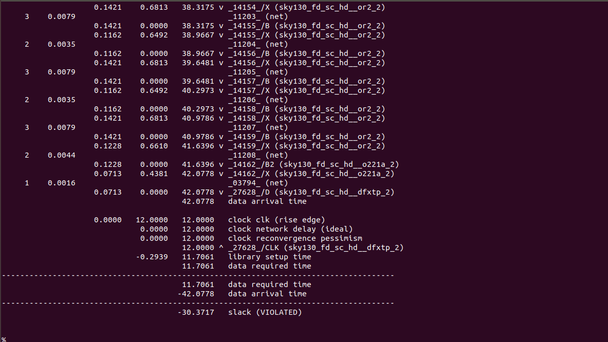
*`data required time 11.7061` vs `data arrival time 42.0778` → `slack (VIOLATED) -30.3717` — every hop shows the net name, the driving cell, and the incremental/cumulative delay columns, exactly as `report_checks -fields {slew trans net cap input_pin}` prints them*

A third capture — this one shows a violated **hold-adjacent setup path** into `_26481_/D` (`slack -0.03`, barely violated) immediately followed, in the same terminal scrollback, by the start of a **successful CTS run** (`Clock Tree Synthesis was successful`):

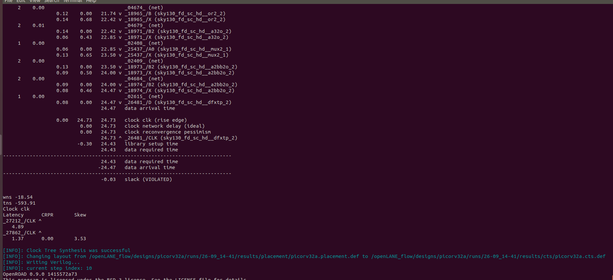
*This is the clearest evidence in the whole session that Placement → Resizer → CTS were finally chained cleanly: the STA report closes out, and the very next lines are TritonCTS's own success log*

Timing debugging commands used to chase specific violating paths:

```bash
replace_cell _15200_ sky130_fd_sc_hd__or2_4
report_checks -fields {net cap slew input_pins} -digits 4
```

`replace_cell` swaps a specific instance for a different (often higher-drive-strength) cell from the same library **without re-running synthesis**, so the effect of a targeted resize on a specific violating path can be checked immediately — a fast, surgical alternative to a full resizer/optimization pass.

---

## Part 5 — Macro Placement Failure (`MAPL-3`)

```
[PROC] Begin Extracting Macro Cells ...
[ERROR] Cannot find any macros in this design.
 (MAPL-3)
[ERROR]: during executing: "openroad -exit .../scripts/openroad/or_basic_mp.tcl ..."
[ERROR]: Flow Failed.
```

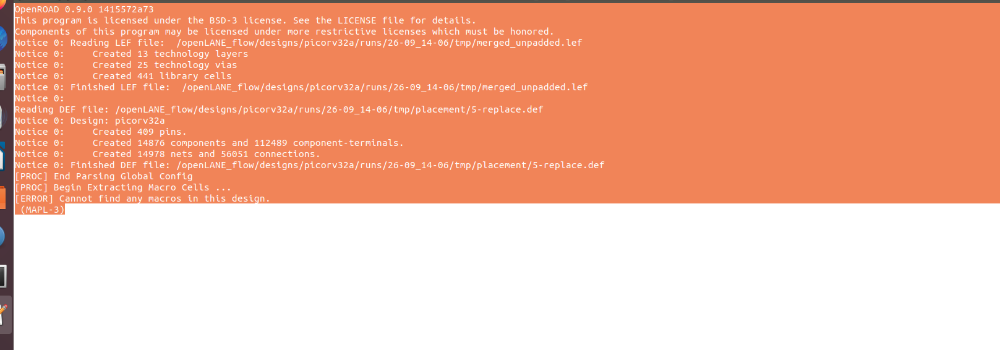
*The macro-placement stage aborting immediately after "Begin Extracting Macro Cells" — this design has no true hardened macros, but the real problem is upstream (see 5.2)*

### 5.1 Dead end: `PL_MACRO_PLACEMENT_CFG`

First attempt tried setting an env var directly at the bash prompt:

```bash
set ::env(PL_MACRO_PLACEMENT_CFG) 0
# bash: syntax error near unexpected token `('
```

This fails because `set ::env(...)` is **Tcl syntax**, not bash — it only works inside the OpenLANE interactive Tcl shell.

### 5.2 Root cause: `sky130_vsdinv.lef` missing for *this* run

Digging into the actual `prep` log for the failing run revealed the real problem:

```
Traceback (most recent call last):
  File "/openLANE_flow/scripts/mergeLef.py", line 84, in <module>
    f = open(lefFile)
FileNotFoundError: [Errno 2] No such file or directory:
  '.../designs/picorv32a/src/sky130_vsdinv.lef'
```

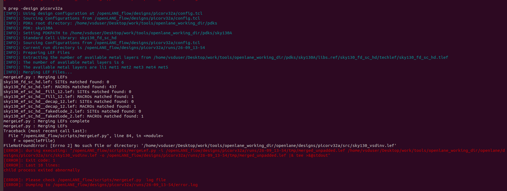
*The actual root cause behind the MAPL-3 symptom: `prep`'s own LEF-merge step crashed here first, several stages before macro placement ever ran*

`prep -design` never fully merged the custom cell's LEF for this particular run/checkout — because the file genuinely wasn't present at that path yet (see Part 2.2). Since `prep` aborted before finishing, the downstream macro-placement stage inherited an incomplete/empty macro list, surfacing as the unrelated-looking `MAPL-3` error.

**Why this cascades the way it does:** `or_basic_mp.tcl` only runs its macro-placement pass on cells it can identify as *macros* (large, pre-hardened blocks — not standard cells) from the merged LEF. `picorv32a` genuinely has none in this configuration, so `MAPL-3` is, in isolation, an expected/benign message on a design with no macros — but because `prep` had crashed partway through the LEF merge, the flow's bookkeeping around that stage was left in an inconsistent state, and the error was fatal rather than a warning to skip past.

**Fix:** re-verify the file actually exists at the exact path referenced by `EXTRA_LEFS`, then re-run `prep -design picorv32a -overwrite` to regenerate a clean run directory.

```bash
ls ~/Desktop/work/tools/openlane_working_dir/pdks   # sanity check PDK_ROOT
grep EXTRA_LEFS designs/picorv32a/config.tcl
grep -c "sky130_vsdinv" runs/<run-tag>/tmp/merged.lef
```

---

## Part 6 — Environment Slip-ups: Wrong Shell / Docker Session

```bash
sudo docker run -it -v $(pwd)/openLANE_flow:/openLANE_flow -v $PDK_ROOT:$PDK_ROOT \
  -e PDK_ROOT=$PDK_ROOT -u $(id -u USER):$(id -g USER) efabless/openlane:v0.21
```

This drops into a **plain `bash-4.2` prompt**, not the OpenLANE Tcl interactive shell:

```
bash-4.2$ package require openlane 0.9
bash: package: command not found
```

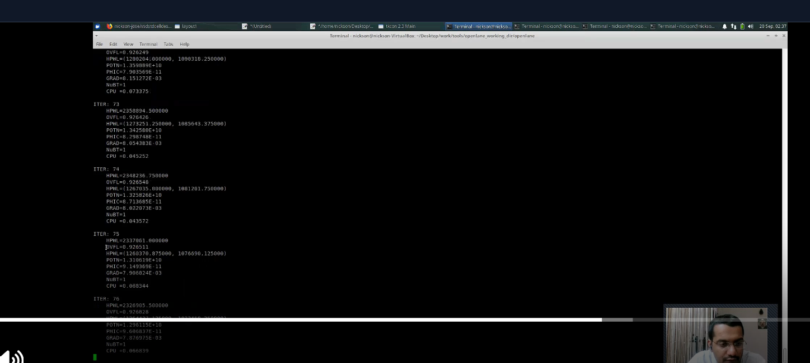
*`docker run ... efabless/openlane:v0.21` on its own only gets you a bash shell inside the container — `package require` is a Tcl command and has to be typed after entering OpenLANE's own interactive interpreter*

`package require` is a **Tcl command**, not a bash builtin — it only works once you're inside OpenLANE's own interactive Tcl interpreter. The correct entry sequence is:

```bash
./flow.tcl -interactive
# or, once inside the container:
openlane
```
```tcl
% package require openlane 0.9
0.9
% prep -design picorv32a -overwrite
```

A `make mount`-based Docker invocation was also tried and failed on a permissions issue:

```
WARNING: Error loading config file: /home/vsduser/.docker/config.json: open .../config.json: permission denied
Unable to find image 'efabless/openlane:current' locally
docker: Error response from daemon: manifest for efabless/openlane:current not found: manifest unknown: manifest unknown.
Makefile:162: recipe for target 'mount' failed
```

— resolved by going back to the direct `sudo docker run ... efabless/openlane:v0.21` form above with the correct, existing image tag.

---

## Part 7 — Resizer Stage Error: `or_resizer.tcl` cannot read `resizer.lib`

```
Error: or_resizer.tcl, 17 cannot read file .../runs/<run-tag>/tmp/resizer.lib.
```

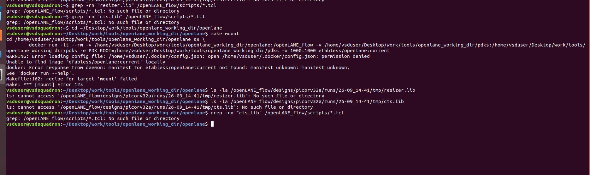
*A `.docker/config.json` permission error surfaced while re-launching a container to inspect this run — a host-level Docker/user-permissions issue, ruled out first before continuing the .lib investigation*

Checked whether the file was ever generated:

```bash
ls -la .../runs/<run-tag>/tmp/resizer.lib
# ls: cannot access '.../tmp/resizer.lib': No such file or directory

ls -la .../runs/<run-tag>/tmp/cts.lib
# ls: cannot access '.../tmp/cts.lib': No such file or directory
```

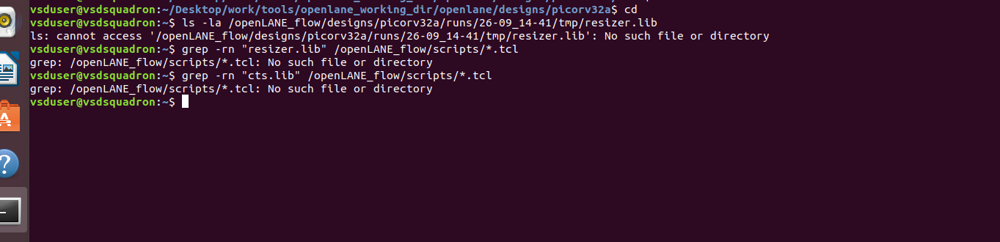
*`ls -la tmp/resizer.lib` and `tmp/cts.lib` both come back "No such file or directory" — neither trimmed liberty file was ever written for this run*

Searched the OpenLANE scripts to understand how/when that trimmed liberty file is supposed to be produced:

```bash
grep -rn "resizer.lib" openLANE_flow/scripts/*.tcl
grep -rn "cts.lib" openLANE_flow/scripts/*.tcl
```

**Why a "trimmed" liberty file exists at all:** the Resizer/CTS stages don't need every timing arc in the full sign-off liberty file — they need a smaller, DRC-clean subset with cells that have no known LVS/DRC exclusions, so `trim_lib` produces a purpose-built `.lib` for that one stage rather than reusing the full library wholesale. Both `resizer.lib` and `cts.lib` are only generated as a byproduct of a stage's own Tcl proc actually completing — since earlier stages had aborted (macro placement / prep issues from Parts 2 and 5), these trimmed `.lib` files were never written for that run. **Fix:** re-run the flow from a clean `prep`, letting each stage complete fully so it writes its own trimmed liberty before the next stage tries to read it.

---

## Part 8 — Clock Tree Synthesis (CTS): Source Review & the `cts.lib` Saga

### 8.1 Reading `cts.tcl`'s `run_cts` proc

```tcl
proc run_cts {args} {
    if { ! [info exists ::env(CLOCK_PORT)] && ! [info exists ::env(CLOCK_NET)] } {
        puts_info "::env(CLOCK_PORT) is not set"
        puts_warn "Skipping CTS..."
        set ::env(CLOCK_TREE_SYNTH) 0
    }

    if {$::env(CLOCK_TREE_SYNTH)} {
        puts_info "Running TritonCTS..."
        set ::env(CURRENT_STAGE) cts
        TIMER::timer_start

        if { ! [info exists ::env(CLOCK_NET)] } {
            set ::env(CLOCK_NET) $::env(CLOCK_PORT)
        }

        set ::env(SAVE_DEF) $::env(cts_result_file_tag).def
        ...
        # trim the lib to exclude cells with drc errors
        if { ! [info exists ::env(LIB_CTS)] } {
            set ::env(LIB_CTS) $::env(TMP_DIR)/cts.lib
            trim_lib -input $::env(LIB_SYNTH_COMPLETE) -output $::env(LIB_CTS) -drc_exclude_only
        }
        try_catch openroad -exit $::env(SCRIPTS_DIR)/openroad/or_cts.tcl ...
        ...
        # once TritonCTS has run, STA analysis mode switches from ideal to propagated clock:
        set_propagated_clock [all_clocks]
        repair_clock_inverters
    } else {
        exec echo "SKIPPED!" >> [index_file $::env(cts_log_file_tag).log]
    }
}
```

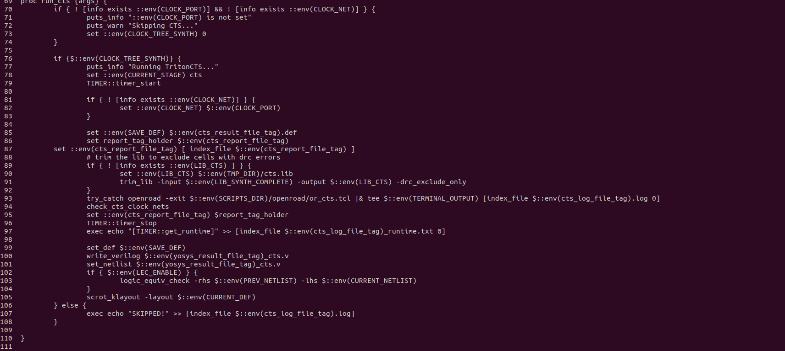
*The `trim_lib -input $::env(LIB_SYNTH_COMPLETE) -output $::env(LIB_CTS)` line is exactly what should produce `tmp/cts.lib` before TritonCTS ever tries to read it*

**Key insight:** `LIB_CTS` defaults to `$TMP_DIR/cts.lib`, built on the fly by `trim_lib` from `LIB_SYNTH_COMPLETE`. If that `trim_lib` step never runs (e.g. an aborted earlier stage, or `LIB_CTS` never got the chance to be created), `or_cts.tcl` fails trying to read a file that simply doesn't exist yet — the exact same class of "consumer stage runs before producer stage finished" bug as the `resizer.lib` failure in Part 7.

Two more individual sub-steps worth naming here, both driven from inside `run_cts` around the core `clock_tree_synthesis` call:

- **`repair_clock_nets`** — a pre-CTS clean-up pass on the (still unbuffered) clock network, fixing any max-slew / max-capacitance violations on the raw clock port/net *before* TritonCTS starts inserting its buffer tree on top of it, so the tree isn't built on an already-broken starting net.
- **`set_propagated_clock [all_clocks]`** — switches STA's clock model from *ideal* (the `clock network delay (ideal) 0.00` seen throughout Part 1's pre-CTS examples) to *propagated*, meaning STA now uses the real, just-inserted buffer-tree delay for every flop's clock arrival time instead of assuming zero latency — this is the exact moment the `Latency`/`Skew` columns in §1.4/§8.3 start meaning something physically real.
- **`repair_clock_inverters`** — a post-CTS clean-up pass that swaps or duplicates clock inverters/buffers that the tree-building step itself left with electrical (slew/cap) violations, without changing the tree's overall topology or skew balance.

### 8.2 Reproducing and confirming the root cause

```
[ERROR ORD-0003] 0 does not exist.
ORD-0003
[ERROR]: during executing: "openroad -exit .../scripts/openroad/or_cts.tcl ..."
```

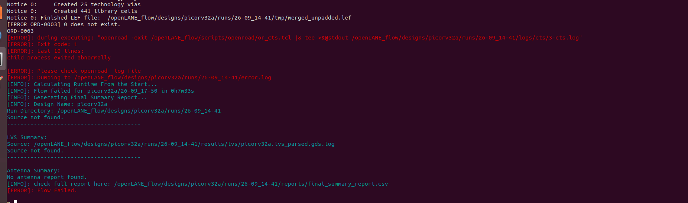
*The same generic ORD-0003 symptom seen earlier at placement (or_replace.tcl), this time thrown inside or_cts.tcl*

and, on a later attempt, the underlying file-not-found became explicit:

```
Error: or_cts.tcl, 22 cannot read file .../runs/<run-tag>/tmp/cts.lib.
```

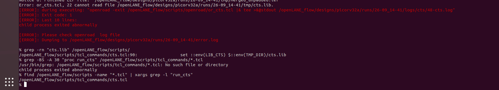
*The precise, actionable error: `or_cts.tcl, 22 cannot read file .../tmp/cts.lib` — confirming `trim_lib` never wrote this file for the failing run*

Attempting to view the `cts.tcl` source with `sed` at the wrong shell prompt (inside the OpenLANE Tcl shell rather than bash) produced a reminder of the same "wrong shell" mistake from Part 6:

```
% sed -n '1,100p' /openLANE_flow/scripts/tcl_commands/cts.tcl
/usr/bin/sed: -e expression #1, char 1: unknown command: `'
```

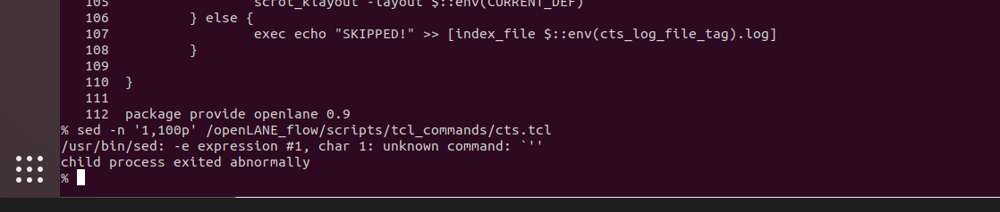
*Same class of mistake as Part 6 — `sed` is a shell command and has no meaning inside the OpenLANE Tcl interpreter's `%` prompt*

`sed` is a shell command; run it from bash, not from inside the OpenLANE Tcl interpreter.

### 8.3 Fix and successful CTS run — real terminal capture

Once the flow was re-run from a clean `prep` (so every prerequisite stage — including the `trim_lib` step that writes `cts.lib`) completed in order:

```tcl
% run_cts
```

TritonCTS ran successfully. The screenshot below is the actual terminal output from this run — the STA summary that TritonCTS itself prints (`wns -18.54`, `tns -593.91`, per-flop `Latency`/`CRPR`/`Skew`), immediately followed by OpenROAD 0.9.0 reading the merged LEF, the new `picorv32a.cts.def`, writing the post-CTS Verilog, and finally invoking KLayout to render a PNG screenshot of the CTS'd layout:

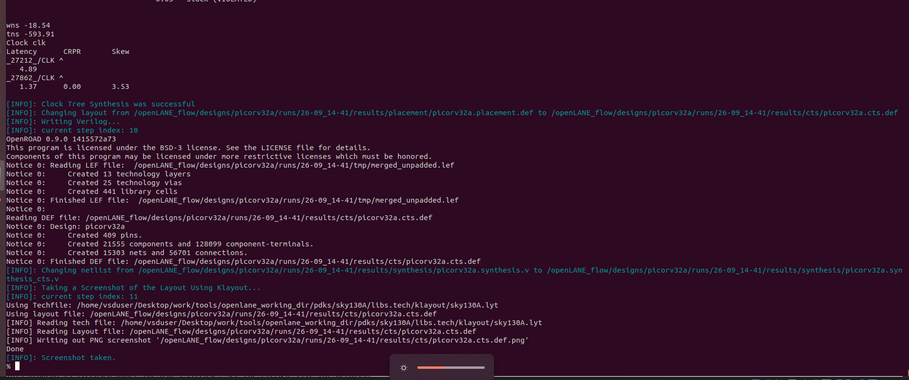
*Note the netlist growth: `Created 21555 components` after CTS (from ~19,916 at placement — see §8.4) — TritonCTS inserted roughly 1,639 clock buffers/inverters; the final lines (`[INFO]: Taking a Screenshot of the Layout Using Klayout...` → `Done` → `[INFO]: Screenshot taken.`) are exactly the command sequence that produced `picorv32a.cts.def.png` below in Part 9*

Post-CTS timing report, including per-flop clock latency and skew:

```
wns -18.54
tns -593.91
Clock clk
Latency    CRPR    Skew
_27212_/CLK ^
   4.89
_27862_/CLK ^
   1.37     0.00    3.53
```

### 8.4 Reading the growth in instance count

Note the netlist grew from ~19,916 instances at placement to **21,555 components** after CTS (as seen directly in the real terminal capture above: `Notice 0: Created 21555 components and 128099 component-terminals.`) — the ~1,639 extra instances are exactly the buffers/inverters TritonCTS inserted along the clock tree, per §1.5.

---

## Part 9 — CTS Success: Final Layout

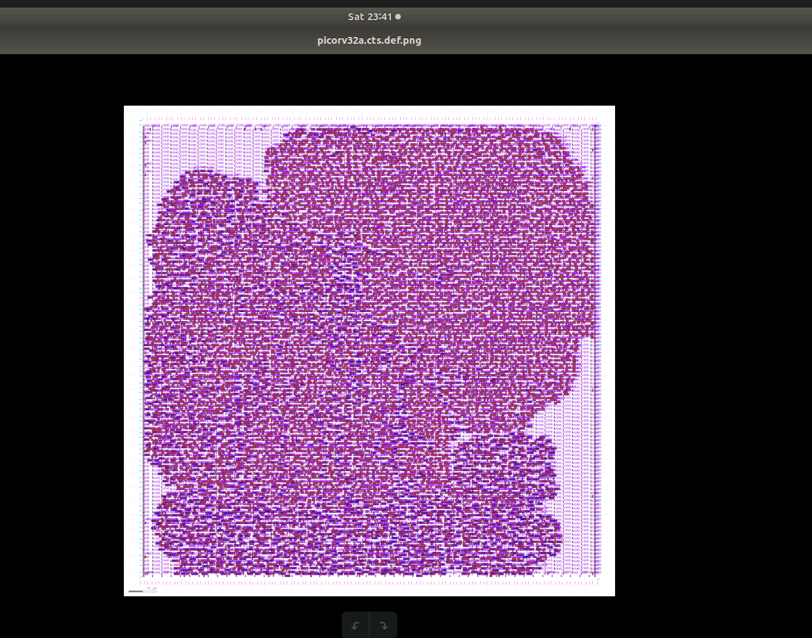
*KLayout render of `picorv32a.cts.def` — the routed clock tree buffers spread across the die after a successful CTS run*

---

## Command Reference — everything that produced today's outputs, in run order

```tcl
# 1. Enter the OpenLANE interactive Tcl shell (NOT plain bash-4.2 — see Part 6)
% package require openlane 0.9

# 2. Prep the design (merges EXTRA_LEFS/EXTRA_LIBS — Part 2)
% prep -design picorv32a -overwrite

# 3. Synthesis, with a tightened fanout constraint (Part 3.1)
% set ::env(SYNTH_MAX_FANOUT) 4
% prep -design picorv32a
% run_synthesis

# 4. Floorplan — three individual steps (Part 3.2)
% init_floorplan
% place_io
% tap_decap_or

# 5. Placement — three individual steps, then macro placement (Part 3.3 / Part 5 for the MAPL-3 fix)
% global_placement
% detailed_placement
% optimize_mirroring

# 6. Resizer / optimization, reading the trimmed resizer.lib (Part 7)
% run_resizer_design

# 7. Clock Tree Synthesis, reading the trimmed cts.lib (Part 8)
% run_cts
% exit
```

```bash
# 8. Standalone post-synthesis STA outside the full flow (Part 4)
sta pre_sta.conf
```

```tcl
# pre_sta.conf contents:
set_cmd_units -time ns -capacitance pF -current mA -voltage V -resistance kOhm -distance um
read_liberty -max $HOME/.../sky130_fd_sc_hd__slow.lib
read_liberty -min $HOME/.../sky130_fd_sc_hd__fast.lib
read_verilog $HOME/.../results/synthesis/picorv32a.synthesis.v
link_design picorv32a
read_sdc $HOME/.../src/base.sdc
report_checks -path_delay min_max -fields {slew trans net cap input_pin}
report_tns
report_wns
```

```bash
# 9. Targeted path debugging (Part 4.5)
replace_cell _15200_ sky130_fd_sc_hd__or2_4
report_checks -fields {net cap slew input_pins} -digits 4
```

```bash
# 10. Diagnostics used along the way
find ~/Desktop -iname "sky130_vsdinv.lef" -o -iname "sky130_vsdinv.lib"
grep -c "sky130_vsdinv" runs/<run-tag>/results/synthesis/picorv32a.synthesis.v
grep EXTRA_LEFS designs/picorv32a/config.tcl
grep -c "sky130_vsdinv" runs/<run-tag>/tmp/merged.lef
grep -rn "resizer.lib" openLANE_flow/scripts/*.tcl
grep -rn "cts.lib" openLANE_flow/scripts/*.tcl
ls -la runs/<run-tag>/tmp/resizer.lib
ls -la runs/<run-tag>/tmp/cts.lib
```

```bash
# 11. Magic visual sanity check (Part 2.4)
magic -T /home/vsduser/Desktop/work/tools/openlane_working_dir/pdks/sky130A/libs.tech/magic/sky130A.tech \
      lef read ../../tmp/merged.lef \
      def read picorv32a.placement.def
```

---

## Part 10 — Supporting Output Screenshots (Successful Results, Not Errors)

Everything above focused on the failures and how they were root-caused. This section is the other half of the story: the actual **successful** command outputs captured along the way — course tracker, design stats, and confirmations that each fix actually worked.

### 10.2 Confirming the custom cell actually landed — successful checks


*`grep -c "sky130_vsdinv" picorv32a.synthesis.v` → 1554 — the custom inverter came through synthesis correctly*

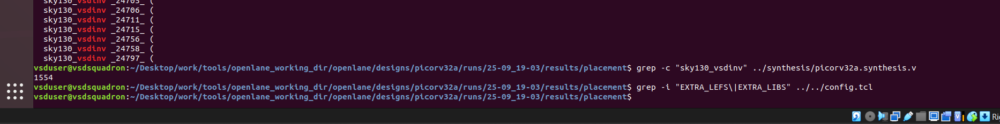
*Re-checked from a different run directory — same 1554 instances, confirming this wasn't a fluke*

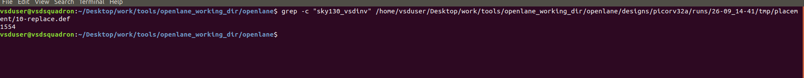
*`grep -c "sky130_vsdinv" 10-replace.def` → 1554 — the custom cell survived all the way through to physical placement*


*Once `sky130_vsdinv.lef` existed at the right path, `prep -design picorv32a -overwrite` merged it cleanly — no more `FileNotFoundError`*

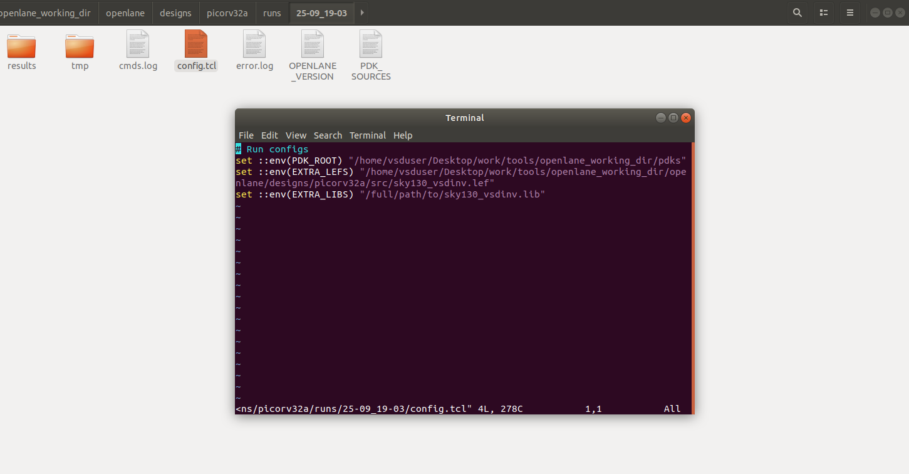
*The fixed `config.tcl`, pointing at the real `sky130_vsdinv.lef` / `.lib` paths*


*`cat >> config.tcl << 'EOF' ... EOF` used to add the two env vars, followed by the verification greps*

### 10.3 Successful placement & synthesis output


*"Global placement was successful" — wns/tns reported immediately after, before legalization*

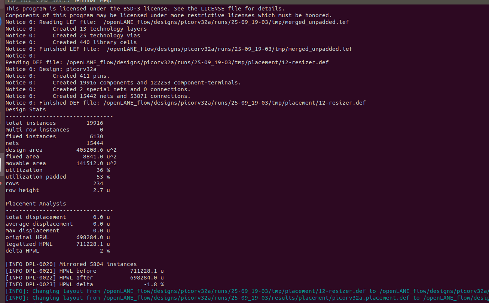
*Total instances, utilization, and HPWL numbers from a clean placement pass*

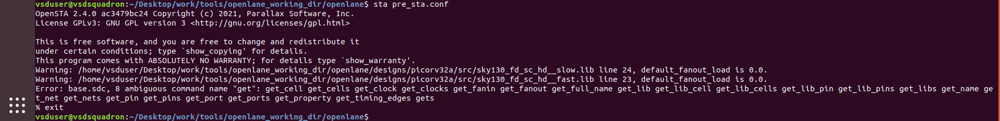
*234 rows, row height 2.7u — consistent with the first successful run, confirming reproducibility*

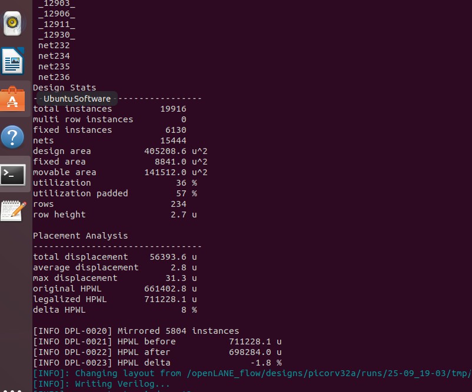
*`[INFO DPL-0020] Mirrored 5804 instances`, HPWL before → after, delta -1.8% — legalization's own success bookkeeping (ties to §3.3)*


*Every standard-cell type instantiated (including `sky130_vsdinv: 1554`), total chip area, then Yosys handing off cleanly into OpenSTA for the post-synthesis timing pass*

### 10.4 CTS success — additional confirmation

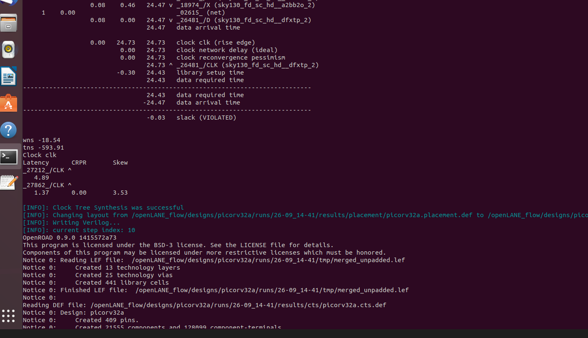
*`wns -18.54` / `tns -593.91` with per-flop skew reported — the same successful post-CTS numbers discussed in §8.3, captured from a slightly earlier point in the same log*


*`Created 21555 components and 128099 component-terminals` — confirms the buffer-tree insertion completed and the flow moved on to render the final layout PNG*

---

## Key Takeaways

- **`EXTRA_LEFS` / `EXTRA_LIBS`** must point at files that actually exist *before* `prep -design` runs — `mergeLef.py` throws a hard `FileNotFoundError` otherwise, which cascades into the confusing, seemingly-unrelated `MAPL-3` ("Cannot find any macros") error several stages later.
- **`[ERROR ORD-0003] 0 does not exist`** is a generic OpenROAD/Tcl "expected object handle doesn't exist" error. It showed up twice for two different underlying reasons: once in `or_replace.tcl` (placement) and once in `or_cts.tcl` (CTS) — both times traced back to a **missing trimmed `.lib` file** (`resizer.lib` / `cts.lib`) that an earlier, incomplete stage should have generated via `trim_lib`.
- **`sta pre_sta.conf` run standalone** is a fast way to sanity-check timing outside the full flow, but it's picky: `create_clock [get ports ...]` needs the fully-qualified `get_ports` (not bare `get`), and every path in `pre_sta.conf` must match the real home directory and run-tag on disk — `$HOME` substitution avoids the first class of mistake entirely.
- **`package require openlane`** and other OpenLANE Tcl commands only work *inside* the OpenLANE interactive shell — never at the raw `bash-4.2` prompt the container drops you into by default.
- **Floorplanning and placement are each three separate steps**, not one command: `init_floorplan` → `place_io` → `tap_decap_or` lays out rows, pins, and latch-up/decap protection; `global_placement` → `detailed_placement` → `optimize_mirroring` finds an analytically-good wirelength solution, then legalizes and mirror-optimizes it.
- **Setup and hold checks are physically grounded, not arbitrary:** setup time comes from how long a flip-flop's internal master latch needs to resolve D before the clock edge freezes it; hold time comes from how long D must stay stable after that edge so the (now-closing) master latch isn't still transparently passing a changing value through.
- **CRPR isn't a delay, it's a correction:** it removes the double-counted pessimism from clock-path segments the launch and capture traces share, which is why it reads `0.00` when the two clock trees diverge immediately and non-zero when they share a long common trunk.
- **Skew isn't automatically bad** — deliberate ("useful") skew can be traded between a setup-critical path and its corresponding hold path; *unintentional* skew from crosstalk delta-delay is the harmful kind, because it's data-dependent and can't be compensated for at design time, only bounded via spacing/shielding.
- Once `cts.lib` was actually generated (by letting every prerequisite stage complete, including its own `trim_lib` call) and read successfully, **CTS completed**, producing a clean timing report and the routed clock tree layout above.
