# Day 9 — Sky130 Module 5: Final Steps for RTL2GDS using TritonRoute and OpenSTA

## Module Overview

Module 5 covers the concluding stages of the RTL-to-GDS flow: **Detailed Routing** (using TritonRoute), **Design Rule Checking**, **Power Distribution Network (PDN)** basics, and **Static Timing Analysis with real clocks (OpenSTA)**.

**Curriculum structure covered in this module:**

| Section | Labs |
|---|---|
| **SKY130_D5_SK1** – Routing and design rule check | SKY_L1: Introduction to Maze Routing<br>SKY_L2: Lee's Algorithm conclusion<br>SKY_L3: Design Rule Check |
| **SKY130_D5_SK2** – Power Distribution | SKY_L1: Lab steps to build power distribution network<br>SKY_L2: Lab steps from power...<br>SKY_L3: Basics of global and detailed (routing) |
| **SKY130_D5_SK3** – TritonRoute Features | SKY_L1: TritonRoute feature 1<br>SKY_L2: TritonRoute Feature 2<br>SKY_L3: TritonRoute method to...<br>SKY_L4: Routing topology algorithm |

This module is the final one in the Sky130 flow, followed by **GitHub Repo Submission**.


---

## 1. Routing — Overview

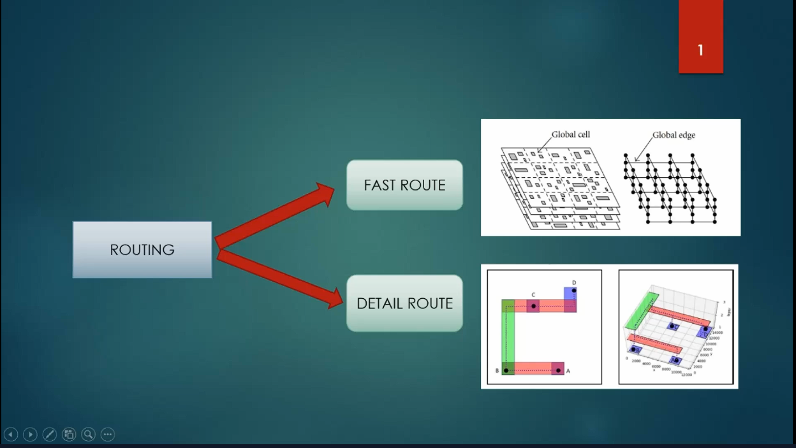

Routing is split into two major stages:

- **Fast Route (Global Route)** — Works on a coarsened representation of the design using **Global Cells** and **Global Edges**, producing rough interconnect paths without committing to exact tracks/vias.
- **Detail Route** — Refines the global routing solution into exact track assignments and via placements, honoring all design rules.

TritonRoute is the detailed router used in this flow; it takes the output of Fast Route (converted to **preprocessed route guides**) and produces the final physical routing.

---

## 2. TritonRoute

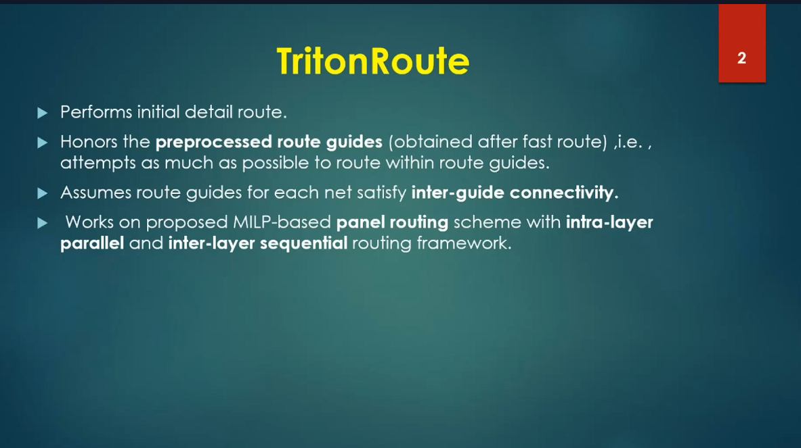

### 2.1 What TritonRoute Does
- Performs the **initial detailed route**.
- Honors **preprocessed route guides** (obtained after fast route) — i.e., it attempts, as much as possible, to route within the given route guides.
- Assumes route guides for each net satisfy **inter-guide connectivity**.
- Works on a proposed **MILP-based (Mixed Integer Linear Programming) panel routing** scheme with an **intra-layer parallel** and **inter-layer sequential** routing framework.

### 2.2 Problem Statement
- **Inputs:** LEF, DEF, Preprocessed route guides
- **Output:** Detailed routing solution with optimized wire-length and via count
- **Constraints:** Route guide honoring, connectivity constraints, and design rules

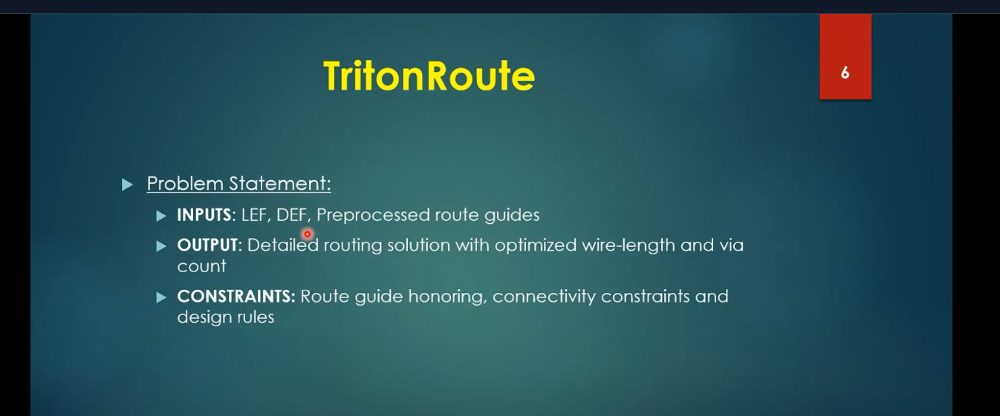

---

## 3. Preprocessed Route Guides

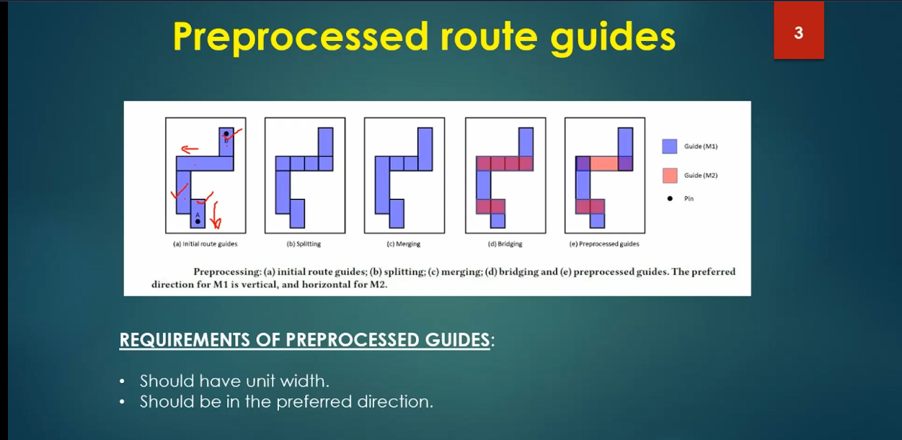

Route guides from the global router are refined through a preprocessing pipeline before being handed to TritonRoute:

1. **(a) Initial route guides** — raw guides straight from global routing.
2. **(b) Splitting** — breaking large/irregular guide shapes into unit-width segments.
3. **(c) Merging** — combining adjacent segments to simplify the guide structure.
4. **(d) Bridging** — connecting guides across layers (e.g., M1 ↔ M2) to preserve connectivity.
5. **(e) Preprocessed guides** — the final cleaned-up set of guides, ready for detailed routing.

**Requirements of preprocessed guides:**
- Should have **unit width**.
- Should be in the **preferred routing direction** (e.g., M1 = vertical, M2 = horizontal).

---

## 4. Inter-Guide Connectivity

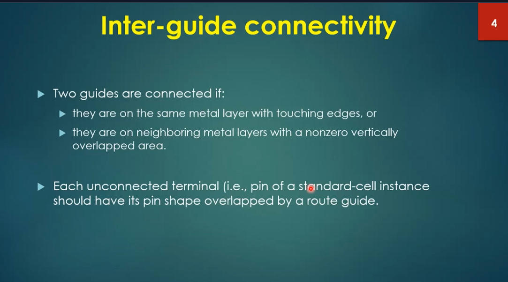

Two guides are considered **connected** if:
- They are on the **same metal layer** with **touching edges**, OR
- They are on **neighboring metal layers** with a **nonzero vertically overlapped area**.

Additionally:
- Each **unconnected terminal** (i.e., a pin of a standard-cell instance) must have its **pin shape overlapped by a route guide** — ensuring every pin is reachable by the router.

---

## 5. Intra-Layer Parallel & Inter-Layer Sequential Panel Routing

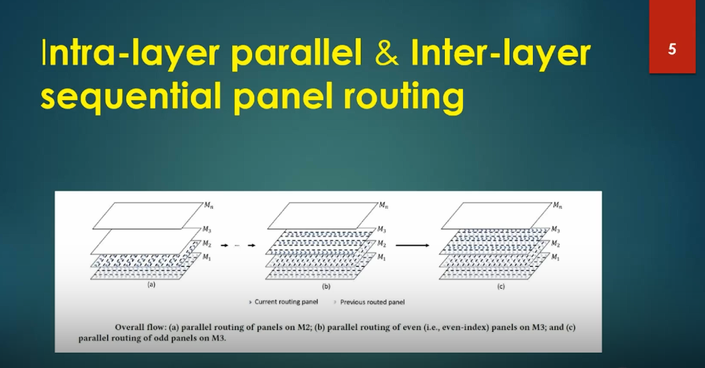

TritonRoute routes the design using a **panel-based** scheme:

- **(a)** Parallel routing of panels on **M2**.
- **(b)** Parallel routing of **even-indexed** panels on **M3**.
- **(c)** Parallel routing of **odd-indexed** panels on **M3**.

This gives:
- **Intra-layer parallelism** — panels on the same layer are routed simultaneously (since they don't interact with each other).
- **Inter-layer sequencing** — layers are processed one after another (current panel depends on previously routed panels/layers) to respect dependencies and avoid conflicts.

This scheme allows the MILP-based panel router to scale to large designs while still respecting layer-to-layer dependencies.

---

## 6. TritonRoute — Handling Connectivity (Access Points)

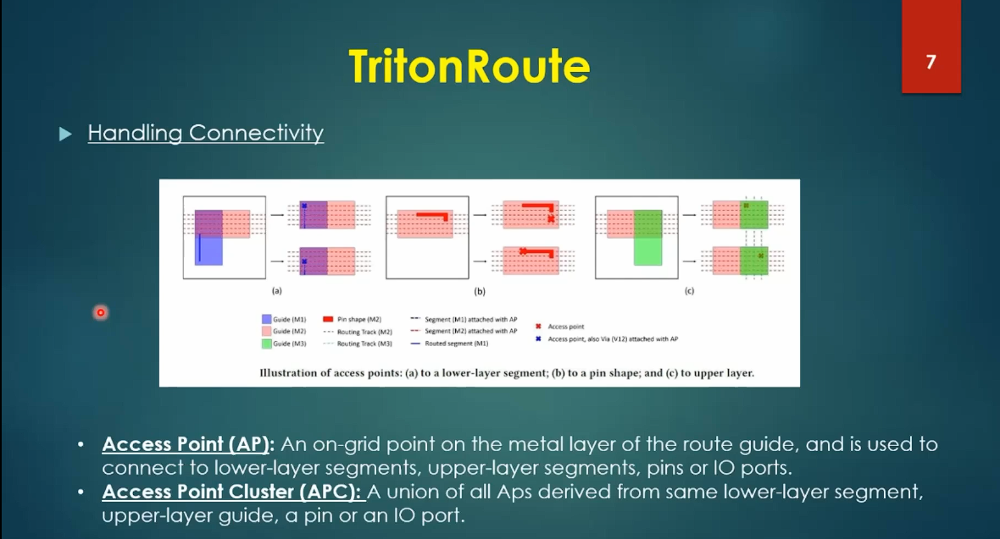

TritonRoute connects route guides, pins, and vias using **Access Points (APs)** and **Access Point Clusters (APCs)**:

- **Access Point (AP):** An on-grid point on the metal layer of the route guide, used to connect to lower-layer segments, upper-layer segments, pins, or IO ports.
- **Access Point Cluster (APC):** A union of all APs derived from the same lower-layer segment, upper-layer guide, a pin, or an IO port.

**Three connectivity scenarios illustrated:**
- **(a)** Access point to a **lower-layer segment** — guide (M1) connects down via an AP/via (V12).
- **(b)** Access point to a **pin shape** (M2) — the router creates a routed segment (M1) that lands on an AP over the pin.
- **(c)** Access point to an **upper-layer** guide (M3) — connectivity established going up through the stack.

---

## 7. Maze Routing — Lee's Algorithm (Lee, 1961)

Detailed routing within a panel/grid is performed using classical **maze routing** based on **Lee's Algorithm**:

### 7.1 Concept
- The routing area is represented as a **grid** of cells.
- Obstacles (macros/cells like DECAP1, DECAP2, DECAP3, Block a, Block b, Block c) are marked as blocked cells.
- Two terminals to be connected are marked (e.g., **Source (1)** and **Target (2)**).

### 7.2 Algorithm Steps
1. **Wave Propagation (BFS):** Starting from the source cell, a breadth-first search expands outward in concentric "wavefronts," labeling each reachable cell with its distance (1, 2, 3, …) from the source, until the target cell is reached.
2. **Backtrace:** Once the target is labeled, the algorithm traces backward from the target to the source, always moving to a neighboring cell with a decreasing distance label, to reconstruct the shortest legal path.
3. The resulting path (shown in red in the routing grid) represents the final route between the two terminals, avoiding all obstacles.

| Step | Illustration |
|---|---|
| Two terminals to connect (blocks 1 and 2) placed on the grid | 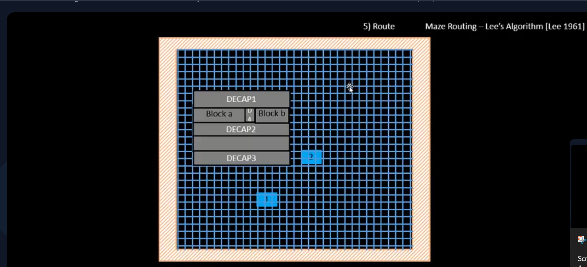 |
| Direct line-of-sight between terminals (obstacles in between) | 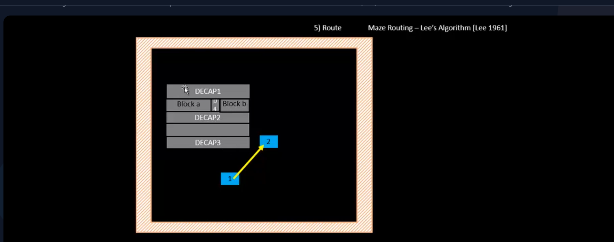 |
| Wave propagation — BFS distance labels expanding from source (S) toward target | 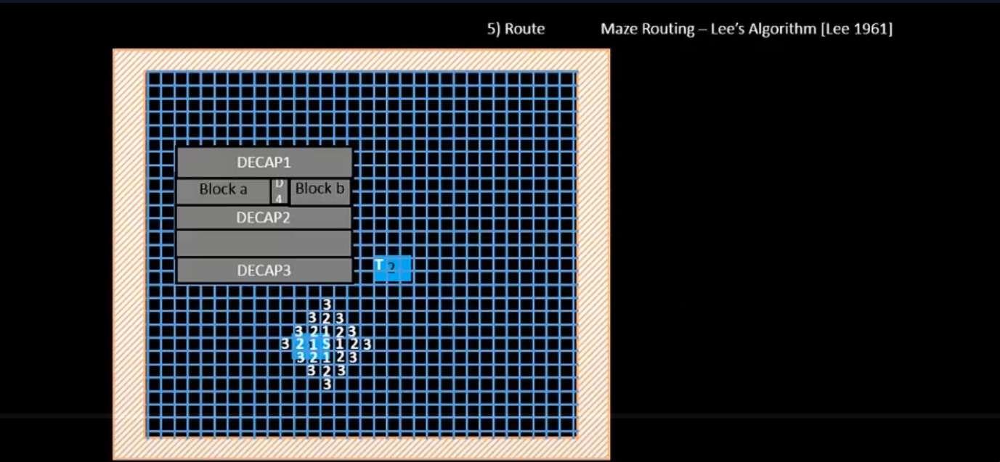 |
| Backtrace complete — shortest legal path (red) found around obstacles | 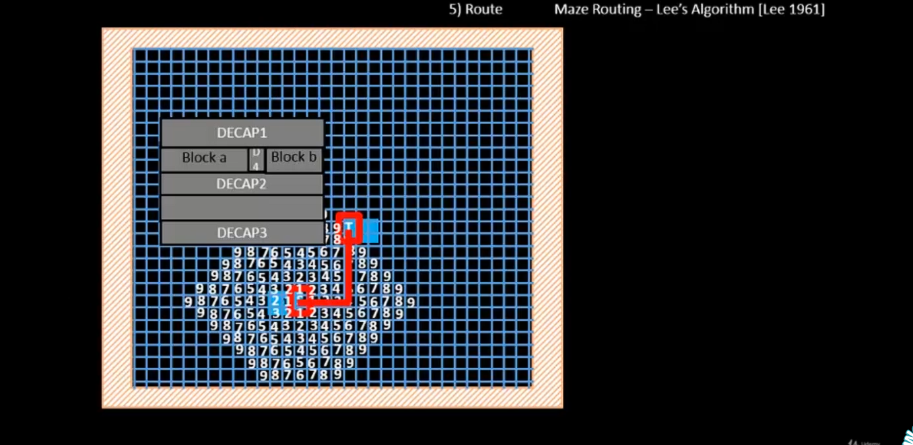 |

### 7.3 Key Properties
- Guarantees the **shortest path** (in grid-cell terms) if one exists.
- Simple and complete (always finds a path if one exists) but can be computationally expensive for large grids — hence why TritonRoute restricts search within **route guides** rather than the entire chip area.

---

## 8. Design Rule Check (DRC) Clean

After routing, the layout must be checked against manufacturing design rules. Three typical design rules checked for a pair of adjacent wires:

1. **Wire Width** — Minimum width a metal wire must have.

   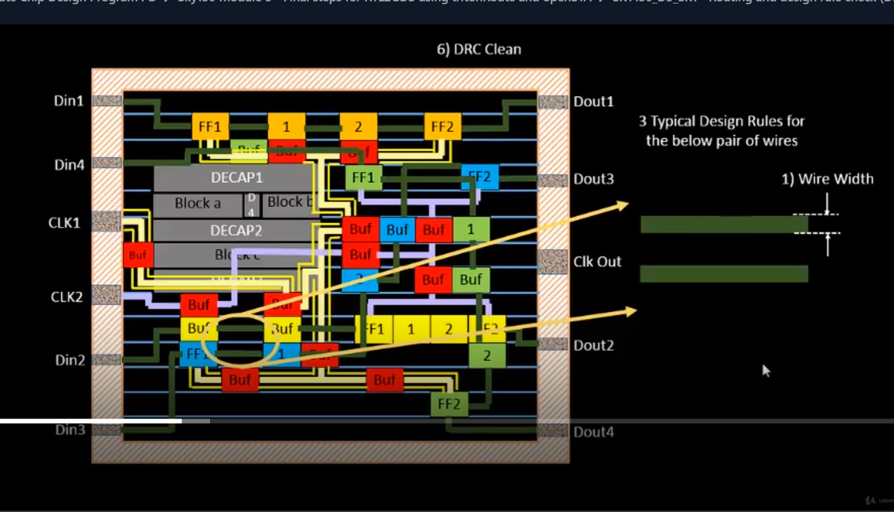

2. **Wire Pitch** — Minimum center-to-center distance between adjacent wires on the same layer.

   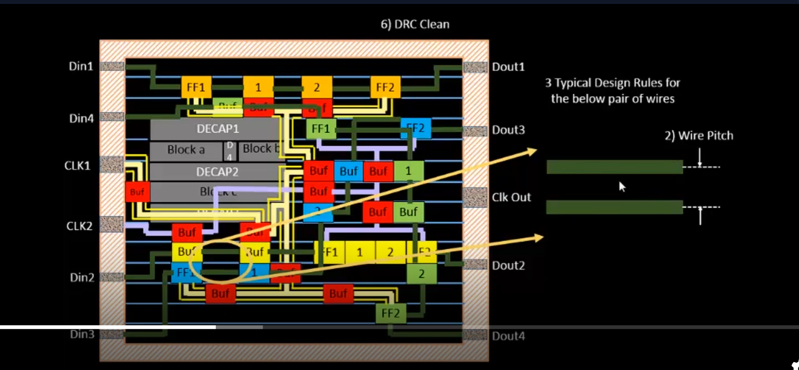

3. **Wire Spacing** — Minimum edge-to-edge gap required between adjacent wires to avoid manufacturing defects.

   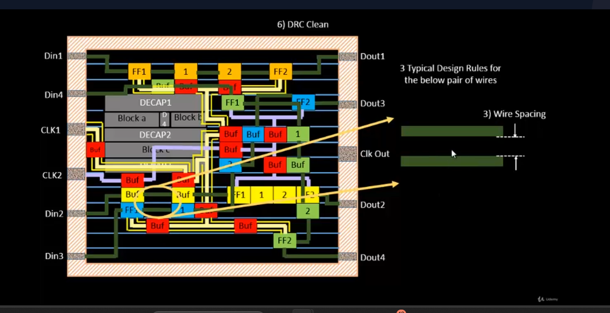

Additionally, **Via Spacing** is checked — minimum spacing required between adjacent vias to prevent shorts.

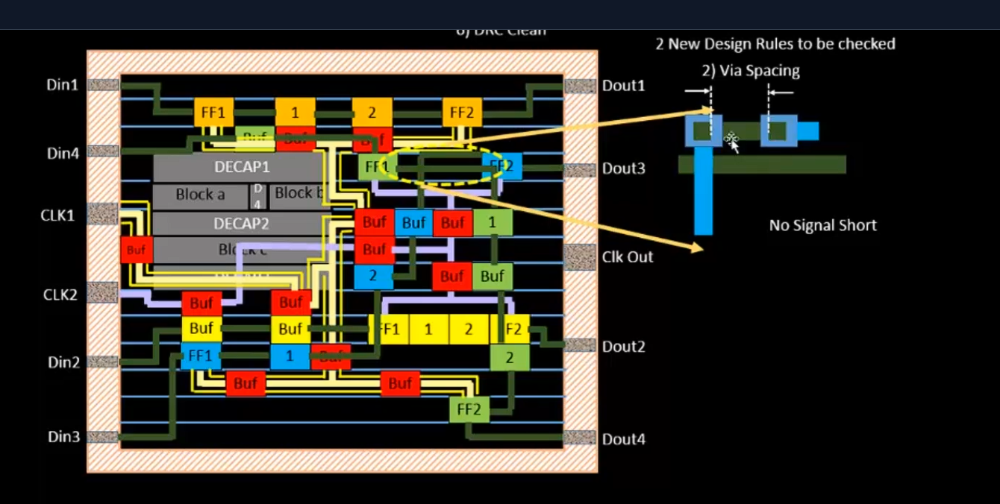

### 8.1 Example DRC Violation
- **Violation Type: Signal Short** — Two nets (e.g., FF1 and FF2 outputs) are routed too close together or overlapping, causing an unintended electrical connection. This is flagged during DRC and must be fixed before the design is considered DRC-clean.

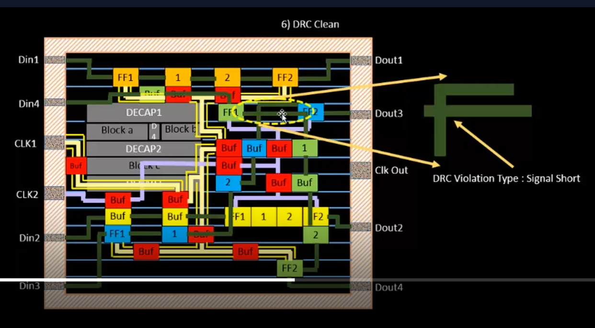

---

## 9. Parasitics Extraction

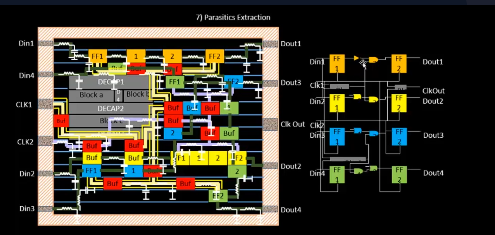

Once the layout is DRC-clean, **parasitic extraction (PEX)** is performed:
- Extracts real-world **resistance (R)** and **capacitance (C)** parasitics from the actual routed wires and vias (not just estimated/ideal values).
- These parasitics are used to build an accurate **RC delay model** of the interconnect for use in timing analysis.
- The extracted netlist reflects real wire geometry — different wire lengths for Din1→Dout1, Din2→Dout2, etc., each contributing distinct RC delay.

---

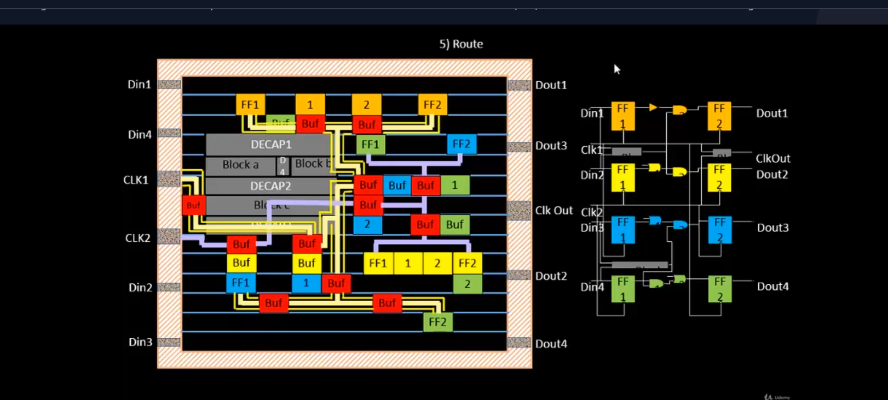

## 10. Timing Analysis (with Real Clocks) — OpenSTA

With real parasitics extracted, Static Timing Analysis is re-run using actual clock and interconnect delays (instead of ideal/zero-delay clocks).

### 10.1 Setup
- **Clock Frequency (F)** = 1 GHz
- **Clock Period (T)** = 1/F = 1 ns
- **Clock Uncertainty (S)** = 10 ps = 0.01 ns
- **Total Uncertainty** = 90 ps = 0.09 ns

### 10.2 Hold Analysis — Single Clock

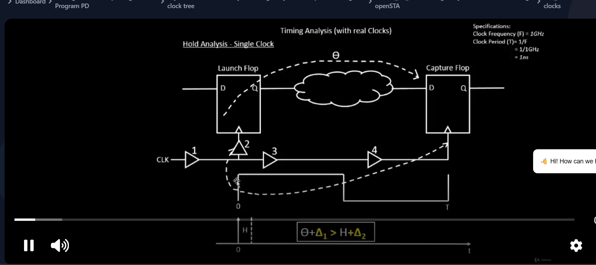

The clock signal travels from the clock source through a series of buffers to reach both the **Launch Flop** and the **Capture Flop**, with:
- **θ (theta):** Clock latency/skew from launch flop to capture flop clock pin.
- **Δ₁ (delta-1):** Data path delay from launch flop through combinational logic to capture flop (the "short path" for hold check).
- **H:** Hold time requirement of the capture flop.
- **Δ₂ (delta-2):** An additional delay margin/reference term (also derived from real wire RC delays).
- **HU:** Hold uncertainty.

**Hold Time Constraint:**

```
θ + Δ₁ > H + Δ₂ + HU
```

This condition must be satisfied for every launch–capture flop pair in the design to avoid a **hold violation** (where new data arrives at the capture flop too early, corrupting the previous captured value).

### 10.3 Computing Real Delays

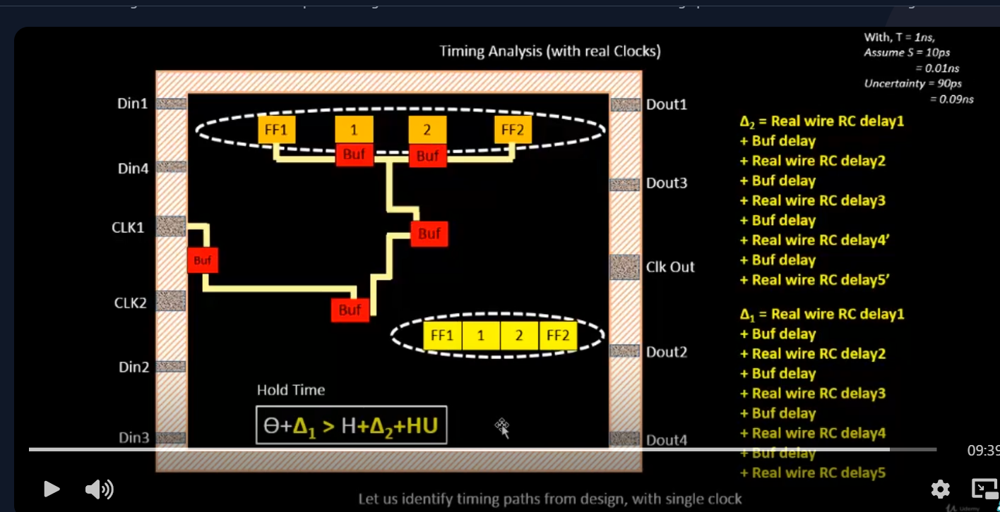

For each path, the real delay Δ is computed as the sum of individual real wire RC delays and buffer delays along the path:

**Δ₂ (long/reference path) example:**
```
Δ₂ = Real wire RC delay1 + Buf delay
   + Real wire RC delay2 + Buf delay
   + Real wire RC delay3 + Buf delay
   + Real wire RC delay4' + Buf delay
   + Real wire RC delay5'
```

**Δ₁ (short/data path) example:**
```
Δ₁ = Real wire RC delay1 + Buf delay
   + Real wire RC delay2 + Buf delay
   + Real wire RC delay3 + Buf delay
   + Real wire RC delay4 + Buf delay
   + Real wire RC delay5
```

Each segment's RC delay is now based on the **actual extracted parasitics** from the routed layout (post-PEX), rather than estimated values used in earlier (pre-layout) timing stages — making this the most accurate timing signoff step in the flow.

---

## 11. Summary — Module 5 Flow

```
Global Route (Fast Route)
        │
        ▼
Preprocessed Route Guides (split → merge → bridge)
        │
        ▼
TritonRoute Detailed Routing
   (Access Points → Panel Routing → Maze Routing/Lee's Algorithm)
        │
        ▼
DRC Clean (Width, Pitch, Spacing, Via Spacing checks)
        │
        ▼
Parasitics Extraction (PEX)
        │
        ▼
Timing Analysis with Real Clocks (OpenSTA — Hold/Setup checks)
        │
        ▼
GitHub Repo Submission
```

---

## Key Takeaways
- TritonRoute performs **detailed routing** honoring route guides using a **MILP-based panel routing** framework (intra-layer parallel, inter-layer sequential).
- **Access Points/Clusters** are the fundamental connectivity mechanism linking guides, pins, and vias across layers.
- **Lee's Algorithm** (maze routing / BFS-based shortest path) underlies the actual wire routing within panels.
- **DRC Clean** verification (width, pitch, spacing, via spacing) is mandatory before signoff.
- **Parasitics Extraction** converts the physical layout into an accurate RC-based timing model.
- Final **timing signoff** with real clocks and real parasitics validates both **setup** and **hold** constraints across the design.
